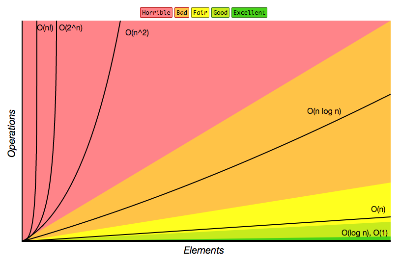

# Složitost
Složitost je charakteristika algoritmu, která měří časové nebo paměťové nároky algoritmu v závislosti na velikosti vstupních dat. Jedná se o způsob kvantifikace, jak efektivně algoritmus pracuje s různě velkými vstupy.

## Asymptotická složitost
__Asympotická složitost__ je charakteristika algoritmu vyjádřená jako rostoucí funkce. Říká nám, jak rychle se zvyšuje počet potřebných operací se zvětšujícím se množstvím vstupních dat.

!!! quote Asymptotické složitosti algoritmů
    Čím pomaleji křivka roste, tím je algoritmus rychlejší.

    

## Amortizovaná složitost
**Amortizovaná složitost** je časová složitost, která je průměrem nejhorších případů v řadě.