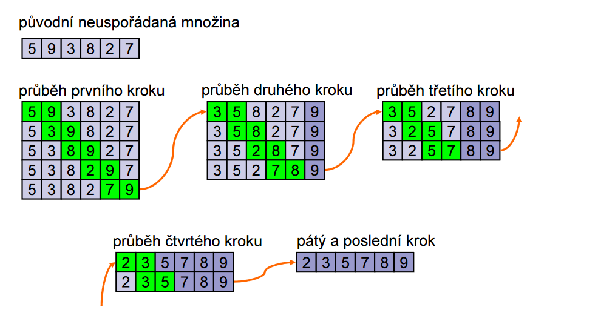
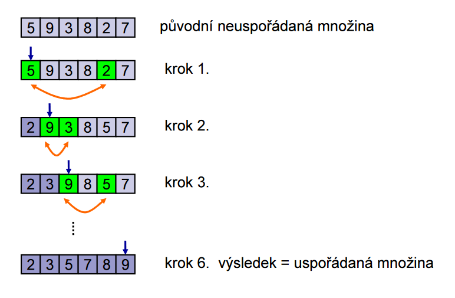
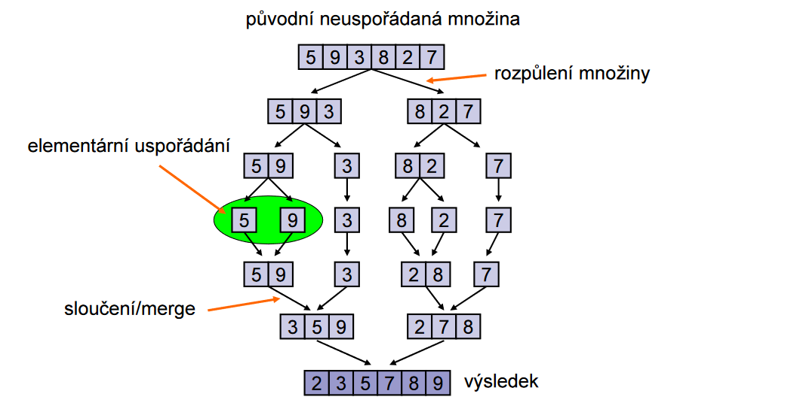
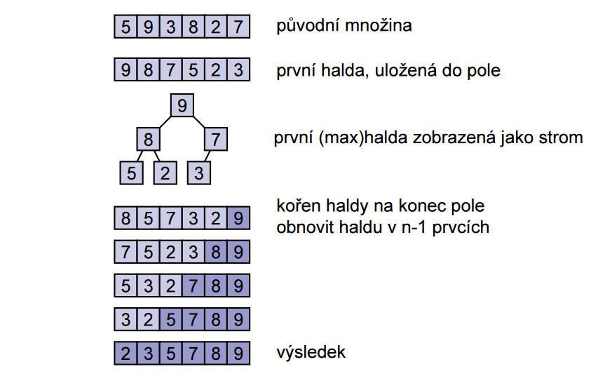

# Vyhledávání a řazení
Vyhledávací a řadící (třídící) algoritmy jsou takové algoritmy, které mají za úkol vyhledat a respektive setřídy prvky v kolekci dat.

## Vyhledávací algoritmy
Vyhledávací algoritmy slouží k nalezení určitého prvku v kolekci dat. Existuje mnoho různých vyhledávacích algoritmů, z nichž některé jsou vhodné pro různé typy dat a různé podmínky.

### Lineární vyhledávání
**Lineární vyhledávání** je algoritmus pro vyhledávání, kdy procházíme prohledávaný prostor, dokud nenalezneme hledaný prvek.

### Binární vyhledávání
**Binární vyhledávání** je vyhledávácí algoritmus, který používá metodu půlení intervalu k nalezení hledaného prvku.

!!! warning O prohledávaném prostoru
    Pro binární vyhledávání musí být prohledávaný prostor **seřazen**

### Interpolační vyhledávání
**Interpolační vyhledávání** je varianta binárního vyhledávání, která se snaží simulovat lidské chování při prohledávání.

!!! example "Vzorec pro interpolační vyhledávání"
    $$
    \text{approx} = \text{first} + \frac{(\text{last} - \text{first})(k - a[\text{first}])}{a[\text{last}] - a[\text{first}]}
    $$

## Řadící algoritmy
__Řadící__ (nebo taky _třídící_) algoritmy se používají k uspořádání prvků v kolekci dat v pořadí podle nějakého pravidla (predikátu). Řadící algoritmy můžeme mezi sebou porovnávat na základě jejich vlastností:

- Algoritmus je __přirozený__, pokud je na seřazených datech rychlejší než na seřazených datech.
- Algoritmus je __stabilní__, pokud jsou prvky se stejnou hodnotou ponechány neseřazeny.

### Bubblesort
__Bubblesort__ je jednoduchý třídící algoritmus, který postupně prochází kolekci dat a v každém průchodu porovnává sousední prvky a vyměňuje je, pokud nejsou ve správném pořadí. Tento proces se opakuje, dokud nejsou všechny prvky ve správném pořadí. Algoritmus je vnitřní, stabilní a přirozený. 

!!! abstract "Princip Bubblesortu"
    1. Porovnej dva sousední prvky
    2. Prohoď je tak, aby byly správně seřazeny
    3. Opakuj, dokud není celá posloupnost seřazená


!!! example "Průběh Bubblesortu"
    

!!! bug "Problém želv a zajíců"
    Dopsat

### Shakersort
**Shakersort** je vylepšená varianta __bubblesortu__, která řadí posloupnost v obou směrech. Algoritmus nejdříve provede bubblesort dopředu, čímž probublá největší prvky na konec, a následně provede ještě jeden bubblesort směrem na začátek, čímž probublá nejmenší prvky na začátek.

Tímto algoritmem se dá předejít problémů *želv a zajíců*

### Combsort
__Combsort__ je třídící algoritmus založený na principu původního algoritmu bubblesort, ale s vylepšeným mechanismem pro vyhledání a výměnu nevhodných prvků. Neporovnávají se prvky vedle sebe, ale prvky, které jsou od sebe vzdáleny s určitým rozestupem. 

!!! abstract "Princip Combsortu"
    1. __Nastavení rozestupu na celou délku kolekce__
    2. __Porovnání prvků s rozestupem__. Pokud jsou v nesprávném pořadí, jsou vyměněny.
    3. __Zmenšení rozestupu__. Rozestup se zmenší pomocí určitého faktoru zmenšení. Typicky je tento faktor zvolen tak, aby byl blízko k hodnotě $\frac{1}{\sqrt{2}}$ pro optimální výkon algoritmu.
    4. __Opakování__

### Selectsort
**Selectsort** je jednoduchý třídící algoritmus, který postupně prochází kolekci dat a ve každém kroku vybírá nejmenší (nebo největší) prvek a umísťuje ho na správné místo. Tento proces je opakován, dokud nejsou všechny prvky ve správném pořadí. Algoritmus je vnitřní, nestabilní a nepřirozený.

!!! abstract "Princip Selectsortu"
    1. Algoritmus najde **nejmenší** prvek v nesetříděné části
    2. Nejmenší prvek je přesunut na konec setřízené části
    3. Opakuj, dokud není celý vstup setřízený

!!! example "Průběh Selectsortu"
    

### Insertsort
**Insertsort** je algoritmus, který postupně prochází kolekci dat a v každém kroku vkládá jeden prvek do již seřazené části kolekce, dokud nejsou všechny prvky seřazené. Algoritmus je vnitřní i vnější, stabilní a přirozený.

!!! abstract "Princip Insertsortu"
    1. Vyber nultý prvek, se kterým nic dělat nebudem
    2. Vyber druhý prvek a porovnej ho s prvním, pokud je menší, dej ho před první
    3. Vyber třetí prvek a porovnej ho s prvníma dvěma, zařaď ho na správné místo
    4. Opakuj, dokud nebude pole seřazeno

!!! example "Průběh Insertsortu"
    

### Mergesort
**Mergesort** je třídící algoritmus typu [Divide and Conquer](algoritmizace.md#divide-and-conquer), který je vnitřní, stabilní a přirozený.

!!! abstract "Princip Mergesortu"
    1. Rozdělit posloupnost na dvě cca stejně velké podposloupnosti
    2. Pokračovat v rozdělování, dokud se z toho nestane problém porovnání dvou čísel
    3. Seřazené výsledky sloučit dohromady

!!! example "Průběh Mergesortu"
    

### Heapsort
**Heapsort** je třídící algoritmus, který používá haldy k třízení vstupní posloupnosti dat.

!!! abstract "Princip Heapsortu"
    1. Ze vstupních dat sestav haldu
    2. Vyber kořen haldy
    3. Umísti kořen na začátek výstupní posloupnosti
    4. Znovusestav haldu ze zbývajících prvků
    5. Opakuj, dokud není z čeho dělat haldu.

!!! example "Průběh Heapsortu"
    

### Quicksort
**Quicksort** je třídící algoritmus typu [Divide and Conquer](algoritmizace.md#divide-and-conquer). V každém kroku vybere jeden prvek z kolekce dat jako pivot a rozdělí zbývající prvky na dvě skupiny podle toho, zda jsou menší nebo větší než pivot. Poté opakuje tento proces pro každou skupinu. Algoritmus je vnitřní, nestabilní a nepřirozený, ovšem v terénu je nejrychlejší ze všech obecných třídících algoritmů.

!!! info "Princip Quicksortu"
    1. Zvolit dělící prvek (pivot)
    2. Projdeme pole zleva dokud nenalezneme větší prvek než dělící prvek
    3. Dále ho projdeme zprava, dokud nenalezneme menší prvek než dělící prvek
    4. Tyto podposloupnosti následně řadíme 
    5. *Rinse and repeat*

### Bogosort
Bogosort je třídící algoritmus, který ke setřízení dat spoléhá na opakování náhodného rozmístění prvků, dokud se netrefí do seřazené permutace.

!!! example Pseudokód bogosortu
    ```js
    function bogosort(array) {
        while (!isOrdered(array)) {
            shuffle(array);
        }
    }
    ```

!!! bug "Neber tohle vážně"
    Tenhle algoritmus byl vymyšlenej jako vtip a reálně nikde není použitej, ani by to nikoho normálního nenapadlo použít.