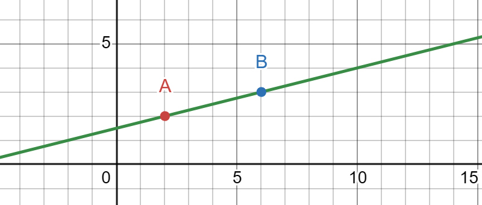
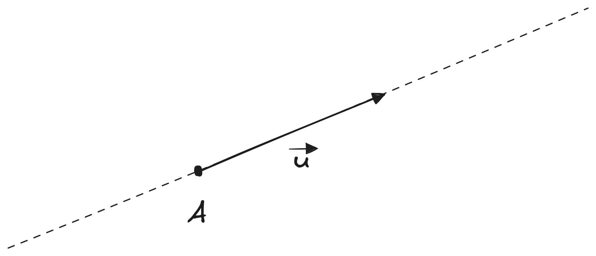

# Parametrická rovnice přímky
Parametrická rovnice přímky v rovině vyjadřuje všechny body přímky jako funkce jednoho parametru. Přímka je určena dvěma body, nebo jedním bodem a směrovým vektorem.

!!! abstract "Parametrická rovnice přímky"
    $$
    p: X = A + t\cdot\vec{u}
    $$

    - $p$ je přímka, na které pracujeme
    - $X$ je bod na přímce, který chceme vyjádřit
    - $A$ je výchozí bod, který víme, že leží na přímce
    - $\vec{u}$ je směrový vektor přímky

## Motivace
Mějme dva body: $A$ a $B$. Pokud proložíme oba dva body nekonečně dlouhou čárou, dostáváme __přímku__.

!!! example "Přímka"
    

Když se na takovou přímku podíváme, zjistíme, že má nějaký úhel. Tento úhel zpravidla určujeme vůči ose X.

!!! question "Proč potřebujeme k určení přímky dva body?"
    No kdybychom měli jenom jeden, tak kolem něho existuje nekonečně mnoho přímek do nekonečně mnoha směrů. Druhý bod nám dává informaci o směru přímky.

Vyjadřovat směr přímky pomocí dvou bodů je nešikovný, protože se častěji pracujume se situací, že máme jeden bod a směr. Směr přímky si můžeme vyjádřit jako vektor mezi dvěma body, čímž nám vznikne __směrový vektor__ přímky. Následně lze jakýkoliv bod na přímce vyjádřit pomocí bodu a zvětšeného či zmenšeného směrového vektoru. Násobek směrového vektoru vlastně říká: "jak moc musím posunout výchozí bod, abych vytvořil chtěný bod?"

!!! example "Parametrická přímka"
    

## Souřadnice bodu na parametrické přímce
Souřadnici bodu, který leží na parametrické přímce vyjádřené jako $p: X = A + t\cdot\vec{u}$, zjistíme tak, že si rovnici této přímky rozepíšeme né jako rovnici s vektory, ale po jednotlivých souřadnicích:

!!! abstract "Souřadnice bodu na parametrické přímce"
    $$\begin{aligned}
        x &= a_1 + t \cdot u_1 \\
        y &= a_2 + t \cdot u_2 \\
    \end{aligned}$$

    kde $x$ a $y$ je souřadnice bodu, $a_1$ a $a_2$ jsou souřadnice výchozího bodu, který nám určuje přímku, $u_1$ a $u_2$ jsou souřadnice směrového vektoru, a $t$ je parametr, který říká, o kolik musím směrový vektor zvětšit či zmenšit, abych se posunul z bodu $A$ do našeho hledaného bodu.

Nezáleží přitom, jestli pracuju v rovině (2 dimenze - 2 souřadnice), v prostoru (3 dimenze - 3 souřadnice), nebo nějakém obskurním 6D prostoru. Pokud si rozepíšu rovnici přímky po jednotlivých souřadnicích, vždy dostanu tolik rovnic, kolik je dimenzí prostoru.

!!! question "Kdy bod leží na přímce?"
    Aby bod ležel na parametricky zadané přímce, stačí dosadit jeho souřadnice do rovnice přímky a spočítat, jestli pro obě dvě souřadnice vychází stejný parametr $t$.

    $$\begin{aligned}
        x &= a_1 + t_1 \cdot u_1 \\
        y &= a_2 + t_2 \cdot u_2 \\
        t_1 &= t_2
    \end{aligned}$$

    Pro obě souřadnice musí vycházet stejná velikost parametru $t$. Proč? Protože máme směrový vektor $\vec{u}$, který násobíme nějakým číslem $t$. Vzpomeň si, že když násobíme vektor číslem ($t \cdot \vec{u}$), tak daným číslem vynásobíme všechny jeho souřadnice:

    $$\begin{aligned}
        t \cdot \vec{u} &= (t \cdot u_1, t \cdot u_2, ...)
    \end{aligned}$$

    Kdyby nám vyšlo pro nějakou souřadnici jiné $t$, znamenalo by to, že jsme museli tu souřadnici vynásobit jiným číslem než ty ostatní, což nedává smysl.

## Vzájemná poloha parametrických přímek
Pokud máme dvě přímky, například $p$ a $q$, může nás zajímat, jaký je mezi nimi vztah. Vzpomeň si, že přímky jsou nekonečně dlouhé čáry - v takovém případě mohou mezi nimi nastat tři situace:

- Přímky mají různý směr a různý výchozí bod.
- Přímky mají stejný směr, ale mají různé výchozí body.
- Přímky mají stejný směr a stejný výchozí bod.

!!! tip "Kdy tohle použiju?"
    Parametrické přímky a určování jejich vzájemné polohy se hojně využívá například v počítačové grafice při simulovaní paprsků světla, v CAD systémech při definování tvarů součástí, nebo v Houghově transformaci pro detekci hran. Zároveň se používají k určování kolizí, protože parametricky popsané objekty, jako jsou přímky či roviny, jsou asi tím nejjednoduším tvarem na počítání průsečíků.

Prvnímu případu, neboli kdy mají dvě přímky různý směr a různý výchozí bod, nazýváme __různoběžnými přímkami__. Různoběžné budou, i když by měli stejný výchozí bod, akorát se nám tím ušetří práce v hledání průsečíku. Druhá situace, neboli kdy mají dvě přímky stejný směr, ale různé výchozí body, nazýváme __rovnoběžnými přímkami__. Ty žádný průsečík mít nebudou, protože se "nikdy nepotkají"[^1]. Naopak pokud mají stejný směr i stejný bod, pak jsou __totožné__.

!!! abstract "Jak určit vzájemnou polohu přímek"
    Uvažujme dvě přímky $p$ a $q$, které mají směrové vektory $\vec{u}$ a $\vec{v}$.
    
    1. Zjistím, jestli vektory $\vec{u}$ a $\vec{v}$ mají stejný směr.
    2. Pokud mají stejný směr, dosadím souřadnice jednoho bodu z přímky $p$ a zjistím, jestli leží na přímce $q$
        1. Pokud leží, tak jsou přímky __totožné__
        2. Pokud neleží, tak jsou __rovnoběžné__
    3. Pokud nemají stejný směr, jsou __různoběžné__.

Prvním krokem je zjištění, jestli mají směrové vektory stejný směr. Pokud mají, znamená to, že jsou násobky jednoho a toho samého vektoru.

!!! tip "Jak zjistit, jestli je vektor násobkem jiného vektoru"
    Uvažujme dva vektory $\vec{u} = (u_1, u_2)$ a $\vec{v} = (v_1, v_2)$. Abych zjistil, jestli je vektor $\vec{v}$ násobkem vektoru $\vec{u}$, hledám takové $a$, aby platilo:
    
    $$\begin{aligned}
        v_1 &= a \cdot u_1 \\
        v_2 &= a \cdot u_2 \\
        \\
        a &= \frac{v_1}{u_1} = \frac{v_2}{u_2} \\
    \end{aligned}$$

    Neboli snažím se najít takové číslo $a$, které vyhovuje všem souřadnicím.

    ??? example "Příklad 1: Vektory jsou násobkem"
        Pokud bychom si dali například $\vec{u} = (-2, 1)$ a $\vec{v} = (4, -2)$, pak řešíme

        $$\begin{aligned}
            a &= \frac{4}{-2} \cdot a\\
            a &= \frac{-2}{1} \cdot a\\
            \\
            a &= -2 \\
            a &= -2 \\
            -2 &= -2
        \end{aligned}$$

        Tím jsme našli číslo $a = -2$, kterým když vynásobíme souřadnice vektoru $\vec{u}$, dostaneme vektor $\vec{v}$

    ??? example "Příklad 2: Vektory nejsou násobkem"
        Pokud bychom si dali například $\vec{u} = (-5, 3)$ a $\vec{v} = (7, 1)$, pak řešíme

        $$\begin{aligned}
            a &= \frac{7}{-5}\\
            1 &= \frac{1}{3}\\
            \\
            \frac{7}{-5} &\not{=} \frac{1}{3} \\
        \end{aligned}$$

        V tomto případě neexistuje takové $a$, které by z vektoru $(-5, 3)$ udělalo vektor $(7, 1)$

    ??? warning "Neumím se zlomkama, budu to dělat sčítací metodou"
        Tady sčítací metoda nejde použít, respektive je nespohlivá. Sčítací metoda slouží k nalezení hodnoty jedné neznámé a k zpětnému dosazení zpět do soustavy rovnic. Ale pojďme si udělat experiment. Koukni na příklad 2, kde byly vektory $\vec{u}=(-5, 3)$ a $\vec{v} = (7, 1)$. Sčítací metodou by to vypadat takto:

        $$\begin{aligned}
            7 &= -5a \\
            1 &= 3a \\
            \\
            8 &= -2a \\
            -4 &= a \\
        \end{aligned}$$

        Dostali jsme výsledek $a = -4$, ale dává smysl? Když zkusíme vektor $\vec{u}$ vynásobit číslem $a$:
        
        $$\begin{aligned}
            -4 \cdot (-5, 3) &= (20, -12)
        \end{aligned}$$

        Tak to asi úplně není ten vektor $\vec{v}$, který má souřadnice $(7, 1)$. Sčítací metoda nefunguje kvůli tomu, že se k těm dvou rovnicím chováme jako ke dvou různým, což je blbost - je to jeden a ten samý výraz, který určuje vztah pro $a$ - takže to je "jedna rovnice", ale rozepsaná na dvou řádcích. Proto je lepší ten tvar zlomků ($a = \frac{v_1}{u_1} = \frac{v_2}{u_2}$), protože v tom je vidět, že se musí rovnat obojí.
 
Pokud nejsou vektory násobkem, neboli jsou [lineárně nezávislé](../linearni_algebra/vektorove_prostory.md#lineární-závislost), budou přímky mířit do různých směrů. V takovém se po nás může chtít spočítat průsečík, neboli bod, který mají obě přímky společné.

!!! tip "Hledání průsečíku"
    Uvažujme přímky $p$ a $q$:

    $$\begin{aligned}
        p: x &= 7 - 3t \\
            y &= 1 + t \\
            \\
        q: x &= 3 - s \\
            y &= 4 + 2s
    \end{aligned}$$ 

    Když se podíváme na takto napsané rovnice, můžeme z nich vyčíst jejich výchozí body a směrové vektory. Pro přímku $p$ je výchozí bod $A[7, 1]$ a směrový vektor $\vec{u} = (-3, 1)$. Pro přímku $q$ je výchozí bod $B[3, 4]$ a směrový vektor $\vec{v} = (-1, 2)$. Tyto vektory jsou nejsou stejné, protože:

    $$\begin{aligned}
        a &= \frac{v_1}{u_1} = \frac{v_2}{u_2} \\
        a &= \frac{1}{3} \not{=} \frac{1}{2}
    \end{aligned}$$

    neexistuje takové $a$, kterým můžeme vynásobit vektor $\vec{u}$, abychom dostali vektor $\vec{v}$. Díky tomuto zjištění můžeme říct, že jsou přímky různoběžné. To ale taky znamená, že mají jeden společný bod, neboli __průsečík__. Pro průsečík platí, že jeho souřadnice musí být stejná na obou přímkách, neboli když to napíšeme ve formě rovnic:

    $$\begin{aligned}
        x_p &= x_q \\
        y_p &= y_q \\
    \end{aligned}$$ 

    Abychom tedy nalezli průsečík, stačí nám vzít předpisy obou přímek a porovnat je mezi sebou pro každou souřadnici. Pro naše přímky $p$ a $q$ to bude vypadat takto:

    $$\begin{aligned}
        7 - 3t &= 3 - s \\
        1 + t &= 4 + 2s \\
    \end{aligned}$$ 

    tuto soustavu o dvou neznámých můžeme vyřešit například sčítací metodou:

    $$\begin{aligned}
        7 - 3t &= 3 - s \\
        1 + t &= 4 + 2s \\
        \\
        8 - 2t &= 7 + s \\
        1 - 2t &= s \\
        \\
        7 - 3t &= 3 - (1 - 2t) \\
        1 + t &= 4 + 2 \cdot (1 - 2t) \\
        \\
        7 - 3t &= 2 + 2t \\
        1 + t &= 6 - 4t \\
        \\
        5 &= 5t \\
        -5 &= 5t \\
        \\
        t &= 1
    \end{aligned}$$ 

    Poslední krok je dosadit do předpisu přímky - je jedno do které, jenom musíme použít správnou podle toho, co známe. My známe parametr $t$, takže můžeme dosadit do přímky $p$.

    $$\begin{aligned}
        x &= 7 - 3 \\
        y &= 1 + 1 \\
        \\
        x &= 4 \\
        y &= 2 \\
    \end{aligned}$$

    Průsečík má tedy souřadnice $P[4, 2]$.

Pokud mají přímky směrové vektory stejné, můžeme rozhodovat, jestli je rovnoběžná (nemají žádné společné body) nebo totožná, což vypadá jako že leží na sobě a mají tak všechny body společné.

!!! question "Je přímka rovnoběžná nebo totožná?"
    Uvažujme přímky $p$ a $q$:

    $$\begin{aligned}
        p: x &= 1 - 2t \\
            y &= 3 + t \\
            \\
        q: x &= 7 + 4s \\
            y &= -4 - 2s
    \end{aligned}$$ 

    Když se podíváme na takto napsané rovnice, můžeme z nich vyčíst jejich výchozí body a směrové vektory. Pro přímku $p$ je výchozí bod $A[1, 3]$ a směrový vektor $\vec{u} = (-2, 1)$. Pro přímku $q$ je výchozí bod $B[7, -4]$ a směrový vektor $\vec{v} = (4, -2)$. Tyto vektory jsou stejné, protože $\vec{u} = -2\vec{v}$. Naším cílem je tedy zjistit, jestli jsou různoběžné (nemají žádný společný bod), nebo jestli jsou totožné (mají všechny body společné). K tomu nám stačí dosadit jeden bod a dopočítat. Pokud si vybereme bod $A$ z přímky $p$, musíme ho dosadit do přímky $q$ a naopak, dosazovat do té jedné a té samé přímky nemá smysl, páč to bude prostě platit. Budeme tedy hledat, jestli bod $A$ leží na přímce $q$:

    $$\begin{aligned}
        1 &= 7 + 4s \\
        3 &= -4 -2s \\
        \\
        -6 &= 4s \\
        7 &= -2s \\
        \\
        -\frac{6}{4} &= s \\
        -\frac{7}{2} &= s \\
        \\
        -\frac{3}{2} &= s \\
        -\frac{7}{2} &= s \\
    \end{aligned}$$

    Z výsledku vidíme, že pro obě souřadnice nám vyšel různý parametr $s$ - to znamená, že bod $A$ neleží na přímce $q$ a znamená to, že jsou přímky rovnoběžné. Kdyby vyšel parametr $s$ pro obě souřadnice stejný, znamená to, že bod leží na přímce $q$ a tím, že mají stejný směr, tak budou i všechny další body ležet na obou přímkách a byly by tak totožné.

[^1]: Pokud tohle čte nějaký chytrolín, tak by mi jistě omlátil o hlavu, že v moment, co bych si definoval neeklidovskou geometrii, například eliptickou, tak že se mi rovnoběžky potkají. Já vím, ale to fakt není matematika na úrovni analytické geometrie a v ten moment se akorát snažíš vyjebat s definicema a mým zjednodušením pro lepší interpretaci v reálném světe (páč žijeme v euklidovském prostoru) :).