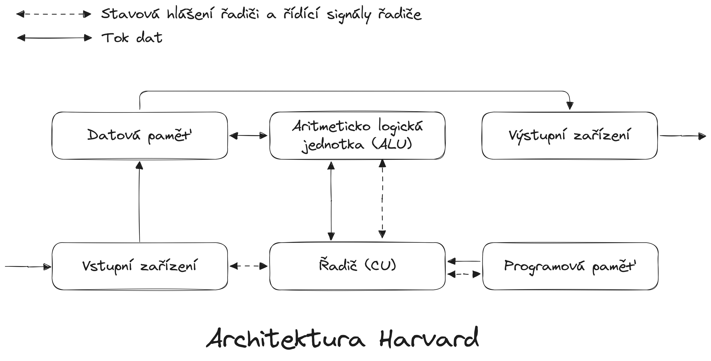

# Hardvardská architektura
Harvardská architektura je alternativou k von Neumannově architektuře, která odděluje paměť pro data a instrukce. Každý typ paměti má svou vlastní sběrnici, což umožňuje současný přístup k instrukcím i datům. Díky této separaci nedochází k zpomalení, protože přenosy dat a načítání instrukcí mohou probíhat paralelně, což výrazně zvyšuje propustnost systému.

Harvardská architektura se často používá v vestavěných systémech a mikrořadičích, kde jsou výkon a efektivita kritické. Například procesory typu RISC a některé digitální signálové procesory (DSP) využívají tuto architekturu. Přestože je harvardská architektura efektivnější pro určité aplikace, její implementace je obvykle složitější a dražší než u von Neumannovy architektury.

!!! example "Harvardská architektura"
    

!!! question "Vlastnosti harvardské architektury"
    1. Instrukce a data __mají oddělenou__ paměť, takže je možné ve stejném okamžiku načítat instrukci a přistupovat k datům
    2. Jednotlivé sběrnice jsou oddělené (datová, instrukcí a adresová)
    3. Řízení procesoru je odděleno od řízení vstupních a výstupních jednotek (nejsou napojeny přímo na ALU).
