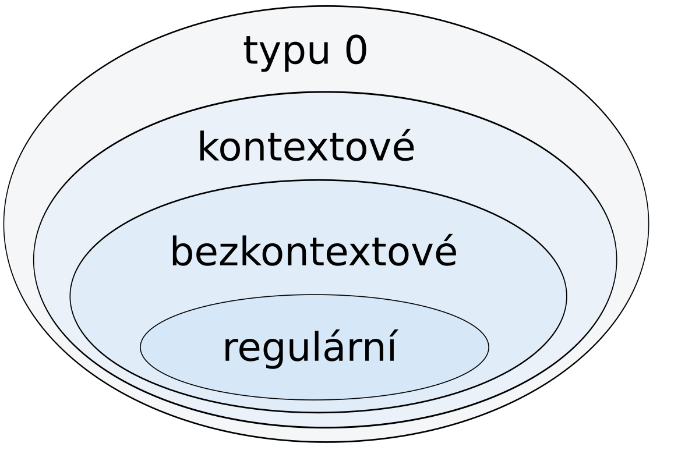

# Gramatika
Gramatika je sada pravidel, která říká, jak můžeme vytvořit slova jazyka z určitého počátečního symbolu. Proces generování funguje tak, že začneme s počátečním symbolem a postupně na něj uplatňujeme pravidla, dokud nevytvoříme požadované slovo. Gramatiku $G$ zapisujeme jako uspořádanou čtveřici $G = (N, T, P, S)$, kde

- $N$ je množina [pomocných symbolů](#terminální-a-neterminální-symboly) (neterminálů).
- $T$ je množina [konečných symbolů](#terminální-a-neterminální-symboly) (terminálů).
- $P$ je množina __přepisovacích pravidel__.
- $S \in N$ je speciální __počáteční symbol__, také znamý jako _kořen gramatiky_.

!!! abstract "Předpoklady"
    - Gramatika musí mít nějaké pomocné symboly a konečné symboly. Tyhle dvě množiny nesmí být prázdné.
    - Množina přepisovacích pravidel musí být konečná.

!!! example "Příklad jednoduché gramatiky"
    Máme abecedu $\Sigma = \{a,\,b\}$. Počáteční symbol je $S$ a jsou určena dvě přepisová pravidla:
    
    1. $S \to aSb$
    2. $S \to ba$

    - Začínáme počátečním symbolem $S$. První slovo, které můžeme vytvořit, je aplikovaním pravidla č. 2 - tím nám vznikne slovo $ba$.
    - Začínáme počátečním symbolem $S$. Druhé slovo, které můžeme vytvořit, je použitím prvního pravidla a následně druhého - $S \to aSb \to abab$. 
    - Začínáme počátečním symbolem $S$. Třetí slovo, které můžeme vytvořit, je dvojitým použitím prvního pravidla a následně druhého - $S \to aSb \to aaSbb \to aababb$. 

    Takhle můžeme pokračovat do nekonečna. Jazykem této gramatiky o dvou pravidlech mohou být slova $L = \{ba,\,abab,\,aababb,\,...\}$

## Terminální a neterminální symboly
- Terminální symboly (neboli terminály, konečné symboly) jsou symboly, které už nelze dále přepisovat. Konečná slova, která gramatika generuje, obsahují jen tyto symboly.
- Neterminální symboly (neboli neterminály, pomocné symboly) jsou pomocné symboly, které slouží k popisu struktury jazyka. Používají se v pravidlech gramatiky k přepisování a někdy se jim říká proměnné.

!!! info ""
    - Terminální (konečné) symboly se v teorii jazyků často označují malými písmeny latinské abecedy (nebo někdy číslicemi)
    - Neterminální (pomocné) symboly velkými písmeny nebo slovy ve špičatých závorkách.

- Větná forma je každý řetězec symbolů (terminálních i neterminálních), který můžeme vytvořit z počátečního neterminálního symbolu pomocí pravidel gramatiky.
- Věta je větná forma, která obsahuje pouze terminální symboly (bez neterminálů).

## Přepisovací pravidla
Pravidla přepisování jsou množina pravidel, která určují, jak měnit symboly ve slovech. Pravidlo, které vypadá jako $\alpha \to \beta$, znamená: _"symboly $\alpha$ přepiš na symboly $\beta$"_.

- $\alpha$ může obsahovat libovolnou kombinaci symbolů, ale musí tam být alespoň jeden [neterminální symbol](#terminální-a-neterminální-symboly) (pomocný symbol, který se ještě může přepisovat).
- $\beta$ může obsahovat terminální i neterminální symboly nebo může být i prázdný.

Při odvozování slova přepisujeme postupně části slova. Vybereme část, která odpovídá levé straně nějakého pravidla, a nahradíme ji pravou stranou. Zbytek slova před i za výskytem levé strany (tzv. kontext) zůstává stejný.

- Tomuto nahrazení levé strany pravou stranu říkáme __přímé přepsání__ a označujeme ho symbolem $\Rightarrow$.
- Pokud můžeme udělat více těchto přímých přepsání zasebou, mluvíme prostě o __přepsání__ a zapisujeme to jako $w \overset{*}{\Rightarrow} z$.

Jazyk $L(G)$ generovaný gramatikou $G$ je množina všech slov (věty), která můžeme vytvořit z počátečního symbolu pomocí konečného počtu kroků přepisování. Tato slova jsou složena jen z terminálních symbolů.

$$L(G) = \{w | w \in T^* \wedge S \overset{*}{\Rightarrow} w\}$$

!!! example "Příklad zápisu gramatiky"
    $$G: S \to 0S1 | 01$$

    - Symbol $S$ je počáteční symbol a zároveň je neterminálním symbolem.
    - Symboly $0$ a $1$ jsou terminální.
    - Tato gramatika má dvě přepisovací pravidla, která jsou oddělena svislou čárou.

    $$\begin{aligned}
    S &\overset{2}{\Rightarrow} 01 \\
    S &\overset{1}{\Rightarrow} 0S1 \overset{2}{\Rightarrow} 0011 \\
    S &\overset{1}{\Rightarrow} 0S1 \overset{1}{\Rightarrow} 00S11 \overset{1}{\Rightarrow} 000111 \\
    \end{aligned}$$

## Chomského hiearchie gramatik
Chomského hierarchie je rozdělení formálních gramatik podle toho, jak složité jazyky dokážou generovat.

!!! quote "Vrstvy chomského Hiearchie"
    

### Gramatiky typu 0 (neomezené/frázové gramatiky)
Tyto gramatiky zahrnují všechny možné formální gramatiky. Generují jazyky, které mohou být rozpoznané Turingovým strojem, což jsou velmi obecné stroje schopné zpracovat širokou škálu problémů. Tyto jazyky se nazývají rekurzivně spočetné jazyky.

- Nejsou zde žádná omezení na tvar pravidel.
- Každé pravidlo má formu: $\alpha \to \beta$, kde 
    - $\alpha$ musí obsahovat alespoň jeden neterminál a může být jakýmkoli řetězcem terminálů a neterminálů.
    - $\beta$ může být libovolný řetězec terminálů a neterminálů.

### Gramatiky typu 1 (kontextové gramatiky)
Tyto gramatiky jsou o něco jednodušší než gramatiky typu 0, ale stále mohou být velmi složité. Tato gramatika generuje kontextové jazyky a je omezená tím, že žádné pravidlo nemůže zkracovat řetězce. Kontextové jazyky může rozpoznat Turingův stroj s omezenými zdroji (tzv. lineárně ohraničený).

- Pravidla musí dodržovat formu $\alpha{X}\beta \to \alpha{\gamma}\beta$.
    - $\alpha$ a $\beta$ jsou z uzávěru všech terminálů a neterminálů
    - $X$ je neterminál
    - $\gamma$ je z pozitivního uzávěru všech terminálů a neterminálů (nemůže to být prázdné slovo).
- Alternativní, ale ekvivalentní, definice: $\alpha \to \beta$
    - $\alpha \in (N \cup T)^* . N . (N \cup T)^*$
    - $|\alpha| \le |\beta|$

- Pravidlo S → ε je povoleno jen, pokud se $S$ nevyskytuje na pravé straně žádného jiného pravidla.
- Tato gramatika generuje kontextové jazyky a je omezená tím, že žádné pravidlo nemůže zkracovat řetězce.

### Gramatiky typu 2 (bezkontextové gramatiky)
Tyto gramatiky generují bezkontextové jazyky, které lze rozpoznat nedeterministickým zásobníkovým automatem.

- Pravidla musí dodržet formu $X \to \gamma$ kde 
    - $X$ je neterminál (pomocný symbol)
    - a $\gamma$ je buďto terminál nebo neterminál, či jakákoliv jejich kombinace ($\gamma \in \left(N \cup T\right)^*$)
- Na levé straně může být pouze jeden neterminál (není v kontextu).
- Povoleno pravidlo $X \to \varepsilon$

#### Lineární gramatika
Lineární gramatika spadá do gramatiky typu 2, pokud se v přepisových pravidlech nachází jak levá, tak i pravá lineární gramatika. Jinak řečeno, existuje takové pravidle, které je zapsané nebo ho lze zapsat ve tvaru $A \to xBy$.

### Gramatiky typu 3 (regulární gramatiky)
Tyto gramatiky generují regulární jazyky, které jsou nejjednodušší a mohou být rozpoznané konečným automatem (automat bez paměti).

- Pravidla musí dodržovat formu $A \to aB$ nebo $A \to a$
- Gramatika může obsahovat pravidlo $S \to \varepsilon$, pokud se $S$ nevyskytuje v žádném jiném pravidle na pravé straně.
- U všech pravidel je na levé straně přesně jeden [neterminál](#terminální-a-neterminální-symboly) a na pravé straně nejvýše jeden [neterminál](#terminální-a-neterminální-symboly).

!!! important "Rozdíl mezi regulární a lineární gramatikou"
    - Regulární gramatika má pouze **jeden** terminál, protože používá prvky z množiny terminálů.
    - Lineární gramatika může mít i řetězec terminálů, protože používá prvky z uzávěru množiny terminálů.

#### Regulární gramatika
Regulární gramatika má pravidla ve tvaru

- $A \to aB$
- $A \to Ba$
- $A \to a$
- $A \to \varepsilon$

Podle umístění terminálního symbolu se rozlišuje

- **levá regulární gramatika**: terminální symbol je na začátku pravé strany ($A \to Ba$)
- **pravá regulární gramatika** terminální symbol je na konci pravé strany ($A \to aB$)

#### Lineární gramatika
Do regulárních gramatik spadají také pravidla, která splňují podmínky lineární gramatiky. Lineární gramatika je obecnější definice regulární gramatiky, kdy terminály $x$ a $y$ nemusíme tahat přímo z množiny terminálů $T$, ale z jejího uzávěru $T^*$. Ten obsahuje kromě samotných terminálů jejich různé kombinace a opakování. Lineární gramatika splňující pravidla G3 má pravidla ve tvaru:

- $A \to xB$ (pravá lineární gramatika)
- $A \to By$ (levá lineární gramatika)
- $A \to x$
- $A \to \varepsilon$

Pokud narazíme na pravidlo typu $A \to xBy$, nebo respektive $A \to xB$ a $B \to Cy$, pak se sice jedná o lineární gramatiku, ale splňující podmínky pro G2, ne pro G3.

!!! question "Proč nelze kombinovat levou a pravou lineární gramatiku?"
    Je to kvůli tomu, jak je definována gramatika typu 3. Ta totiž umí pracovat jenom s případem, kdy je neterminál pouze na jedné straně od terminálu. 
    
    Pokud máme levé i pravé pravidlo, například $A \to xB$ a $B \to Cy$, lze ho pomocí tranzitivní vlastnosti spojit v $A \to xBy$, což je přepisovací pravidlo nesplňující podmínky pro G3.

### Příklady
!!! example "Příklad: Jakého typu jsou následující gramatiky?"
    !!! example ""
        |Gramatika 1|Vysvětlení pravidel|
        |:--|:--|
        |$S \to abA$ | Pravidlo odpovídá pravé lineární gramatice, protože začíná řetězcem terminálů.|
        |$S \to ab$ | Pravidlo odpovídá pravé lineární gramatice, protože začíná řetězcem terminálů.|
        |$A \to aaB$ | Pravidlo odpovídá pravé lineární gramatice, protože začíná řetězcem terminálů.|
        |$A \to ba$ | Pravidlo odpovídá pravé lineární gramatice, protože začíná řetězcem terminálů.|
        |$B \to AB$ | Tady nastává průser. V tomto případě pravidle nemá žádné terminály, ale jenom neterminály. Aby pravidlo splňovalo úroveň gramatiky G3, musí tam být alespoň jeden terminál. Podmínky pro G2 již ale splňuje, protože tam je jedno, co je na pravé straně. (tvar $A \to \gamma,\,\gamma \in (N \cup T)^*$)|
        |$B \to \varepsilon$ | Toto pravidlo obecně platí i v G3 |

        Nejhorším pravidlem v gramatice 1 je tak pravidlo $B \to AB$, které splňuje podmínky G2, a **celá gramatika tak splňuje podmínky pro gramatiku typu 2.**

    !!! example ""
        |Gramatika 2|Vysvětlení pravidel|
        |:--|:--|
        |$S \to abA$ | Pravidlo odpovídá pravé lineární gramatice, protože začíná řetězcem terminálů.|
        |$S \to ab$ | Pravidlo odpovídá pravé lineární gramatice, protože začíná řetězcem terminálů.|
        |$A \to Bab$ | Pravidlo odpovídá levé lineární gramatice, protože začíná neterminálem, za kterým je řetězec terminálů.|
        |$A \to \varepsilon$ | Toto pravidlo obecně platí v G3 |
        |$B \to bbB$ | TPravidlo odpovídá pravé lineární gramatice, protože začíná řetězcem terminálů.|
        |$B \to b$ | Toto pravidlo je obecně jakékoliv z G3 |

        Nalezli jsme levá i pravá lineární pravidla, takže musíme zpozornět. Když použijeme tranzitivitu, tak zjistíme, že se v množině přepisových pravidel nachází $S \to abBab$ 
        
        $$(S \to abA) + (A \to Bab) = S \to abBab$$
        
        Pravidlo $S \to abBab$ nevyhovuje požadavkům typu 3 (kde terminály musí být pouze na jedné straně), ale vyhovuje předpisu G2 ($A \to \gamma,\,\gamma \in (N \cup T)^*$).
        
        **Celá gramatika tak splňuje podmínky pro gramatiku typu 2.**

    !!! example ""
        |Gramatika 3|Vysvětlení pravidel|
        |:--|:--|
        |$S \to A$|Pravidlo obecně vyhovující G3, páč $S$ je počáteční symbol|
        |$A \to AbB$|Pravidlo obsahuje více než jeden neterminál. Toto je skupina G2|
        |$A \to a$|Pravidlo obecně vyhovující skupině G3|
        |$AbB \to baB$|Tak tohle je další průser. Obviously to nevyhovuje G3 ani G2, protože na levé straně máme terminály i neterminály. G1 to ale také nevyhovuje - tam je podmínka, že prostředek levé strany musí být neterminál. Tady je $b$, což je terminál. Takže poslední možností je G0.|
        |$AbB \to BAbB$|Stejné odůvodnění jako výše - G3 ani G2 to být nemůže. G1 nám ale tady fungovat bude. Když se podíváme, tak obě strany mají společné $bB$ - když si z toho uděláme proměnnou, například $\beta \to bB$, vznikne $A\beta \to BA\beta$. To už podmínky G1 splňuje, konkrétně tu druhou definici, páč levá strana je kratší než pravá.|
        |$B \to b$|Pravidlo vyhovující G3|
        |$B \to \varepsilon$|Pravidlo vyhovující G3|

        Protože nejhůř ohodnocené pravidlo bylo G1, tak **celá gramatika splňuje podmínky pro gramatiku typu 1.**

!!! example "Rozhodněte o typu gramatiky"
    $$\begin{aligned}
        N &= \{A, S\}\\
        T &= \{0, 1, c\} \\
        G &= (N, T, P, S) \\
        \\
        S &\to 0A1 \\
        0A &\to 00A1 \\
        A &\to c
    \end{aligned}$$

    - Pravidlo $S \to 0A1$ odpovídá G3, protože má terminály z obou konců řetězce.
    - Pravidlo $0A \to 00A1$ odpovídá skupině G1, protože když si vezmeme tvar $\alpha{X}\beta \to \alpha{\gamma}\beta$ a dosadíme 
        - $\alpha = 0$, přičemž $\alpha$ musí být z uzávěru sjednocení terminálů a neterminálů. To platí, protože 0 je v množině terminálů $T$.
        - $\beta = \varepsilon$, přičemž $\beta$ musí také být z uzávěru sjednocení terminálů a neterminálů - do čehož prázdný řetězec $\varepsilon$ patří.
        - $\gamma = 0A1$, přičemž $\gamma$ musí být z pozitivního uzávěru sjednocení terminálů a neterminálů - což je v pořádku, protože $\gamma$ není prázdný řetězec a $0A1$ je kombinace symbolů z množin terminálů a neterminálů.
        - Podmínka $A \in N$ platí. 
    - Pravidlo $A \to c$ vyhovuje G3.

    **Celá gramatika je tak typu G1.**

