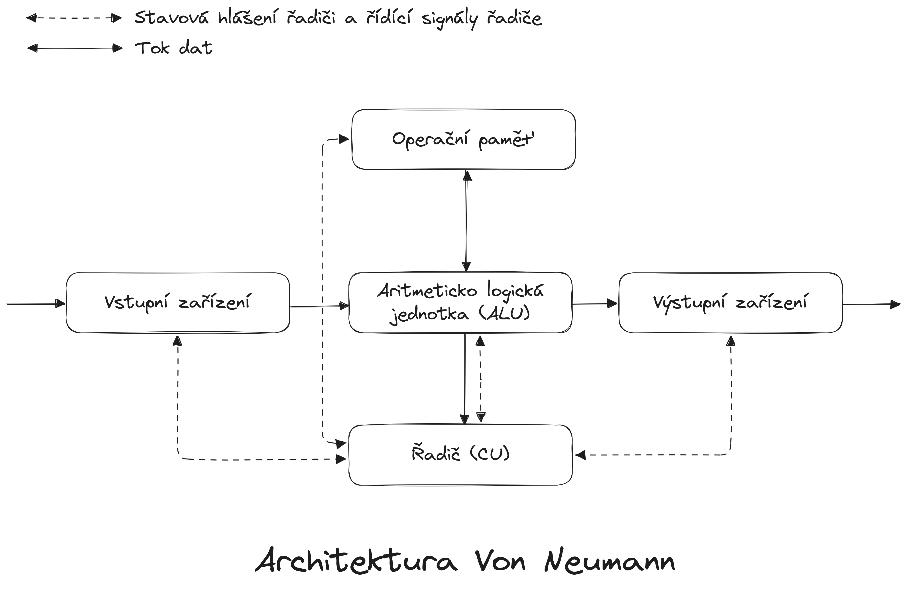

# Architektura počítačů
Architektura počítačů je oblast zabývající se návrhem a konstrukcí strojů pro zpracování dat a signálů. Architektura určuje funkci, organizaci a implementaci jednotlivých systémů.

Pokud se chceme bavit o architektuře počítačů, je dobré vědět, co to počítač vlastně je a z čeho se skládá. Za počítač budeme považovat stroj na číslicové (digitální) zpracování dat. Tento stroj provádí výpočty nebo řídí operace, které lze popsat čísly a logickými výrazy. Každý počítač obsahuje:

- Procesor s aritmeticko logickou jednotkou a řídící jednotkou
- Vstupní a výstupní zařízení
- Operační a archivní paměť

Jak tyto prvky uspořádat mezi sebou a uplatnil je k řešení problému určují konceptuální modely počítače, přičemž nejznámější je [Von Neumannovská architektura](./von_neumann.md). V této architektuře se používá jedna sdílená paměť pro ukládání dat i instrukcí. Počítat poté zpracovává instrukce za sebou tak, jak jsou uloženy v paměti.

!!! question "Vlastnosti Von Neumannovy architektury"
    1. Struktura počítače je nezávislá na typu řešené úlohy - počítač se programuje obsahem paměti
    2. Instrukce a data sdílí jednu a tu samou paměť
    3. Paměť je rozdělena do stejně velkých buněk
    4. Program je tvořen posloupností příkazů
    5. Změna pořadí provádění instrukcí se vyvolá podmíněným nebo nepodmíněným skokem
    6. Pro reprezentaci čísel se používá dvojková číselná soustava
    7. Během výpočtu nelze s počítačem komunikovat
    8. Vstupy a výstupy jsou napojeny přímo na ALU

Nevýhodou Von Neumannovy architektury je právě sdílení jedné paměti pro data i instrukce programu, protože zpracování instrukcí procesorem je v dnešní době diametrálně rychlejší než komunikace s pamětí, a tudíž musí takový počítač čekat na data. Tento problém adresuje [Hardvardská architektura](./hardvarska_architektura.md), která paměť programu a paměť s daty odděluje od sebe.

Výkonnost počítače představuje jeho schopnost efektivně zpracovávat informace. Měření výkonnosti je komplexní a nelze jej vyjádřit jediným číslem; proto se často používá tzv. vektor výkonnosti, který zahrnuje různé aspekty výkonu. Mezi základní ukazatele patří počet operací nebo instrukcí provedených za sekundu, a to buď s pevnou, nebo pohyblivou řádovou čárkou. Dalšími důležitými faktory jsou propustnost systému, doba odezvy a míra využití zdrojů.

!!! example "Vzorečky"
    - __Výkonnost__ $P_T(T)$: Inverzní hodnota doby $T$ potřebné k provedení jednoho úkonu (např. programu).
    $$
        P_T(T) = \frac{1}{T}
    $$

    - __Propustnost__ $P_R(n, T)$: Počet $n$ úkonů (např. úloh) provedených za čas $T$.
    $$
        P_R(n, T) = \frac{n}{T}
    $$

    Pro hodnocení výkonnosti se používají různé metriky: 

    - __MIPS__ (Million Instructions Per Second) $P_{MIPS} = \frac{IC}{T_{CPU}} \cdot 10^{-6}$ 
    - __MOPS__ (Million Operations Per Second) $P_{MOPS} = \frac{IC}{T_{CPU}} \cdot 10^{-6}$ 
    - __MFLOPS__ (Million Floating point Operations Per Second) $P_{MFLOPS} = \frac{IC}{T_{CPU}} \cdot 10^{-6}$

    Pro zjištění Tp je třeba sestavit tabulku četnosti výskytu jednotlivých instrukcí při „běžném provozu“ počítače. Každá instrukce má přiřazenu svoji váhu ai, která vyjadřuje pravděpodobnost výskytu instrukce v programu.

## Otázky ke zkoušce

### Architektury obecně
!!! example ""
    Uveďte charakteristické vlastnosti Von Neumanova architektury počítačů.

1. Struktura počítače je nezávislá na typu řešené úlohy - počítač se programuje obsahem paměti
2. Instrukce a data sdílí jednu a tu samou paměť
3. Paměť je rozdělena do stejně velkých buněk
4. Program je tvořen posloupností příkazů
5. Změna pořadí provádění instrukcí se vyvolá podmíněným nebo nepodmíněným skokem
6. Pro reprezentaci čísel se používá dvojková číselná soustava
7. Během výpočtu nelze s počítačem komunikovat
8. Vstupy a výstupy jsou napojeny přímo na ALU

---

!!! example ""
    Uveďte charakteristické vlastnosti architektury VLIW počítačů, kde se v současnosti nejčastěji používá?

---

!!! example ""
    Jaký je rozdíl mezi subskalárními, sklárními a superskalárními procesory?

---

!!! example ""
    Uveďte charakteristické vlastnosti Harvardské architektury počítačů

Vlastnosti harvardské architektury oproti von neumannově:

1. Instrukce a data __mají oddělenou__ paměť, takže je možné ve stejném okamžiku načítat instrukci a přistupovat k datům
2. Jednotlivé sběrnice jsou oddělené (datová, instrukcí a adresová)
3. Řízení procesoru je odděleno od řízení vstupních a výstupních jednotek (nejsou napojeny přímo na ALU).

---

!!! example ""
    Uveďte charakteristické vlastnosti procesorů typu CISC.

- Rozsáhlá instrukční sada
- Proměnná délka instrukcí
- Zpracování instrukce ve více cyklech (CPI 5 až 10)
- Velký počet adresovacích režimů
- 

---

!!! example ""
    Uveďte charakteristické vlastnosti procesorů typu RISC.

### Vylepšení procesoru
!!! example ""
    Předpokládejme vylepšení procesoru pro web. Nový CPU je 10x rychlejší pro webové aplikace než nynější. Dále víme, že nyní je CPU zaměstnán ze 40% výpočty a 60% času čeká na vstupně–výstupní operace. Jaké bude celkové zrychlení po plánovaném vylepšení?

$$\begin{aligned}
    S_{OVERALL} &= \frac{1}{(1 - F_E) + \frac{F_E}{S_E}} \\
    S_{OVERALL} &= \frac{1}{(1 - 0.4) + \frac{0.4}{10}} \\
    S_{OVERALL} &= \frac{1}{0.64} \\
    S_{OVERALL} & 1.5625 \\
\end{aligned}$$

!!! example ""
    Předpokládejme vylepšení procesoru pro databázové výpočty. Nový procesor je 5x rychlejší než nynější. Dále víme, že nyní je procesor zaměstnán z 65% výpočty a 35% času čeká na vstupně – výstupní operace. Jaké bude celkové zrychlení po plánovaném vylepšení.

$$\begin{aligned}
    F_E &= 0.65 \\
    S_E &= 5 \\
    \\
    S_{OVERALL} &= \frac{1}{\frac{0.35}{1} + \frac{0.65}{5}} \\
    S_{OVERALL} &= \frac{1}{0.35 + 0.13} \\
    S_{OVERALL} &\simeq 2.083 \\
\end{aligned}$$

!!! example ""
    Výpočetní úloha je rozdělena na 3 části, z nichž každá trvá daný čas (P1 = 20%, P2 = 30% a P3= 50%). Jaké je celkové zrychlení, jestliže část P1 zrychlíme 5x, část P2 nezrychlíme a část P3 zrychlíme 10x?

$$\begin{aligned}
    S_{OVERALL} &= \frac{1}{\frac{0.2}{5} + \frac{0.3}{1} + \frac{0.5}{10}} \\
    S_{OVERALL} &= \frac{1}{0.04 + 0.3 + 0.05} \\
    S_{OVERALL} &= \frac{1}{0.39} \\
    S_{OVERALL} &\simeq 2.564 \\
\end{aligned}$$

!!! example ""
    Předpokládejme vylepšení procesoru pro databázové výpočty. Nový procesor je 4x rychlejší než nynější. Dále víme, že nyní je procesor zaměstnán z 70% výpočty a 30% času čeká na vstupně – výstupní operace. Jaké bude celkové zrychlení po plánovaném vylepšení.

$$\begin{aligned}
    S_{OVERALL} &= \frac{1}{\frac{0.3}{1} + \frac{0.7}{4}} \\
    S_{OVERALL} &= \frac{1}{0.3 + 0.175} \\
    S_{OVERALL} &= \frac{1}{0,475} \\
    S_{OVERALL} &\simeq 2.105 \\
\end{aligned}$$

!!! example ""
    Vypočítejte průměrnou dobu přístupu do paměti (systém složený z cache a operační paměti), je-li vybavovací doba cache 12 ns, čas získání dat z operační paměti 160 ns a pravděpodobnost neúspěchu je 10%.

$$\begin{aligned}
    T_C &= 12 \\
    MP &= 160 \\
    MR &= 0.1 \\
    \\
    HT &= (1 - MR) \cdot T_C \\
    HT &= 0.9 \cdot 12 \\
    HT &= 10.8 \\
    \\
    AMAT &= HT + MR \cdot MP \\
    AMAT &= 10.8 + 0.1 \cdot (12 + 160) \\
    AMAT &= \boxed{26.8 ns}
\end{aligned}$$

!!! example ""
    Mikrořadič pracuje s frekvencí 4 MHz. K provedení jednoho instrukčního cyklu vyžaduje 4 hodinové takty. Program obsahuje 90% instrukcí jednocyklových a 10% instrukcí doucyklových. Jaký je výkon mikrořadiče v MIPS?

!!! example ""
    Předpokládejme vylepšení procesoru pro databázové výpočty. Nový procesor je 3x rychlejší než nynější. Dále víme, že nyní je procesor zaměstnán z 75% výpočty a 25% času čeká na vstupně – výstupní operace. Jaké bude celkové zrychlení po plánovaném vylepšení.

!!! example ""
    DSP pracuje s frekvencí 80 MHz a k provedení jedné instrukce vyžaduje 4 hodinové takty. Během jedné instrukce udělá 2 FP aritmetické operace (součet a součin), 3 přístupy do paměti (přečte 2 operandy a uloží výsledek), obnoví jeden FP registr a inkrementuje 3 adresové ukazatele (čítače). Jaký je výkon procesoru v MIPS a MOPS?

!!! example ""
    Počítač zpracovává program, který má 5 milionů 1-CPI (jednotaktových instrukcí), 1 milion 2-CPI a 1 milion 3-CPI. Kmitočet hodinových taktů je 100 MHz. Jaká je jeho výkonnost v MIPS?

### Nový stav instrukcí
