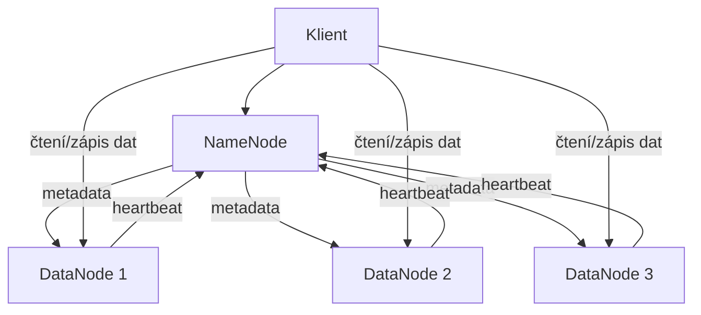
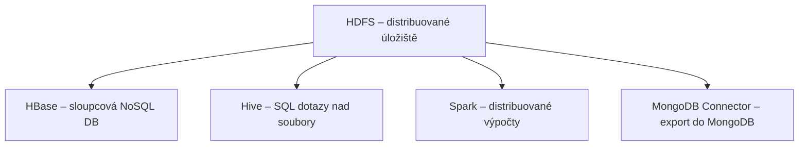

# Dokumentové databáze

Dokumentové databáze patří do rodiny NoSQL databází a místo tabulek a řádků ukládají data jako **dokumenty** – typicky ve formátu JSON nebo BSON (Binary JSON). Každý dokument je samostatná jednotka, která může mít vlastní strukturu nezávislou na ostatních dokumentech ve stejné kolekci.

!!! abstract "Proč dokumentové databáze?"

    - **Flexibilní schéma** – každý dokument může mít jinou strukturu, atributy lze přidávat za běhu bez migrace.
    - **Blízkost k objektovému modelu** – dokument odpovídá objektu v kódu, odpadá ORM mapování.
    - **Horizontální škálování** – přirozená podpora shardingu, data lze rozdělit mezi stovky uzlů.
    - **Agregace** – bohaté možnosti dotazování a transformace dat přímo v databázi.
    - **Vnořené dokumenty** – související data lze vnořit do jednoho dokumentu, čímž odpadá JOIN.

| Vlastnost | Relační databáze | Dokumentová databáze |
|:--|:--|:--|
| Datový model | Tabulky, řádky, sloupce | Kolekce, dokumenty (JSON/BSON) |
| Schéma | Pevné, definované předem (DDL) | Flexibilní, dynamické |
| Vztahy | Cizí klíče, JOIN | Vnořené dokumenty, reference |
| Škálování | Vertikální (obtížně horizontální) | Horizontální (sharding) |
| Transakce | ACID napříč tabulkami | ACID na úrovni dokumentu, multi-document od MongoDB 4.0 |
| Dotazovací jazyk | SQL (deklarativní) | MongoDB Query API, agregační pipeline |

## MongoDB

MongoDB je nejpopulárnější dokumentová databáze – open-source, napsaná v C++, navržená pro vysokou propustnost, horizontální škálování a práci s nestrukturovanými nebo polostrukturovanými daty.

### Základní koncepty

| Koncept MongoDB | Obdoba v relační DB | Popis |
|:--|:--|:--|
| **Dokument** | Řádek (záznam) | Jeden BSON objekt – základní jednotka dat. |
| **Kolekce** | Tabulka | Skupina dokumentů – nevyžaduje jednotné schéma. |
| **Databáze** | Databáze | Skupina kolekcí. |
| **Pole** (field) | Sloupec | Klíč v dokumentu. |
| **\_id** | Primární klíč | Unikátní identifikátor – automaticky `ObjectId`, lze přepsat. |
| **Vnořený dokument** | JOIN (částečně) | Dokument uvnitř jiného dokumentu – eliminuje potřebu spojování. |

```javascript
// Příklad dokumentu v kolekci "users"
{
    _id: ObjectId("507f1f77bcf86cd799439011"),
    name: "Jan Novák",
    email: "jan@example.com",
    age: 28,
    address: {
        city: "Liberec",
        street: "Studentská 2",
        zip: "46117"
    },
    tags: ["student", "IT"],
    createdAt: ISODate("2025-01-15T10:30:00Z")
}
```

### BSON – Binary JSON

MongoDB interně ukládá data ve formátu **BSON** (Binary JSON), který rozšiřuje JSON o:

- Další datové typy: `Date`, `ObjectId`, `Binary data`, `Decimal128`, `Long`, `Timestamp`.
- Efektivnější parsování – binární formát, rychlejší než textový JSON.
- Podpora pro indexované prohledávání.

### CRUD operace

```javascript
// CREATE – vložení jednoho dokumentu
db.users.insertOne({
    name: "Petr Svoboda",
    email: "petr@example.com",
    age: 35
});

// CREATE – hromadné vložení
db.users.insertMany([
    { name: "Alice", email: "alice@example.com" },
    { name: "Bob",   email: "bob@example.com" }
]);

// READ – jeden dokument podle podmínky
db.users.findOne({ email: "jan@example.com" });

// READ – více dokumentů s projekcí a řazením
db.users.find(
    { age: { $gte: 18, $lte: 65 } },  // filtr
    { name: 1, email: 1, _id: 0 }     // projekce (které pole vrátit)
).sort({ age: -1 }).limit(10);

// UPDATE – nastavení hodnot
db.users.updateOne(
    { _id: ObjectId("...") },
    { $set: { age: 29 }, $push: { tags: "alumni" } }
);

// DELETE
db.users.deleteMany({ age: { $lt: 18 } });
```

### Dotazovací operátory

| Operátor | Význam | Příklad |
|:--|:--|:--|
| `$eq`, `$ne` | Rovná se / nerovná se | `{ age: { $ne: null } }` |
| `$gt`, `$gte`, `$lt`, `$lte` | Větší / větší nebo rovno / menší / menší nebo rovno | `{ age: { $gte: 18 } }` |
| `$in`, `$nin` | V seznamu / mimo seznam | `{ city: { $in: ["Praha", "Brno"] } }` |
| `$and`, `$or`, `$not` | Logické operátory | `{ $or: [{ age: { $lt: 18 } }, { age: { $gt: 65 } }] }` |
| `$exists` | Pole existuje / neexistuje | `{ email: { $exists: true } }` |
| `$regex` | Regulární výraz | `{ name: { $regex: /^Nov/ } }` |
| `$elemMatch` | Prvek pole splňuje podmínku | `{ tags: { $elemMatch: { $eq: "student" } } }` |

### Indexy v MongoDB

MongoDB používá indexy založené na $B^+$-stromech, podobně jako relační databáze. Bez indexů probíhá **collection scan** (procházení všech dokumentů).

```javascript
// Jednoduchý index
db.users.createIndex({ email: 1 });  // 1 = vzestupně, -1 = sestupně

// Složený index
db.users.createIndex({ name: 1, age: -1 });

// Unikátní index
db.users.createIndex({ email: 1 }, { unique: true });

// Textový index (fulltext)
db.articles.createIndex({ title: "text", body: "text" });

// TTL index – dokumenty se automaticky mažou po uplynutí času
db.sessions.createIndex(
    { createdAt: 1 },
    { expireAfterSeconds: 3600 }
);

// Zobrazení všech indexů v kolekci
db.users.getIndexes();
```

!!! info "Typy indexů v MongoDB"
    | Typ | Popis | Příklad použití |
    |:--|:--|:--|
    | **Single Field** | Index nad jedním polem. | `email`, `_id` (automaticky) |
    | **Compound** | Index nad více poli – pořadí polí záleží. | `{ name: 1, age: -1 }` |
    | **Multikey** | Index nad polem – pro každý prvek pole se vytvoří záznam v indexu. Automaticky, pokud je pole typu array. | `tags`, `categories` |
    | **Text** | Fulltextový index – podporuje stemming, stop words, relevance scoring. Pouze jeden na kolekci. | `title`, `description` |
    | **Geospatial** | Index pro geografické dotazy (`$near`, `$geoWithin`). | GPS souřadnice |
    | **Hashed** | Hashuje hodnoty indexovaného pole – používá se pro sharding. | `_id` pro rovnoměrné rozložení |
    | **TTL** | Automaticky maže dokumenty po uplynutí nastavené doby. | Session data, cache, logy |
    | **Wildcard** | Indexuje všechna pole nebo podmnožinu polí – vhodné pro dynamická schémata. | `{ "$**": 1 }` |

### Agregační pipeline

Agregační pipeline je deklarativní framework pro zpracování a transformaci dat. Dokumenty procházejí sekvencí **stages** (fází), kde každá fáze data filtruje, transformuje, seskupuje, nebo obohacuje. Vstupem každé fáze je výstup fáze předchozí.

```javascript
db.orders.aggregate([
    // Fáze 1: filtrování – jen objednávky z roku 2025
    { $match: { createdAt: { $gte: ISODate("2025-01-01") } } },

    // Fáze 2: rozbalení pole položek do jednotlivých dokumentů
    { $unwind: "$items" },

    // Fáze 3: seskupení podle produktu, výpočet agregací
    { $group: {
        _id: "$items.productId",
        totalRevenue: { $sum: { $multiply: ["$items.price", "$items.quantity"] } },
        totalSold: { $sum: "$items.quantity" },
        avgPrice: { $avg: "$items.price" }
    }},

    // Fáze 4: seřazení podle tržeb sestupně
    { $sort: { totalRevenue: -1 } },

    // Fáze 5: Top 10 produktů
    { $limit: 10 },

    // Fáze 6: obohacení o název produktu z kolekce products (LEFT JOIN)
    { $lookup: {
        from: "products",
        localField: "_id",
        foreignField: "_id",
        as: "product"
    }}
]);
```

!!! info "Klíčové fáze agregační pipeline"
    | Fáze | Význam |
    |:--|:--|
    | `$match` | Filtruje dokumenty – ekvivalent `WHERE` v SQL. |
    | `$group` | Seskupuje dokumenty a počítá agregace (`$sum`, `$avg`, `$min`, `$max`, `$push`). |
    | `$sort` | Řadí podle zadaných polí. |
    | `$project` | Transformuje dokumenty – vybírá, přejmenovává, počítá nová pole. |
    | `$unwind` | Rozbaluje pole – každý prvek pole se stane samostatným dokumentem. |
    | `$lookup` | LEFT JOIN s jinou kolekcí (od MongoDB 3.2). |
    | `$limit` / `$skip` | Omezuje počet dokumentů / přeskakuje prvních N. |
    | `$addFields` | Přidává nová pole do dokumentů. |
    | `$bucket` | Rozděluje dokumenty do intervalů podle hodnoty. |

### Replikace

MongoDB zajišťuje dostupnost a odolnost pomocí **Replica Setu** – skupiny `mongod` procesů, které drží identická data. Replica Set typicky obsahuje:

- **Primary** – přijímá všechny zápisy. Právě jeden v RS.
- **Secondary** – replikuje data z primary. Čtení z nich je možné, ale ve výchozím nastavení nekonzistentní (mohou být pozadu).
- **Arbiter** – neukládá data, jen hlasuje při volbě nového primary. Používá se pro lichý počet hlasujících uzlů.

!!! abstract "Jak replikace funguje"

    1. Zápis přijde na **primary**.
    2. Primary zapíše změnu do svého **oplogu** (operations log).
    3. Secondary neustále čtou oplog primary a aplikují změny na svá data.
    4. Pokud primary selže, proběhne **volba** – secondary s nejaktuálnějším oplogem se stane novým primary.
    5. Klient je automaticky přesměrován na nový primary (driver to řeší).

### Sharding (horizontální škálování)

Pokud data přesáhnou kapacitu jednoho serveru, MongoDB je rozdělí mezi více serverů pomocí **shardingu**. Data se rozdělují podle **shard key** – pole nebo kombinace polí, podle kterých se dokumenty distribuují.

!!! abstract "Komponenty shardovaného clusteru"

    - **Shard** – uzel (nebo replica set), který drží podmnožinu dat.
    - **Config Server** – uchovává metadata o tom, který shard drží jaká data (rozsahy shard key).
    - **Mongos** – router, který přijímá dotazy od klientů a přesměrovává je na správné shardy.

!!! info "Výběr shard key"
    Shard key je nejdůležitější rozhodnutí při shardingu. Ovlivňuje rovnoměrnost distribuce a výkon dotazů:

    | Typ shard key | Výhody | Nevýhody |
    |:--|:--|:--|
    | **Hashed** – hashovaná hodnota pole | Rovnoměrné rozložení, ideální pro `_id`. | Range queries přes více shardů – scatter-gather. |
    | **Ranged** – rozsahy hodnot (např. `customerId`) | Efektivní range queries, data blízko sobě. | Může vzniknout *hot shard* – jeden shard dostává většinu zápisů. |
    | **Compound** – kombinace polí | Lepší cílení dotazů na jeden shard. | Složitější na správu. |

### Transakce v MongoDB

MongoDB historicky podporovalo atomicitu pouze na úrovni **jednoho dokumentu**. Od verze 4.0 (2018) podporuje **multi-document ACID transakce** – včetně rollbacku napříč více dokumenty a kolekcemi.

```javascript
const session = client.startSession();
try {
    session.startTransaction();
    const orders = session.client.db("shop").collection("orders");
    const inventory = session.client.db("shop").collection("inventory");

    await orders.insertOne({ userId: 42, productId: 7, qty: 1 }, { session });
    await inventory.updateOne(
        { productId: 7 },
        { $inc: { stock: -1 } },
        { session }
    );

    await session.commitTransaction();
} catch (error) {
    await session.abortTransaction();
} finally {
    session.endSession();
}
```

!!! warning "Transakce a výkon"
    Multi-document transakce v MongoDB používají zámky – v distribuovaném prostředí jsou dražší než v relačních DB. Pro většinu případů stále platí: **navrhuj schéma tak, aby atomická operace stačila na jeden dokument** (vnořené dokumenty, $inc, $push).

## HDFS

HDFS (Hadoop Distributed File System) **není dokumentová databáze**, ale distribuovaný souborový systém navržený pro ukládání **obrovských objemů dat** (petabajty a víc) na komoditním hardwaru. Je základním kamenem ekosystému Apache Hadoop a často slouží jako podkladová vrstva pro databáze a analytické nástroje (HBase, Hive, Spark), včetně dokumentových databází.

### Architektura HDFS

HDFS je postavený na modelu **master–worker**:

!!! abstract "Komponenty HDFS"

    - **NameNode** (master): Spravuje metadata – jmenný prostor, adresářovou strukturu a mapování souborů na bloky. **Bez NameNode je cluster nepoužitelný** – single point of failure (řeší se sekundárním NameNode nebo HA párem).
    - **DataNode** (worker): Ukládá skutečná data ve formě **bloků** na lokálních discích. Periodicky posílá NameNode heartbeat a report o uložených blocích.
    - **Secondary NameNode**: Není záložní! Pravidelně stahuje a spojuje editační logy s obrazem souborového systému (*checkpointing*), aby NameNode neměl při restartu příliš velký log.

!!! info "Jak HDFS ukládá soubory"

    1. Soubor se rozdělí na **bloky** o velikosti typicky 128 MB (na rozdíl od 4 KB u běžných FS).
    2. Každý blok je **replikován** na více DataNodů (výchozí replikační faktor = 3).
    3. NameNode rozhodne, které DataNody budou blok držet – snaží se o rack-awareness (repliky napříč racky).
    4. Klient čte z **nejbližší repliky**, čímž se šetří síťová propustnost.



### Vlastnosti HDFS

| Vlastnost | Popis |
|:--|:--|
| **Write-once, read-many** | Soubory lze vytvořit a zapisovat jen jednou (append-only). Nelze upravovat existující data uprostřed souboru. Navrženo pro dávkové zpracování, ne pro OLTP. |
| **Velké bloky** | 128 MB bloky snižují režii metadat a umožňují sekvenční čtení velkých souborů. |
| **Replikace** | Každý blok je standardně 3× replikován – odolnost proti výpadku DataNode. |
| **Rack awareness** | HDFS ví, ve kterém racku se DataNode nachází – repliky umisťuje napříč racky pro odolnost. |
| **Streaming přístup** | Optimalizace pro sekvenční čtení celých souborů, ne pro náhodný přístup. |
| **Lokalita dat** | Výpočet se přesouvá k datům (ne naopak) – MapReduce úloha běží na stejném uzlu jako data. |

### HDFS vs. MongoDB – kdy použít co

| Kritérium | MongoDB | HDFS |
|:--|:--|:--|
| **Typ úložiště** | Dokumentová databáze (strukturované dotazy). | Distribuovaný souborový systém (soubory, bloky). |
| **Přístup k datům** | Náhodný, indexovaný, dotazy v reálném čase. | Sekvenční, dávkový, streamování celých souborů. |
| **Latence** | Milisekundy – OLTP, operational. | Sekundy až minuty – batch processing. |
| **Velikost dat** | GB až TB na kolekci. | PB a víc – masivní datová jezera. |
| **Vzory přístupu** | CRUD operace nad dokumenty, agregační pipeline. | MapReduce, Spark, Hive (SQL nad soubory). |
| **Modifikace dat** | Časté aktualizace dokumentů. | Append-only – data se nemění. |
| **Transakce** | ACID (single i multi-document). | Žádné – souborový systém. |
| **Typické použití** | Webové aplikace, katalogy, uživatelské profily, IoT data, CMS. | Data lake, archivace, dávková analytika, strojové učení. |

### HDFS v ekosystému – jak se používá s dokumentovými DB

HDFS sám o sobě není dotazovatelný – je to jen úložiště. V praxi se nad ním staví vrstvy, které umožňují dotazování:



Typický tok dat: **HDFS ukládá surová data → Spark je zpracuje → výsledky se uloží do MongoDB**, kde slouží pro rychlé dotazy z aplikace.
