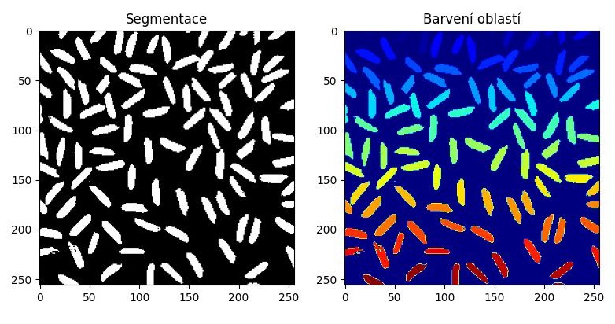

# Barvení oblastí
Barvení oblastí je algoritmus, který __v binárním obraze__ hledá uzavřené množiny (oblasti) obrazových bodů. V OpenCV je barvení oblastí implementováno ve funkci `cv2.connectedComponentsWithStats()`.

!!! example "Barvení oblastí"
    

## Princip algoritmu
Algoritmus funguje na principu procházení obrazu jakožto grafu. Protože je vstupní obraz binární, tak je pozadí označeno 0 a popředí 1. Algoritmus pracuje s maticí navštívených bodů a maticí barev. 

1. Pro každý bod se podívá, jestli již nebyl navštíven a jestli je součástí popředí. Pokud ano, jedná se o součást oblasti.
2. Algoritmus se podívá do jeho okolí a tyto body dá do fronty ke zpracování.
3. Aktuální oblast je nalezena ve chvíli, kdy ve frontě už nejsou žádné další body.
4. Poté se najde nejbližší nezpracovaný bod a algoritmus běží znova.
5. Algoritmus běží, dokud nejsou navštíveny všechny body. 

## Implementace v Pythonu
```python
def bfs_coloring(image):
    """Funkce pro barvení oblastí pomocí prohledávání do šířky

    Args:
        image: Binární obrázek k barvení

    Returns:
        Matice s očíslovanými oblastmi
    """
    rows, cols = image.shape
    visited = np.zeros_like(image).astype("bool")
    colors = np.zeros_like(image).astype("uint8")

    directions = [(0, 1), (0, -1), (1, 0), (-1, 0)]

    def is_valid(x, y):
        return 0 <= x < rows and 0 <= y < cols

    def bfs(x, y, color):
        queue = deque([(x, y)])
        visited[x][y] = True
        colors[x][y] = color

        # Zkoumáme všechny okolní body, dokud je v rámci obrázku, nebyli jsme na něm a je vysegmentovaný jako 1
        while queue:
            current_x, current_y = queue.popleft()

            for dx, dy in directions:
                new_x, new_y = current_x + dx, current_y + dy
                if is_valid(new_x, new_y) and not visited[new_x][new_y] and image[new_x][new_y] == 1:
                    queue.append((new_x, new_y))
                    visited[new_x][new_y] = True
                    colors[new_x][new_y] = color

    color_count = 0
    for i in range(rows):
        for j in range(cols):
            if not visited[i][j] and image[i][j] == 1:
                color_count += 1
                bfs(i, j, color_count)

    return colors
```