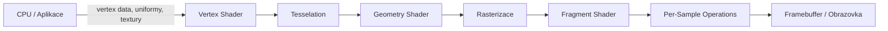

# Grafická pipeline

Grafický pipeline je sekvence fází, kterou procházejí data od definice 3D scény v aplikaci až po výsledné pixely na obrazovce. V moderní real-time grafice je klíčová role **GPU** – masivně paralelního procesoru specializovaného na operace s vektory a maticemi, který jednotlivé fáze vykonává hardwarově a programovatelně pomocí shaderů.

!!! abstract "OpenGL jako model"
    Tento dokument popisuje pipeline optikou **OpenGL** (a příbuzných API jako OpenGL ES a WebGL). Moderní API jako Vulkan, Direct3D 12 a Metal používají stejný konceptuální model, liší se mírou, jakou vývojář řídí synchronizaci a správu paměti.

## Struktura pipeline



!!! abstract "Fáze grafické pipeline"

    1. **CPU / Aplikace** – příprava dat, nahrání na GPU.
    2. **Vertex Shader** – transformace každého vrcholu z modelového prostoru do clip space.
    3. **Tesselace** (volitelná) – hardwarové dělení polygonů pro vyšší detail.
    4. **Geometry Shader** (volitelný) – manipulace s celými primitivy (trojúhelníky, úsečkami).
    5. **Rasterizace** – převod primitiv na fragmenty (budoucí pixely).
    6. **Fragment Shader** – výpočet barvy každého fragmentu (textury, osvětlení).
    7. **Per-Sample Operations** – depth test, stencil test, blending.
    8. **Framebuffer** – finální pixely v paměti, zobrazení na obrazovce.

## Datové toky v pipeline

Data proudí pipeline **jednosměrně zleva doprava** – každá fáze produkuje výstup, který je vstupem fáze následující. Klíčové datové struktury, které proudí pipeline:

### Vertexové buffery (VBO)

Vstupem pipeline je geometrie definovaná ve **vertexových bufferech** – polích vrcholů v GPU paměti. Každý vrchol nese sadu atributů:

```c
// Definice vertexových dat v aplikaci
float vertices[] = {
    // pozice (x, y, z) | normála (nx, ny, nz) | UV souřadnice
    -0.5f, -0.5f, 0.0f,   0.0f, 0.0f, 1.0f,   0.0f, 0.0f,
     0.5f, -0.5f, 0.0f,   0.0f, 0.0f, 1.0f,   1.0f, 0.0f,
     0.0f,  0.5f, 0.0f,   0.0f, 0.0f, 1.0f,   0.5f, 1.0f,
};
```

!!! info "Typické vertexové atributy"
    | Atribut | Význam | Příklad |
    |:--|:--|:--|
    | `position` (`vec3`) | Pozice vrcholu v modelovém prostoru. | `(0.5, -0.5, 0.0)` |
    | `normal` (`vec3`) | Normálový vektor pro výpočet osvětlení. | `(0, 0, 1)` |
    | `texcoord` (`vec2`) | UV souřadnice pro mapování textur. | `(1.0, 0.0)` |
    | `color` (`vec4`) | Barva vrcholu (pro vertex coloring). | `(1, 0, 0, 1)` |
    | `tangent` / `bitangent` (`vec3`) | Pro normal mapping a bump mapping. | — |

### VAO (Vertex Array Object)

VAO zapouzdřuje **konfiguraci vertexových atributů** – která VBO jsou navázána, jaký je formát dat (offset, stride, datový typ) a kterému atributovému indexu ve shaderu odpovídají.

```c
GLuint VAO, VBO;
glGenVertexArrays(1, &VAO);
glGenBuffers(1, &VBO);

glBindVertexArray(VAO);
glBindBuffer(GL_ARRAY_BUFFER, VBO);
glBufferData(GL_ARRAY_BUFFER, sizeof(vertices), vertices, GL_STATIC_DRAW);

// Konfigurace atributu 0 – pozice
glVertexAttribPointer(0, 3, GL_FLOAT, GL_FALSE, 8 * sizeof(float), (void*)0);
glEnableVertexAttribArray(0);
// Konfigurace atributu 1 – normály
glVertexAttribPointer(1, 3, GL_FLOAT, GL_FALSE, 8 * sizeof(float), (void*)(3 * sizeof(float)));
glEnableVertexAttribArray(1);
// Konfigurace atributu 2 – UV souřadnice
glVertexAttribPointer(2, 2, GL_FLOAT, GL_FALSE, 8 * sizeof(float), (void*)(6 * sizeof(float)));
glEnableVertexAttribArray(2);
```

### Uniformy

Uniformy jsou **konstantní data pro celý draw call** – hodnoty nastavené CPU, které zůstávají stejné pro všechny vrcholy a fragmenty v rámci jednoho vykreslovacího příkazu. Používají se pro matice (MVP), světelné parametry, čas, barvy materiálu.

```c
// Nastavení uniformní matice
GLint modelLoc = glGetUniformLocation(shaderProgram, "model");
glUniformMatrix4fv(modelLoc, 1, GL_FALSE, glm::value_ptr(modelMatrix));
```

### Varying / Interpolace

Data vypočtená ve vertex shaderu (např. barva, UV souřadnice, transformovaná pozice) se předávají do fragment shaderu jako **varying** proměnné. Rasterizér tyto hodnoty **lineárně interpoluje** přes plochu trojúhelníku – fragment uprostřed trojúhelníku dostane průměr hodnot vrcholů.

```glsl
// Vertex shader – výstup do fragment shaderu
out vec3 vFragPos;
out vec2 vTexCoord;

// Fragment shader – vstup z vertex shaderu (interpolovaný)
in vec3 vFragPos;
in vec2 vTexCoord;
```

## Druhy a použití shaderů

Shadery jsou programy spouštěné na GPU, psané v GLSL (OpenGL Shading Language). Každý typ shaderu běží v jiné fázi pipeline a zpracovává jinou jednotku dat.

### Vertex Shader

Spouští se **pro každý vrchol**. Jeho úkolem je transformovat pozici vrcholu z modelového prostoru (lokální souřadnice objektu) do **clip space** – prostoru, ze kterého GPU ořezává neviditelné části.

!!! abstract "Co dělá vertex shader"

    - Násobí pozici vrcholu MVP maticí (Model $\times$ View $\times$ Projection).
    - Připravuje data pro interpolaci a předání fragment shaderu (normály, UV, barvy).
    - Může provádět deformace, animace, displacement.

```glsl
#version 330 core
layout (location = 0) in vec3 aPos;       // vstup z VBO
layout (location = 1) in vec3 aNormal;
layout (location = 2) in vec2 aTexCoord;

uniform mat4 model;
uniform mat4 view;
uniform mat4 projection;

out vec3 vNormal;
out vec2 vTexCoord;
out vec3 vFragPos;

void main() {
    vec4 worldPos = model * vec4(aPos, 1.0);
    gl_Position = projection * view * worldPos;  // povinný výstup
    vFragPos = vec3(worldPos);
    vNormal = mat3(transpose(inverse(model))) * aNormal;
    vTexCoord = aTexCoord;
}
```

### Tesselation Shader (volitelný)

Rozděluje existující polygony na menší – umožňuje dynamické zvyšování geometrického detailu bez nutnosti posílat více dat z CPU. Skládá se ze dvou částí:

- **Tessellation Control Shader (TCS)**: Určuje úroveň teselace – jak moc dělit každý polygon.
- **Tessellation Evaluation Shader (TES)**: Počítá pozici nově vytvořených vrcholů z barycentrických souřadnic.

Použití: terén s adaptivním LOD (level of detail), zakřivené povrchy s plynulým přechodem, displacement mapping.

### Geometry Shader (volitelný)

Spouští se **pro každé primitivum** (trojúhelník, úsečka, bod) a může generovat **novou geometrii** – přidávat nebo odebírat vrcholy. Na rozdíl od vertex shaderu vidí celé primitivum najednou.

!!! example "Použití geometry shaderu"

    - Generování normál pro debug vizualizaci.
    - Billboard sprites z jednotlivých bodů (částicové systémy).
    - Vykreslení stínových objemů (*shadow volumes*).
    - Jeden draw call → více vrstev (cube map rendering v jednom průchodu).

!!! warning "Výkon geometry shaderu"
    Geometry shader je na GPU často **úzkým hrdlem** – jeho výstup je nepredikovatelný a rozbíjí paralelismus pipeline. V moderních enginech je nahrazován compute shadery nebo mesh shadery (Vulkan, DX12).

### Fragment Shader

Spouští se **pro každý fragment** (kandidáta na pixel). Jeho úkolem je spočítat výslednou barvu – aplikuje textury, počítá osvětlení, stíny, post-processing efekty. Je to fáze, kde se odehrává většina vizuální kvality.

```glsl
#version 330 core
in vec3 vNormal;
in vec2 vTexCoord;
in vec3 vFragPos;

uniform sampler2D uTexture;
uniform vec3 uLightPos;
uniform vec3 uLightColor;
uniform vec3 uViewPos;

out vec4 FragColor;

void main() {
    // Ambientní složka
    float ambientStrength = 0.1;
    vec3 ambient = ambientStrength * uLightColor;

    // Difúzní složka (Lambert)
    vec3 norm = normalize(vNormal);
    vec3 lightDir = normalize(uLightPos - vFragPos);
    float diff = max(dot(norm, lightDir), 0.0);
    vec3 diffuse = diff * uLightColor;

    // Spekulární složka (Phong)
    float specularStrength = 0.5;
    vec3 viewDir = normalize(uViewPos - vFragPos);
    vec3 reflectDir = reflect(-lightDir, norm);
    float spec = pow(max(dot(viewDir, reflectDir), 0.0), 32);
    vec3 specular = specularStrength * spec * uLightColor;

    // Textura + osvětlení
    vec4 texColor = texture(uTexture, vTexCoord);
    FragColor = vec4((ambient + diffuse + specular) * vec3(texColor), 1.0);
}
```

### Compute Shader

Na rozdíl od předchozích shaderů **nepatří do renderovací pipeline** – spouští se nezávisle a pracuje nad libovolnými daty v GPU paměti. Využívá masivní paralelismus GPU pro obecné výpočty (GPGPU).

!!! example "Použití compute shaderu"

    - Fyzikální simulace částic.
    - Post-processing (HDR tonemapping, bloom, motion blur).
    - Generování mipmap, výpočet průměrného jasu scény.
    - AI inference na GPU.
    - Procedurální generování textur a geometrie.

## Komunikace CPU se shadery

CPU a GPU jsou dvě samostatné výpočetní jednotky s vlastní pamětí. Komunikace probíhá přes OpenGL API – CPU nastavuje stav, nahrává data a vydává vykreslovací příkazy, GPU je asynchronně vykonává.

### Shader program

CPU zkompiluje a slinkuje vertex a fragment shader do **shader programu**. Ten se pak aktivuje před vykreslováním – všechny následující draw cally ho používají.

```c
// Kompilace vertex shaderu
GLuint vertexShader = glCreateShader(GL_VERTEX_SHADER);
glShaderSource(vertexShader, 1, &vertexSource, NULL);
glCompileShader(vertexShader);

// Kompilace fragment shaderu
GLuint fragmentShader = glCreateShader(GL_FRAGMENT_SHADER);
glShaderSource(fragmentShader, 1, &fragmentSource, NULL);
glCompileShader(fragmentShader);

// Linkování programu
GLuint shaderProgram = glCreateProgram();
glAttachShader(shaderProgram, vertexShader);
glAttachShader(shaderProgram, fragmentShader);
glLinkProgram(shaderProgram);

// Použití programu
glUseProgram(shaderProgram);
```

### Uniformní proměnné – CPU → GPU

Hlavní mechanismus pro předávání parametrů z CPU do shaderů. CPU nastaví hodnotu uniformy a shader ji čte jako konstantu po celou dobu draw callu.

```c
// Nastavení skalárních a vektorových uniform
glUniform1i(glGetUniformLocation(program, "useTexture"), 1);
glUniform3f(glGetUniformLocation(program, "lightPos"), 5.0f, 10.0f, 3.0f);
glUniform4f(glGetUniformLocation(program, "color"), 1.0f, 0.5f, 0.2f, 1.0f);

// Nastavení matice (MVP)
glUniformMatrix4fv(glGetUniformLocation(program, "model"), 1, GL_FALSE, glm_value_ptr(model));
```

### Uniform Buffer Objects (UBO) – dávkový přenos

Namísto nastavování desítek jednotlivých uniform lze použít **Uniform Buffer Object** – blok dat v GPU paměti, který sdílí více shaderů a lze ho aktualizovat jedním voláním. Typické použití: matice kamery a projekce, které se mění jednou za snímek.

```glsl
// GLSL – deklarace uniform bloku
layout (std140, binding = 0) uniform CameraBlock {
    mat4 view;
    mat4 projection;
    vec3 cameraPos;
};
```

```c
// CPU – vytvoření a naplnění UBO
GLuint ubo;
glGenBuffers(1, &ubo);
glBindBuffer(GL_UNIFORM_BUFFER, ubo);
glBufferData(GL_UNIFORM_BUFFER, sizeof(CameraData), &cameraData, GL_DYNAMIC_DRAW);
glBindBufferBase(GL_UNIFORM_BUFFER, 0, ubo);
```

### Výměna dat mezi shadery – SSBO

Shader Storage Buffer Object (SSBO) umožňuje **čtení i zápis** libovolně velkých dat z libovolného shaderu, včetně compute shaderu. Na rozdíl od UBO, které je read-only a omezené velikostí, SSBO slouží pro obousměrnou komunikaci a velké datové struktury.

```glsl
// GLSL – SSBO pro výstup z compute shaderu
layout (std430, binding = 0) buffer ParticleBlock {
    vec4 positions[];
};
```

### Draw call – spuštění pipeline

Vrcholem komunikace je **draw call** – příkaz, který říká GPU: „vezmi tato vertexová data, spusť na nich aktuální shader program a výsledek zapiš do framebufferu".

```c
// Vykreslení indexovaného modelu
glBindVertexArray(VAO);
glUseProgram(shaderProgram);
// ... nastavení uniform ...
glDrawElements(GL_TRIANGLES, indexCount, GL_UNSIGNED_INT, 0);

// Instancované vykreslení – tisíce kopií v jednom draw callu
glDrawElementsInstanced(GL_TRIANGLES, indexCount, GL_UNSIGNED_INT, 0, instanceCount);
```

!!! warning "Draw call a výkon"
    Každý draw call má režii – CPU musí připravit GPU příkaz. Moderní hry a aplikace se snaží **minimalizovat počet draw callů** pomocí:

    - **Instancing** – jeden draw call vykreslí tisíce kopií stejného modelu (např. stromy, kameny).
    - **Batching** – sloučení více modelů do jednoho VBO/VAO.
    - **Indirect drawing** – GPU si samo generuje parametry draw callu (např. z compute shaderu).

### Synchronizace CPU–GPU

OpenGL je asynchronní – po zavolání `glDrawElements()` CPU pokračuje dál, zatímco GPU teprve začíná kreslit. To je výhodné pro paralelismus, ale komplikuje synchronizaci:

| Mechanismus | Popis | Cena |
|:--|:--|:--|
| `glFinish()` | CPU počká, dokud GPU nedokončí **všechny** příkazy. | Vysoká – zabíjí paralelismus. |
| `glFlush()` | Všechny nahromaděné příkazy se odešlou GPU, CPU nečeká. | Nízká. |
| **Fence Sync** (`glFenceSync`) | CPU počká na dokončení konkrétního bodu v GPU frontě. Lepší granularita než `glFinish()`. | Střední. |
| **Double buffering** (swap buffers) | Implicitní synchronizace – `SwapBuffers()` čeká na vsync. | Nízká – přirozená. |
| **Pixel Buffer Object + fence** | Asynchronní čtení pixelů z GPU zpět na CPU. | Nízká – neblokující. |

## Průhlednost

Průhlednost je v real-time grafice netriviální problém, protože standardní depth buffer je navržen pro **neprůhledné objekty** – uchovává jen nejbližší pixel a vzdálenější zahazuje. Průhledný objekt ale musí být **zkombinován** s tím, co je za ním.

### Alpha blending

Základní mechanismus průhlednosti – barva fragmentu se **mísí** (*blenduje*) s barvou, která už je ve framebufferu. Míra průhlednosti je dána **alfa kanálem** ($A = 0$ zcela průhledné, $A = 1$ zcela neprůhledné).

```c
// Povolení blendingu
glEnable(GL_BLEND);
// Klasický alpha blending: result = src * alpha + dst * (1 - alpha)
glBlendFunc(GL_SRC_ALPHA, GL_ONE_MINUS_SRC_ALPHA);
```

$$C_{\text{výsledné}} = C_{\text{src}} \cdot A_{\text{src}} + C_{\text{dst}} \cdot (1 - A_{\text{src}})$$

!!! info "Běžné blendovací funkce"
    | Blend funkce | Vzorec | Použití |
    |:--|:--|:--|
    | `(GL_SRC_ALPHA, GL_ONE_MINUS_SRC_ALPHA)` | $\text{src} \cdot A + \text{dst} \cdot (1-A)$ | Klasická průhlednost – sklo, voda, UI. |
    | `(GL_ONE, GL_ONE)` | $\text{src} + \text{dst}$ | Aditivní blending – oheň, exploze, světelné efekty. |
    | `(GL_SRC_ALPHA, GL_ONE)` | $\text{src} \cdot A + \text{dst}$ | Pre-multiplied alpha – viz níže. |
    | `(GL_DST_COLOR, GL_ZERO)` | $\text{src} \cdot \text{dst}$ | Multiplikativní blending – stíny, barevné filtry. |

### Problém pořadí vykreslování

Blending je **závislý na pořadí** – výsledek se liší podle toho, jestli nejdřív smícháme sklo s pozadím nebo pozadí se sklem. Správný postup:

1. **Nejdřív vykresli všechny neprůhledné objekty** (s depth testem a depth write).
2. **Seřaď průhledné objekty odzadu dopředu** (back-to-front) podle vzdálenosti od kamery.
3. Vykresli je v tomto pořadí s depth testem zapnutým (`GL_LESS`), ale s **vypnutým depth write** (`glDepthMask(GL_FALSE)`) – průhledný objekt neblokuje objekty za sebou.

!!! bug "Když pořadí nestačí"
    Back-to-front řazení objektů funguje pro jednoduché scény. Problémy nastávají, když:

    - **Prolínající se průhledné objekty** – který je před kterým? Nejednoznačné.
    - **Konkávní průhledné objekty** – přední část objektu může být za zadní z pohledu kamery.
    - **Řazení na úrovni objektů** – jeden objekt se neřadí; pokud má složitou geometrii, trojúhelníky se uvnitř překrývají.

### Alpha test (discard)

Alternativa k blendingu pro ostrou průhlednost – fragment se buď vykreslí s plnou opacitou, nebo se úplně zahodí, podle prahové hodnoty alfa kanálu. Výhoda: **nepotřebuje řazení**, lze používat depth write. Nevýhoda: pouze binární průhlednost (ano/ne), žádné poloprůhledné okraje.

```glsl
// Fragment shader – discard na základě textury
vec4 texColor = texture(uTexture, vTexCoord);
if (texColor.a < 0.5)
    discard;  // fragment se nevykreslí
FragColor = texColor;
```

Typické použití: ploty, listí stromů, mříže – objekty, kde je průhlednost binární (díra vs. materiál).

### Order-Independent Transparency (OIT)

Pokročilé techniky, které nevyžadují řazení objektů na CPU. Všechny průhledné fragmenty se zachovají, seřadí až na GPU a zkombinují ve správném pořadí.

| Technika | Princip | Výhody | Nevýhody |
|:--|:--|:--|:--|
| **Depth Peeling** | Více průchodů – každý průchod odloupne nejbližší vrstvu průhledných fragmentů. | Přesné, hardwarově podporované. | $O(n)$ průchodů pro $n$ vrstev – drahé. |
| **Weighted Blended OIT** | Jednoprůchodová aproximace – váhuje fragmenty podle hloubky a alfa. | Jeden průchod, rychlé. | Jen aproximace – artefakty při vysoké opacitě. |
| **Per-Pixel Linked Lists** | Fragmenty se ukládají do spojového seznamu v GPU paměti, na konci se seřadí. | Přesné, libovolný počet vrstev. | Vysoká paměťová režie, atomické operace. |
| **Moment-Based OIT** | Momenty (průměr, rozptyl) transmisivity místo přesného řazení. | Jeden průchod, dobrá kvalita. | Složitější implementace. |

### Pre-multiplied alpha

Standardní (straight) alpha ukládá RGB a alfa jako nezávislé hodnoty. **Pre-multiplied alpha** předem vynásobí RGB složky alfou – barva se uloží jako $(R \cdot A, G \cdot A, B \cdot A, A)$.

- **Výhody**: Zjednodušuje blending (stačí `GL_ONE, GL_ONE_MINUS_SRC_ALPHA`), řeší problémy s artefakty na okrajích při filtrování textur, lépe se kombinuje s post-processingem.
- **Typické použití**: Herní enginy, UI frameworky, compositing.
