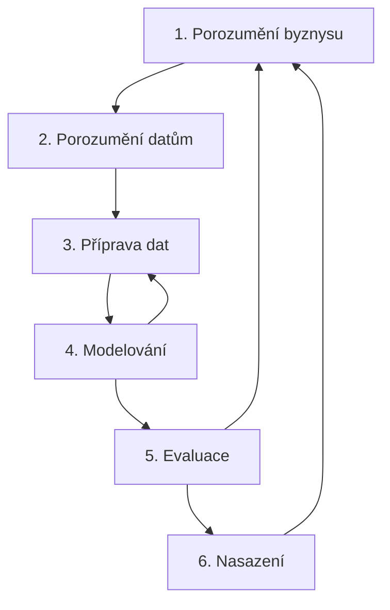

# Data mining

Data mining (dolování dat) je proces objevování vzorů, vztahů a znalostí ve velkých množstvích dat. Vychází z průniku statistiky, strojového učení a databázových systémů – nejde ale o samotné algoritmy, ale o **celý proces** od porozumění problému po nasazení modelu do praxe.

!!! abstract "Data mining vs. strojové učení"

    - **Data mining** je širší pojem – zahrnuje celou metodologii včetně přípravy dat, porozumění byznysu a vyhodnocení výsledků.
    - **Strojové učení** je podmnožina zaměřená na algoritmy, které se učí z dat – je to nástroj, který data mining používá.

## CRISP-DM

CRISP-DM (Cross-Industry Standard Process for Data Mining) je nejpoužívanější metodologie pro data miningové projekty. Definuje šest fází, které nejsou striktně sekvenční – v praxi se mezi nimi libovolně přechází podle potřeby.

!!! abstract "Šest fází CRISP-DM"

    1. **Porozumění byznysu** (*Business Understanding*): Definice cílů a požadavků z pohledu zadavatele. Co chceme zjistit? Jak bude výsledek použit? Převod byznys problému na technickou úlohu.
    2. **Porozumění datům** (*Data Understanding*): Sběr dat, jejich popis, explorace a ověření kvality. Zjišťujeme, co data obsahují, co jim chybí a zda vůbec umožňují odpovědět na byznys otázku.
    3. **Příprava dat** (*Data Preparation*): Nejnáročnější fáze (~60–80 % času projektu). Čištění (chybějící hodnoty, odlehlé hodnoty), transformace (normalizace, kódování), výběr a tvorba atributů (*feature engineering*), integrace z více zdrojů.
    4. **Modelování** (*Modeling*): Aplikace konkrétních algoritmů – klasifikace, regrese, shlukování, asociační pravidla. Typicky se testuje více modelů a ladí jejich hyperparametry.
    5. **Evaluace** (*Evaluation*): Ověření, zda model splňuje byznys cíle definované v první fázi, a zda je dostatečně kvalitní pro nasazení. Použití metrik jako přesnost, senzitivita, ROC křivka.
    6. **Nasazení** (*Deployment*): Integrace modelu do produkčního prostředí – report, dashboard, API, automatické rozhodování. Monitorování, jestli model v čase nedegraduje.

## Základní názvosloví

| Pojem | Význam | Příklad |
|:--|:--|:--|
| **Datová matice** | Tabulka, kde řádky reprezentují **objekty** (instance, případy) a sloupce **atributy** (proměnné, příznaky). | Tabulka klientů: každý řádek = klient, sloupce = věk, příjem, počet dětí, … |
| **Atribut (feature, příznak)** | Jedna charakteristika objektu. Může být numerický, kategoriální, binární, ordinální. | `věk = 34`, `pohlaví = "muž"` |
| **Prediktor** (nezávislá proměnná, $X$) | Atribut používaný jako vstup pro model – to, podle čeho predikujeme. | V modelu ceny bytu: plocha, lokalita, stav. |
| **Cílová proměnná** (závislá proměnná, $y$) | Atribut, který chceme predikovat nebo vysvětlit. U supervizovaných úloh je známá v trénovacích datech. | V modelu ceny bytu: `cena`. |
| **Trénovací data** | Data použitá k naučení modelu. | 80 % historických transakcí. |
| **Testovací data** | Data použitá k vyhodnocení modelu – model je nikdy neviděl během tréninku. | Zbylých 20 % transakcí. |
| **Label** | Známá hodnota cílové proměnné pro konkrétní instanci. | Pro klienta č. 42: `label = "odešel"`. |

## Typy data miningových úloh

Data miningové úlohy lze rozdělit podle toho, co je cílem analýzy a zda máme k dispozici označená data (labely).

!!! abstract "Přehled typů úloh"
    | Typ úlohy | Učení | Cíl | Příklad |
    |:--|:--|:--|:--|
    | **Klasifikace** | Supervizované | Přiřazení objektu do jedné z předem daných tříd. | Detekce spamu (spam/není spam), schválení úvěru. |
    | **Regrese** | Supervizované | Predikce numerické hodnoty. | Predikce ceny nemovitosti, odhad spotřeby. |
    | **Shlukování** (*Clustering*) | Nesupervizované | Rozdělení objektů do přirozených skupin bez předem daných tříd. | Segmentace zákazníků, detekce anomálií. |
    | **Asociační pravidla** | Nesupervizované | Objevení vztahů typu „pokud A, pak B". | Analýza nákupního košíku, doporučování. |
    | **Detekce anomálií** | Obě varianty | Identifikace neobvyklých, odlehlých objektů. | Detekce podvodu na kreditní kartě. |
    | **Sumarizace** | Nesupervizované | Popis dat pomocí statistik, vizualizací, reportů. | Report prodejů podle regionů. |

### Supervizované učení

Vstupem jsou data, kde známe **správnou odpověď** (cílovou proměnnou). Model se učí mapovat vstupní atributy na výstup a hledá funkci $f$, pro kterou platí $y \approx f(X)$. Cílem je dobře predikovat i na neviděných datech (generalizace).

- **Trénování**: Model iterativně upravuje své parametry, aby minimalizoval chybu na trénovacích datech.
- **Příklady**: Klasifikace (odhad třídy) a regrese (odhad číselné hodnoty).

### Nesupervizované učení

Vstupem jsou data **bez cílové proměnné**. Model hledá skryté struktury, vzory a seskupení v datech bez jakékoliv předchozí znalosti o tom, co má hledat.

- **Příklady**: Shlukování, asociační pravidla, redukce dimenzionality (PCA, t-SNE).
- **Výhoda**: Nepotřebuje označená data – ta jsou často drahá a časově náročná na získání.
- **Nevýhoda**: Výsledky se obtížněji vyhodnocují – neexistuje „správná odpověď", se kterou by se daly porovnat.

## Asociační algoritmy

Asociační algoritmy hledají **asociační pravidla** – implikace tvaru $X \to Y$, kde $X$ a $Y$ jsou disjunktní množiny položek. Typickým příkladem je **analýza nákupního košíku**: „kdo si koupil chleba a máslo, často koupil i mléko".

### Statistika implikací

Kvalitu asociačního pravidla $X \to Y$ měříme několika statistikami založenými na četnostech v transakčních datech:

!!! abstract "Klíčové statistiky asociačních pravidel"

    - **Podpora** (*Support*): Jak často se $X \cup Y$ vyskytuje v datech. Vysoká podpora = pravidlo se týká velké části transakcí.

    $$\text{support}(X \to Y) = \frac{|X \cup Y|}{N}$$

    - **Spolehlivost** (*Confidence*): Jak často, když se objeví $X$, se objeví i $Y$. Podmíněná pravděpodobnost $P(Y \mid X)$.

    $$\text{confidence}(X \to Y) = \frac{|X \cup Y|}{|X|} = \frac{\text{support}(X \cup Y)}{\text{support}(X)}$$

    - **Zdvih** (*Lift*): Kolikrát častěji se $X$ a $Y$ vyskytují spolu, než kdyby byly nezávislé. $> 1$ = pozitivní asociace, $=1$ = nezávislost, $< 1$ = negativní asociace.

    $$\text{lift}(X \to Y) = \frac{\text{support}(X \cup Y)}{\text{support}(X) \cdot \text{support}(Y)}$$

!!! example "Příklad výpočtu"
    Data: 100 transakcí. Chleba (CH) v 50, máslo (MA) ve 40, obojí ve 30.

    - $\text{support}(CH \to MA) = 30/100 = 0{,}3$
    - $\text{confidence}(CH \to MA) = 30/50 = 0{,}6$ – 60 % nákupů s chlebem obsahuje i máslo.
    - $\text{lift}(CH \to MA) = 0{,}3 / (0{,}5 \cdot 0{,}4) = 1{,}5$ – kombinace je 1,5× častější, než kdyby byly nezávislé.

### Apriori algoritmus

Apriori je klasický algoritmus pro dolování asociačních pravidel. Jeho klíčovou myšlenkou je **antimonotónní vlastnost** supportu: pokud je množina položek frekventovaná, pak všechny její podmnožiny jsou také frekventované. Ekvivalentně: pokud je množina nefrekventovaná, pak žádná její nadmnožina nemůže být frekventovaná.

!!! info "Frekventovaná množina"
    Frekventovaná množina (*frequent itemset*) je taková množina položek, jejíž **support** je vyšší než uživatelsky zadaný práh **min\_support**. Jen z frekventovaných množin lze generovat asociační pravidla – pravidlo z řídké množiny by bylo statisticky nespolehlivé.

!!! abstract "Postup Apriori algoritmu"

    1. **Generování kandidátů**: Pro $k = 1$ začni s jednoprvkovými množinami. Pro $k > 1$ generuj $k$-prvkové kandidáty z $(k-1)$-prvkových frekventovaných množin.
    2. **Pruning**: Odstraň kandidáty, jejichž libovolná $(k-1)$-prvková podmnožina není frekventovaná (antimonotónní vlastnost).
    3. **Počítání supportu**: Projdi všechna transakční data a spočítej support pro všechny kandidáty.
    4. **Filtrování**: Ponech jen kandidáty, jejichž support ≥ **min\_support**. To jsou frekventované množiny velikosti $k$.
    5. **Inkrementuj $k$** a opakuj, dokud existují frekventované množiny.
    6. **Generování pravidel**: Z frekventovaných množin vygeneruj všechna možná pravidla $X \to Y$ a ponech jen ta, jejichž confidence ≥ **min\_confidence**.

!!! example "Příklad výpočtu Apriori algoritmem"
    Mějme následující transakční data:

    | ID | Položky |
    |:--:|:--|
    | T100 | 1, 2, 3 |
    | T101 | 2, 4 |
    | T102 | 2, 3 |
    | T103 | 1, 2, 4 |
    | T104 | 1, 3 |
    | T105 | 2, 3 |
    | T106 | 1, 3 |
    | T107 | 1, 2, 3, 5 |
    | T108 | 1, 2, 3 |

    **Krok 1 – jednoprvkové množiny:**
    
    | Položka | Support |
    |:--:|:--:|
    | 1 | 6 |
    | 2 | 7 |
    | 3 | 6 |
    | 4 | 2 |
    | 5 | 2 |

    **Krok 2 – dvouprvkové kandidáty:**
    
    | Množina | Support |
    |:--:|:--:|
    | {1, 2} | 4 |
    | {1, 3} | 4 |
    | {1, 4} | 1 |
    | {1, 5} | 2 |
    | {2, 3} | 4 |
    | {2, 4} | 2 |
    | {2, 5} | 2 |
    | {3, 4} | 0 |
    | {3, 5} | 1 |
    | {4, 5} | 0 |

    Pokud `min_support = 3`, frekventované dvouprvkové množiny jsou $\{1,2\}, \{1,3\}, \{2,3\}$.

    **Krok 3 – tříprvkové kandidáty:** Z frekventovaných $\{1,2\}, \{1,3\}, \{2,3\}$ složíme $\{1,2,3\}$:

    - Support $\{1,2,3\} = 3$ → frekventovaná.

    **Krok 4 – generování pravidel** z $\{1,2,3\}$ s `min_confidence = 0,6`:

    - $\{1,2\} \to \{3\}$: confidence = $3/4 = 0{,}75$ ✅
    - $\{1,3\} \to \{2\}$: confidence = $3/4 = 0{,}75$ ✅
    - $\{2,3\} \to \{1\}$: confidence = $3/4 = 0{,}75$ ✅

## Seskupovací (shlukovací) algoritmy

Shlukování (*clustering*) je nesupervizovaná technika, která rozděluje objekty do skupin (**shluků**) tak, aby si objekty uvnitř shluku byly co nejpodobnější a objekty z různých shluků co nejodlišnější.

!!! abstract "Typické využití shlukování"

    - **Segmentace zákazníků** – rozdělení klientů podle nákupního chování pro cílený marketing.
    - **Detekce anomálií** – objekty, které nepatří do žádného shluku, mohou být podezřelé (podvody, chyby).
    - **Komprese obrazu** – redukce barevné palety na $k$ dominantních barev.
    - **Doporučovací systémy** – hledání podobných uživatelů nebo produktů.
    - **Předzpracování** – shlukování jako mezistupeň před klasifikací.

### Typy shlukovacích úloh

| Typ | Popis | Příklad algoritmu |
|:--|:--|:--|
| **Rozdělovací** (*Partitional*) | Rozdělí data do $k$ shluků, každý objekt patří právě do jednoho. Počet shluků je dán předem. | K-means, K-medoids |
| **Hierarchické** | Vytváří stromovou strukturu (dendrogram) – buď aglomerativní (spojování) nebo divizivní (rozdělování). | AGNES, DIANA |
| **Hustotní** (*Density-based*) | Shluky tvoří oblasti s vysokou hustotou bodů, oddělené řídkými oblastmi. Nevyžaduje počet shluků. | DBSCAN, OPTICS |
| **Grid-based** | Rozdělí prostor na mřížku a shlukuje buňky. Rychlé, nezávislé na počtu bodů. | STING, CLIQUE |
| **Model-based** | Předpokládá, že data pocházejí z určitého statistického rozdělení. | Gaussian Mixture Models |

### Standardizace atributů

Atributy často pocházejí z různých škál – např. `věk` (0–100), `příjem` (0–1 000 000). Bez standardizace by atribut s větším rozsahem dominoval měření podobnosti.

| Metoda | Vzorec | Výsledek | Kdy použít |
|:--|:--|:--|:--|
| **Min-max normalizace** | $x' = \frac{x - \min}{\max - \min}$ | Hodnoty v intervalu $[0, 1]$. | Když známe rozsah a chceme zachovat relativní vzdálenosti. |
| **Z-score standardizace** | $x' = \frac{x - \mu}{\sigma}$ | Průměr 0, směrodatná odchylka 1. | Když data obsahují odlehlé hodnoty (z-score je vůči nim odolnější než min-max). |
| **Max-abs** | $x' = \frac{x}{\max\|x\|}$ | Hodnoty v intervalu $[-1, 1]$. | Pro řídká data (zachovává nuly). |

### Hodnocení podobnosti objektů

Abychom mohli shlukovat, musíme definovat **jak měřit podobnost** mezi objekty. Volba metriky zásadně ovlivňuje výsledné shluky.

!!! abstract "Nejpoužívanější metriky vzdálenosti"

    - **Euklidovská vzdálenost**: Nejkratší vzdálenost „vzdušnou čarou". Citlivá na rozdílná měřítka – vyžaduje standardizaci.

    $$d(p, q) = \sqrt{\sum_{i=1}^{n} (p_i - q_i)^2}$$

    - **Manhattanská vzdálenost** (*city block*): Součet absolutních rozdílů podél os. Méně citlivá na odlehlé hodnoty.

    $$d(p, q) = \sum_{i=1}^{n} |p_i - q_i|$$

    - **Kosinová podobnost**: Měří úhel mezi vektory, ne jejich velikost. Vhodná pro textové dokumenty (TF-IDF), kde záleží na směru, ne na délce.

    $$\cos(\theta) = \frac{p \cdot q}{\|p\| \cdot \|q\|}$$

    - **Jaccardův index**: Podobnost dvou množin – vhodný pro binární data.

    $$J(A, B) = \frac{|A \cap B|}{|A \cup B|}$$

## Klasifikační algoritmy

Klasifikace je supervizovaná úloha, kde modelem predikujeme **kategoriální cílovou proměnnou** na základě vstupních atributů. Model se učí z historických dat, kde známe správné třídy – hledá vzory, které odlišují jednotlivé kategorie, a ty pak aplikuje na nová, neoznačená data.

### Rozhodovací stromy

Rozhodovací strom je jeden z nejintuitivnějších klasifikačních modelů – reprezentuje rozhodovací logiku jako **strom pravidel** if-then. Každý vnitřní uzel testuje hodnotu atributu, každá větev odpovídá výsledku testu a každý list reprezentuje třídu.

!!! abstract "Jak se strom staví"

    1. Začni se všemi daty v kořeni.
    2. Najdi atribut, který **nejlépe rozdělí data** podle cílové třídy (podle metriky jako *Information Gain*, *Gini index*, *Chi-square*).
    3. Rozděl data podle hodnoty vybraného atributu – vzniknou větve.
    4. Rekurzivně opakuj pro každou větev, dokud nejsou data v uzlu čistá (jedna třída) nebo nedojde k jinému zastavovacímu kritériu (max hloubka, min počet instancí).
    5. Prořež strom (*pruning*) – odstraň větve, které přispívají k přeučení.

!!! info "Metriky pro výběr atributu při dělení"

    - **Entropie + Information Gain** (ID3, C4.5): Míra neuspořádanosti – čím nižší entropie po rozdělení, tím lepší atribut. Information Gain = redukce entropie.
    - **Gini index** (CART): Pravděpodobnost, že náhodně vybraný prvek bude špatně klasifikován. Nižší = lepší dělení.
    - **Chi-square** (CHAID): Statistický test nezávislosti – měří, jak moc se pozorované četnosti odlišují od očekávaných.

!!! example "Typy rozhodovacích stromů"
    | Algoritmus | Dělicí kritérium | Typ stromu | Počet větví z uzlu |
    |:--|:--|:--|:--:|
    | **ID3** | Information Gain | Klasifikační, kategoriální atributy | Libovolný (podle hodnot) |
    | **C4.5** (J48) | Gain Ratio | Klasifikační, numerické i kategoriální | Libovolný |
    | **CART** | Gini index | Klasifikační i regresní | Vždy binární (2 větve) |
    | **CHAID** | Chi-square test | Klasifikační, kategoriální | Libovolný – slučuje nevýznamné kategorie |

### CHAID

CHAID (Chi-squared Automatic Interaction Detection) je algoritmus pro stavbu rozhodovacích stromů, který se od ostatních liší v tom, jak vybírá atribut a jak určuje počet větví.

!!! abstract "Jak CHAID funguje"

    1. Pro každý atribut spočítá **chi-kvadrát test nezávislosti** mezi atributem a cílovou proměnnou. Tím určí $p$-hodnotu.
    2. Atribut s **nejnižší $p$-hodnotou** (nejvýznamnější závislost) je vybrán pro rozdělení.
    3. Kategorie atributu, které se vůči cílové proměnné chovají podobně, CHAID **sloučí** do jedné větve – tím vzniká proměnlivý počet větví z uzlu.
    4. Rekurzivně se opakuje pro každou větev zvlášť.

- **Výhody**: Přirozeně zpracovává kategoriální data, statisticky podložené rozhodování, slučování kategorií zabraňuje fragmentaci.
- **Nevýhody**: Vyžaduje dostatek dat pro spolehlivý chi-kvadrát test, numerické atributy se musí diskretizovat (rozdělit do intervalů).

### Algoritmická rozšíření rozhodovacích stromů

Samotné rozhodovací stromy trpí **přeučením** (*overfitting*) a vysokou variancí – malá změna dat může vést k úplně jinému stromu. Proto se používají souborové (*ensemble*) metody:

| Metoda | Princip | Výhody | Nevýhody |
|:--|:--|:--|:--|
| **Random Forest** | Natrénuje mnoho stromů, každý na jiné náhodné podmnožině dat a atributů. Výsledek = většinové hlasování. | Vysoká přesnost, odolný proti přeučení, implicitní výběr atributů. | Pomalejší predikce, méně interpretovatelný. |
| **Gradient Boosting** (XGBoost, LightGBM) | Postupně trénuje stromy, kde každý další opravuje chyby předchozího. | Extrémně přesný, vítěz soutěží na Kaggle. | Sklon k přeučení, citlivý na hyperparametry. |
| **AdaBoost** | Každý další strom dává větší váhu vzorkům, které předchozí stromy klasifikovaly špatně. | Jednoduchý, zlepšuje slabé klasifikátory. | Citlivý na šum a odlehlé hodnoty. |

### Evaluace klasifikačních modelů

Po natrénování modelu je potřeba změřit, jak dobře funguje. Pouhé procento správnosti (**accuracy**) nestačí – zvlášť u nevyvážených tříd (např. 1 % podvodných transakcí; model, který vždy řekne „není podvod", má accuracy 99 %, ale je k ničemu).

#### Matice záměn (Confusion Matrix)

Matice záměn porovnává skutečné třídy s predikovanými třídami. Pro binární klasifikaci:

|  | Predikováno: Pozitivní | Predikováno: Negativní |
|:--|:--:|:--:|
| **Skutečnost: Pozitivní** | TP (*True Positive*) ✅ | FN (*False Negative*) ❌ |
| **Skutečnost: Negativní** | FP (*False Positive*) ❌ | TN (*True Negative*) ✅ |

!!! info "Metriky odvozené z matice záměn"

    - **Přesnost** (*Accuracy*): $\frac{TP + TN}{TP + TN + FP + FN}$ – podíl správně klasifikovaných.
    - **Senzitivita** (*Recall, True Positive Rate*): $\frac{TP}{TP + FN}$ – kolik skutečně pozitivních model našel.
    - **Specifičnost** (*True Negative Rate*): $\frac{TN}{TN + FP}$ – kolik skutečně negativních model správně označil.
    - **Preciznost** (*Precision*): $\frac{TP}{TP + FP}$ – jak moc můžeme věřit, že pozitivní predikce je opravdu pozitivní.
    - **$F_1$-skóre**: Harmonický průměr precision a recall: $F_1 = 2 \cdot \frac{\text{precision} \cdot \text{recall}}{\text{precision} + \text{recall}}$

!!! example "Kdy použít kterou metriku"

    - **Detekce rakoviny**: Maximalizujeme **senzitivitu** – raději falešný poplach než přehlédnutý nádor.
    - **Detekce spamu**: Maximalizujeme **preciznost** – raději pár spamů v inboxu než důležitý e-mail ve spamu.
    - **Nevyvážené třídy**: **$F_1$-skóre** místo accuracy.

#### Graf senzitivity a specifičnosti

Graf zobrazuje vztah mezi senzitivitou a specifičností pro různé hodnoty klasifikačního prahu. Při posouvání prahu se mění poměr mezi TP a FP – graf ukazuje, jak zvýšení senzitivity snižuje specifičnost a naopak. **Optimální práh** je v bodě, kde se obě křivky protínají, nebo podle byznys požadavků (např. senzitivita nesmí klesnout pod 95 %).

#### ROC křivka

ROC křivka (Receiver Operating Characteristic) zobrazuje poměr **True Positive Rate** (senzitivita) proti **False Positive Rate** ($1 - \text{specifičnost}$) pro různé klasifikační prahy.

- **Plocha pod křivkou** (*AUC – Area Under Curve*) shrnuje kvalitu modelu jednou hodnotou:
    - $AUC = 1{,}0$ – dokonalý model (vše správně).
    - $AUC = 0{,}5$ – náhodné hádání (model je k ničemu).
    - $AUC < 0{,}5$ – model je horší než náhoda (predikuje opačně).
- **Výhoda ROC**: Je nezávislá na poměru tříd – vhodná pro nevyvážené datasety.

!!! example "Interpretace ROC křivky"
    Čím více je křivka „přitisknutá" k levému hornímu rohu, tím lepší model. Dva modely lze porovnat vizuálně – model s větší AUC je lepší. ROC křivka umožňuje vybrat optimální klasifikační práh podle požadovaného poměru TP/FP.
