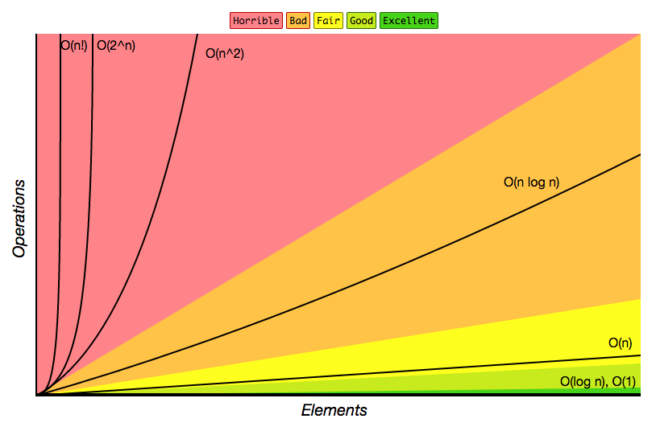

# Teorie algoritmů a složitosti

!!! warning "Tento článek je dočasný"
    Poté, co si splním zkoušku, tak to rozsekám do gramatik, teorie složitosti a dalších sekcí.

## 1. Konečný automat - definice, jazyky rozpoznatelné konečným automatem. Deterministický a nedeterministický KA
Automat slouží k rozpoznávání formálního jazyka. Jazyk je automatem rozpoznatelný, pokud ho vstupní slova dostanou do konečného stavu. Množina všech slov, které automat umí rozpoznat, tvoří jazyk. Naopak, jazyk je rozpoznatelný konečným automatem, pokud lze sestrojit takový konečný automat, který rozezná všechna jeho slova. Konečný automat rozpoznává regulární jazyky.

!!! abstract "Formální definice konečného automatu"
    Konečný automat je uspořádaná pětice $A(Q, \Sigma, \delta, q_0, F)$, kde

    - $Q$ je konečná množina stavů
    - $\Sigma$ je konečná množina symbolů
    - $\delta$ je přechodová funkce
    - $q_0$ je počáteční stav
    - $F$ je konečná množina koncových stavů

Deterministický konečný automat má jeden počáteční stav a vždy přechází do jednoho stavu. Nedeterministický automat může mít počátečních stavů víc a přechodová funkce zobrazuje stav do potenční množiny - takže do množiny všech podmnožin. Jinak řečeno, přechod z jednoho stavu může vést do více stavů.

## 2. Zásobníkový automat - definice, jazyky rozpoznatelné zásobníkovým automatem.
Zásobníkový automat je rozšíření konečného automatu, který má k dispozici nekonečný zásobník.

Problémem regulárních jazyků, které rozpoznává konečný automat, je fakt, že nemá žádnou formu paměti a uchovává si pouze aktuální stav. To dělá problém v situaci, kdy na pravé straně přepisovacího pravidla není terminál, ale pouze neterminály. U regulární gramatiky to není možné, protože na pravé straně musí být vždycky alespoň jeden terminál. U bezkontextové je ale pravá strana libovolný řetězec symbolů z úzávěru sjednocení terminálů a neterminálů.

Přidaný zásobník vytváří novou formu vstupu. Automat čte kromě vstupního slova také stav zásobníku, a může si do zásobníku zapsat symbol. Může se tak do jisté míry nekonečně vracet a zpracovávat nekonečně dlouhé slovo neustálým zapisováním a čtením zásobníku. U zásobníkového automatu může konečný stav nastat tím, že dojde do koncového stavu, nebo že bude na konci čtení zásobník prázdný.

## 3. Gramatiky - definice, chomského hiearchie jazyků.
Gramatika je soubor symbolů a přepisovacích pravidel. která říká, jak můžeme vytvořit slova jazyka z určitého počátečního symbolu. Přepisovací pravidla definují, jak ze symbolu či symbolů udělat nové.

!!! abstract "Formální definice gramatiky"
    Gramatika je čtveřice $G(N, T, P, S)$, kde
    
    - $N$ je množina pomocných symbolů (neterminálů)
    - $T$ je množina konečných symbolů (terminálů)
    - $P$ je množina přepisovacích pravidel
    - $S$ je počáteční symbol

!!! note "Počáteční symboly"
    - Počáteční symbol $S$ musí být z množiny neterminálů ($S \in N$)
    - Počáteční symbol $S$ se nesmí vyskytovat na žádné pravé straně přepisovacího pravidla

Chomského hierarchie je hierarchie tříd formálních gramatik generujících formální jazyky. 

!!! info "Rozdělení gramatik"
    - G3 (Regulární gramatiky) mají v přepisovacích pravidlech¨
        - __na levé straně přesně jeden neterminál a na pravé jeden neterminál s terminálem__ 
        - G3 je regulární, pokud je na pravé straně terminál z množiny terminálů
        - G3 je lineární, pokud je na pravé straně terminál z uzávěru množiny terminálů.
    - G2 (Bezkontextové gramatiky) mají v přepisovacích pravidlech
        - __na levé straně přesně jeden neterminál a na pravé straně řetězec terminálů a neterminálů__
    - G1 (Kontextové gramatiky) mají v přepisovacích pravidlech
        - __na levé straně alespoň jeden neterminál a na pravé straně řetězec terminálů a neterminálů__
    - G0 (Neomezené gramatiky) nemají omezení na přepisovací pravidla.

## 4. Algoritmus - definice a vlastnosti
Algoritmus je konečný sled instrukcí, které slouží k řešení nějakého problému. Algoritmy musí být:

- __Elementární__ - musí obsahovat jednoduché kroky
- __Konečný__ - je jasné, kdy a jak algoritmus skončí
- __Korektní__ - musí dávat správné výsledky
- __Jednoznačný__ - musí pro stejná data pokaždé dávat stejné výsledky

## 5. Turingův stroj - definice, vlastnosti, varianty, problém zastavení turingova stroje a základní princip.
Turingův stroj je teoretický model počítače, který se používá pro modelování algoritmů. Turingova teze říká, že ke každému algoritmu existuje ekvivalentní TS (mohou ale existovat algoritmicky nerozhodnutelné problémy). Turingův stroj je forma konečného automatu, který čte a zapisuje na nekonečnou pásku v obou směrech. Počáteční stav nesmí být shodný s koncovým stavem.

Varianty Turingova stroje:

- Nekonečná jenom směrem doprava (pravostranně nekonečný)
- Lineárně ohraničený
- Vícepáskový (má vstupní, výstupní a pracovní pásky)
- Vícehlavový
- TS s lineární páskou či páskami
- TS s nelineární páskou či páskami

!!! bug "Problém zastavení"
    Problém zastavení Turingova stroje je algoritmicky nerozhodnutelný problém, který říká, že neexistuje obecný algoritmus, který by pro všechny vstupy všech programů dokázal určit, jestli se program zastaví, nebo poběží navždy.

    Princip problému zastavení:
    
    - Řekněme, že problém zastavení lze rozhodnout.
        - Vytvořme program `halt(p, x)`, který
            - vrací `true` když program zastaví
            - a `false` když se program zacyklí a poběží do nekonečna
    - Vytvořme program `paradox(p)`, který volá `halt(p, p)` a provede přesný opak výsledku.
        - pokud to volání vrátí `true`, naschvál se zacyklí.
        - pokud to volání vrátí `false`, ihned skončí.
    - Co je výsledkem programu `paradox(paradox)` ?
        - Volání `paradox(paradox)` uvnitř volá `halt(paradox, paradox)`
        - Pokud `halt(paradox, paradox)` vrátí `true`, pak se `Paradox(Paradox)` zacyklí
        - Pokud `halt(paradox, paradox)` vrátí `false`, pak `Paradox(Paradox)` ihned skončí
        - V obou případech se provede přesně to, co není výsledkem programu `halt`
            - `halt` říká, že program skončí, ale on se zacyklí, a naopak.
            - __Vznikl logický spor__, a tudíž náš předpoklad, že problém zastavená lze rozhodnout, byl špatný. 

## 6. Požadavky na obecný výpočetní systém, turingovsky úplný jazyk. Příklady turingovsky úplných a neúplných jazyků.
Obecný výpočetní systém je takový formální model, který může provádět libovolný algoritmus, tedy popsat jakýkoli výpočet, který je algoritmicky definovatelný (ekvivalentní Turingovu stroji). Toto odpovídá myšlence tzv. Turingovy úplnosti, kdy storj má stejnou výpočetní sílu jako Turingův stroj. Turingovsky úplný jazyk je takový jazyk, který je schopen vyjádřit všechny algoritmicky vypočitatelné funkce. Jazyky z G0 gramatik jsou turingovsky úplné.

## 7. Časová a paměťová složitosti algoritmu, princip stanovení asymptotické složitosti, definice. Přechod od složitosti algoritmu ke složitosti problému
Časová složitosti algoritmu udává vztah mezi velikostí vstupních dat a časem potřebným pro výpočet. Obdobně paměťová složitost určuje, kolik paměti potřebuje algoritmus vzhledem k velikosti vstupu. Asymptotická složitost je vyjádření složitosti pomocí tříd, které popisují, jak bude s rostoucí velikostí vstupu růst i složitost.

## 8. Běžné třídy složitosti, příklady složitosti a typických probémů v těchto třídách

## 9. P a NP problémy - příklady, rozhodovací a optimalizační formulace.

## 10. Problém dvou lupičů, problém batohu, problém obchodnáho cestujícího.

## 11. Dynamické programování - obecný princip a příklady.

## 12. Hladové (greedy) algoritmy, obecný princip, příklady.

## 13. Uložení reálných čísel, zaokrouhlovací chyba a diskretizační chyba. Numerická nestabilita.

## 14. Kvantové počítače - základní principy.