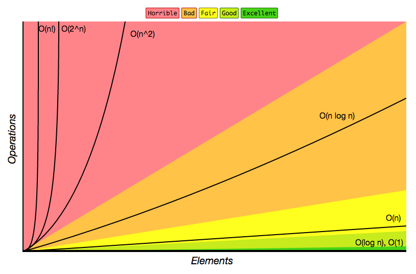
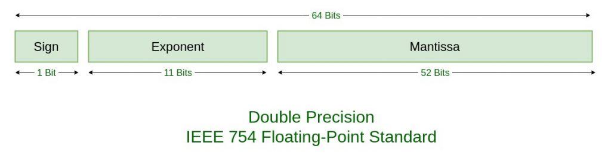

# Teorie algoritmů a složitosti

## 4. Algoritmus - definice a vlastnosti
Algoritmus je konečný sled instrukcí, které slouží k řešení nějakého problému. Algoritmy musí být:

- __Elementární__ - musí obsahovat jednoduché kroky
- __Konečný__ - je jasné, kdy a jak algoritmus skončí
- __Korektní__ - musí dávat správné výsledky
- __Jednoznačný__ - musí pro stejná data pokaždé dávat stejné výsledky

## 6. Požadavky na obecný výpočetní systém, turingovsky úplný jazyk. Příklady turingovsky úplných a neúplných jazyků.
Obecný výpočetní systém je takový formální model, který může provádět libovolný algoritmus, tedy popsat jakýkoli výpočet, který je algoritmicky definovatelný (ekvivalentní Turingovu stroji). Toto odpovídá myšlence tzv. Turingovy úplnosti, kdy storj má stejnou výpočetní sílu jako Turingův stroj. Turingovsky úplný jazyk je takový jazyk, který je schopen vyjádřit všechny algoritmicky vypočitatelné funkce. Jazyky z G0 gramatik jsou turingovsky úplné.

## 7. Časová a paměťová složitosti algoritmu, princip stanovení asymptotické složitosti, definice. Přechod od složitosti algoritmu ke složitosti problému
Časová složitosti algoritmu udává vztah mezi velikostí vstupních dat a časem potřebným pro výpočet. Obdobně paměťová složitost určuje, kolik paměti potřebuje algoritmus vzhledem k velikosti vstupu. Asymptotická složitost je vyjádření složitosti pomocí tříd, které popisují, jak bude s rostoucí velikostí vstupu růst i složitost algoritmu.

## 8. Běžné třídy složitosti, příklady složitosti a typických probémů v těchto třídách

!!! abstract "Třída složitosti"
    Třída složitosti je množina problémů, které mohou být vyřešeny strojem $M$ za použití $O(f(n))$ zdrojů R, kde $n$ je velikost vstupu.

|Třída|V|
|:--:|:--:|
|$DTIME(t(n))$|Množina problémů řešitelných __časově deterministickým__ turingovým strojem v $O(t(n))$|
|$NTIME(t(n))$|Množina problémů řešitelných __časově nedeterministickým__ turingovým strojem v $O(t(n))$|
|$DSPACE(s(n))$|Množina problémů řešitelných __prostorově deterministickým__ turingovým strojem v $O(s(n))$|
|$NSPACE(s(n))$|Množina problémů řešitelných __prostorově nedeterministickým__ turingovým strojem v $O(s(n))$|

!!! info "Časová komplexita"
    - __Třída P__ obsahuje problémy, které jsou řešeny deterministickými Turingovi stroji v polynomiálním čase a za použití neomezeného množství paměti.
        - Djikstra, řazení, Euklidův algoritmus
    - __Třída NP__ obsahuje problémy, které jsou řešeny nedeterministickými Turingovi stroji v polynomiálním čase. Výpočet může větvit do $n$ cest, a když jedna z cest uspěje při ověřením deterministickým Turingovým strojem, známe řešení.
        - Problém obchodního cestujícího, barvení grafu
    - __Třída EXP__ obsahuje problémy, které jsou řešeny deterministickým turingovským strojem v exponenciálním čase.
    - __Třída NEXP__ obsahuje problémy, které jsou řešeny nedeterministickým turingovským strojem v exponenciálním čase.

!!! info "Prostorová komplexita"
    - __Třída L__ obsahuje problémy, které jsou řešeny v logaritmickém prostoru pomocí deterministického turingova stroje.
        - Dosažitelnost v neorientovaném grafu
    - __Třída NL__ obsahuje problémy, které jsou řešeny v logaritmickém prostoru pomocí nedeterministického turingova stroje.
    - Obdobně existují analogie pro P, NP, EXP a NEXP
        - Problém dosažitelnosti v orientovaném grafu

$$\begin{aligned}
    P \subseteq NP \subseteq PSPACE \subseteq EXPTIME \subseteq EXPSPACE
\end{aligned}$$

## 9. P a NP problémy - příklady, rozhodovací a optimalizační formulace.
Rozhodovací úloha (decision problem) je taková, kde se má pro danou instanci odpovědět pouze ANO/NE. Optimalizační úloha naopak vyžaduje najít nejlepší možnou strukturu podle zadaného kritéria (např. nejkratší nebo nejmenší řešení). Obecně platí, že ke každé optimalizační úloze lze formulovat ekvivalentní rozhodovací verzi (např. “Existuje řešení s hodnotou nejméně či nejvýše k?”).

__P problémy__

- Regulární matice (invertibilita)
- Nejkratší cesta v ohodnoceném grafu
- Rozhodnutí prvočíselnosti

__NP problémy__

- Hamiltonovská kružnice
- Problém součtu podmnožiny

## 10. Problém dvou lupičů, problém batohu, problém obchodního cestujícího.

!!! info "Problém dvou lupičů"
    Máme množinu předmětů s hodnotami. Dva lupiči si chtějí kořist rozdělit tak, aby měli stejnou (nebo co nejpodobnější) hodnotu.

    - __Rozhodovací formulace__: Existuje rozdělení množiny na dvě disjunktní podmnožiny tak, aby součet hodnot v obou byl stejný?
    - __Optimalizační formulace__: Rozděl množinu na dvě části tak, aby byl rozdíl součtů minimální.

!!! info "Problém batohu"
    Máme batoh s omezenou kapacitou a předměty. Každý má váhu a hodnotu. Cílem je zabalit co nejhodnotnější kombinaci.
    
    - __Rozhodovací formulace__: Existuje výběr předmětů s celkovou váhou ≤ W a celkovou hodnotou ≥ K?
    - __Optimalizační formulace__: Najdi výběr předmětů s maximální hodnotou, jehož váha nepřekročí W.

!!! info "Problém obchodního cestujícího"
    Obchodník musí navštívit každé město právě jednou, vrátit se zpět a minimalizovat délku cesty.

    - __Rozhodovací formulace__: Existuje okružní cesta, která navštíví všechna města a má délku ≤ K?
    - __Optimalizační formulace__: Najdi nejkratší možnou okružní cestu, která projde všemi městy právě jednou.

## 11. Dynamické programování - obecný princip a příklady.
Dynamické programování (DP) je silná algoritmická technika, která umožňuje řešit komplexní úlohy efektivněji než jednoduchá rekurze nebo brute‑force. Podstatou je využití paměti k ukládání výsledků dílčích výpočtů, aby se ten samý výpočet neprováděl vícekrát. 

Problém lze rozdělit na podproblémy, které se opakují vícekrát při rekurzivním řešení. Pokud bychom takové podproblémy řešili znovu a znovu stejným způsobem (např. v jednoduché rekurzi), platili bychom za to vysokou cenou ve výpočetním čase. DP to řeší tak, že jednou vypočtený výsledek uloží a později ho znovu použije. Optimální podstruktura znamená, že optimální řešení celku lze získat z optimálních řešení jeho dílčích částí. To znamená, že když známe optimální řešení menších instancí problému, můžeme je zkombinovat, abychom získali optimální řešení celé úlohy.

Dynamické programování spočívá v následujících krocích:

1. Rozlož problém na podproblémy — najdi rekurenční vztah mezi větším problémem a jeho dílčími případy.
2. Urči, zda existuje optimální podstruktura — můžeš složit nejlepší řešení z dílčích řešení?
3. Ověř, zda se podproblémy překrývají — opakují se stejné instancí znovu a znovu?
4. Ulož výsledky — do tabulky nebo cache (např. pole, mapa), aby se již vypočtené výsledky znovu nepřepočítávaly.
5. Kombinuj výsledky — z výsledků dílčích podproblémů sestav finální odpověď.

!!! info "Top-Down (Memoizace)"
    Rekurzivní řešení, ale před výpočtem si zkontroluješ, jestli už výsledek podproblému nemáš uložený.
    Výhoda: přirozené formulace, ale někdy náročnější na paměť.

!!! info "Bottom-Up (Tabulace)"
    Iterativní přístup, kde postupně vyplňuješ tabulku výsledků od nejmenších podproblémů až k výsledku celku.

## 12. Hladové (greedy) algoritmy, obecný princip, příklady.
Hladový algoritmus je metoda řešení optimalizačních úloh, která v každém kroku vybírá aktuálně nejlepší lokální možnost, s vírou (nebo nadějí), že tyto lokální volby povedou k globálně optimálnímu řešení celého problému. Na rozdíl od dynamického programování nepamatuje celou historii úvah ani se nevrací zpět, když zjistí, že udělal chybu — prostě vždy pokračuje vpřed podle jednoduchého pravidla výběru.

!!! abstract "Jak fungují greedy algoritmy?"
    Greedy algoritmy fungují podle tohoto jednoduchého postupu:

    1. Na začátku máš vstupní množinu dat nebo stav.
    2. Vyhodnotíš všechny aktuální možnosti.
    3. Vybereš tu nejlepší volbu podle nějakého kritéria (např. největší zisk, nejmenší náklad).
    4. Přidáš tuto volbu do řešení a přesuneš se do dalšího kroku.
    5. Opakuješ, dokud nemáš hotové řešení nebo nelze dělat další volby. 

!!! success "Kdy greedy algoritmy fungují?"
    Greedy strategie je úspěšná jen pokud problém splňuje dvě vlastnosti:

    1. __Greedy Choice Property__ - Lokálně nejlepší volba vede k řešení, které je i globálně nejlepší (optimální).
    2. __Optimal Substructure__ - Optimální řešení se skládá z optimálních řešení menších podproblémů.

    Funguje to například pro Dijkstrův algoritmus, hledání minimální kostry grafu nebo třeba huffmanovo kódování.

!!! failure "Kdy greedy algoritmy nefungují?"
    Greedy není obecně univerzální algoritmus — pro některé problémy může vést k neoptimálním řešením, protože dělá rozhodnutí pouze na základě současného stavu bez uvážení budoucích možností. Například:

    1. __0/1 problém batohu__ - pokud zvolíš položky s nejlepším poměrem hodnoty ku váze, nemusí to dát celkově nejlepší výsledek.
    2. __Problém obchodního cestujícího__ - greedy heuristika (navštiv nejbližší město) často nedá nejlepší okružní cestu.

## 13. Uložení reálných čísel, zaokrouhlovací chyba a diskretizační chyba. Numerická nestabilita.
Reálná čísla se v počítačích ukládají podle standardu IEEE-754. Reálné číslo se skládá ze tří částí:

- Znaménko
- Exponent
- Mantisa

!!! example "Reprezentace reálného čísla podle IEEE-754"
    $$\begin{aligned}
        \pm\ \text{mantisa} \cdot 2^{\text{exponent}}
    \end{aligned}$$

!!! quote "Rozdělení v paměti pro 64bitový systém"
    

!!! failure "Zaokrouhlovací chyba"
    Všechna reálná čísla uložit nelze, protože jich je nekonečně mnoho. Paměť a počet bitů je ovšem konečný. Čísla se tak ukládají jako jejich nejbližší reprezentace. V důsledku toho vzniká zaokrouhlovací chyba, neboli rozdíl mezi přesným výsledkem a reprezentací v paměti.

!!! failure "Diskretizační chyba"
    Diskretizační chyba je typ chyby vznikající při nahrazování spojitých veličin (např. derivací) diskrétními hodnotami, nejčastěji při numerickém řešení rovnic nebo modelování na počítači. Jinak řečeno, je to chyba vzniklá aproximací spojitého světa na konečnou sadu bodů nebo hodnot.

!!! warning "Numerická nestabilita"
    Algoritmus je numericky nestabilní, pokud akumulující se chyby v jednotlivých krocích mají výrazný dopad na přesnost řešení. U stabilních metod roste chyba s počtem kroků nejvýše lineárně.

## 14. Kvantové počítače - základní principy.
Kvantový počítač je výpočetní zařízení, které využívá zákony kvantové mechaniky místo klasické logiky bitů. Tradiční počítače používají bity (0 nebo 1), zatímco kvantové počítače používají qubity (quantum bits), které mohou být v superpozici stavů. Tato odlišnost je základem jejich výpočetní výhody pro určité úlohy.

!!! note "Stav qubitu"
    Qubit může být 0 i 1 současně v určité kombinaci. Teprve při měření qubit „kolabuje“ do jednoho z klasických stavů (0 nebo 1).

!!! info "Entanglement"
    Entanglement je jev, kdy jsou dva nebo více qubitů propojené tak, že stav jednoho je okamžitě závislý na stavu druhého, i když jsou od sebe vzdálené. To znamená, že pokud změříš jeden z entanglovaných qubitů, informace o tom ovlivní i druhý — jejich stavy jsou silně korelované. Tato vlastnost umožňuje kvantovým algoritmům vytvářet komplexní korelace mezi qubity a provádět výpočty, které by byly pro klasický počítač extrémně náročné.

!!! info "Interference"
    Kvantové stavy se chovají jako vlny. Při výpočtech lze měnit fázi qubitů tak, že se mohou zesilovat nebo rušit:
    
    - Konstruktivní interference – zesiluje pravděpodobnost správných výsledků.
    - Destruktivní interference – potlačuje pravděpodobnost chybných výsledků

Kvantové výpočty se provádějí pomocí kvantových bran, což jsou operace, které mění stav qubitů. Hadamardova brána vytvoří superpozici. CNOT brána — vytváří entanglement mezi qubity. Kvantový program je posloupnost těchto bran, kterou lze vizualizovat jako kvantový obvod, podobně jako klasický logický obvod, ale s efekty superpozice a interferencí.

!!! abstract "Princip kvantového algoritmu"
    1. Vyresetuj všechny qubity na 0
    2. Aplikuj brány a sestav obvod
    3. Změr qubity - dostaneš řetězec bitů

Díky superpozici a entanglementu může kvantový počítač pracovat paralelně s velkým množstvím stavů současně — což umožňuje u některých úloh dosáhnout exponenciálního zrychlení oproti klasickým algoritmům. Kvantové počítače jsou ale extrémně citlivé na okolní vlivy, což vede k fenoménu dekoherence — ztrátě kvantových vlastností vlivem prostředí.