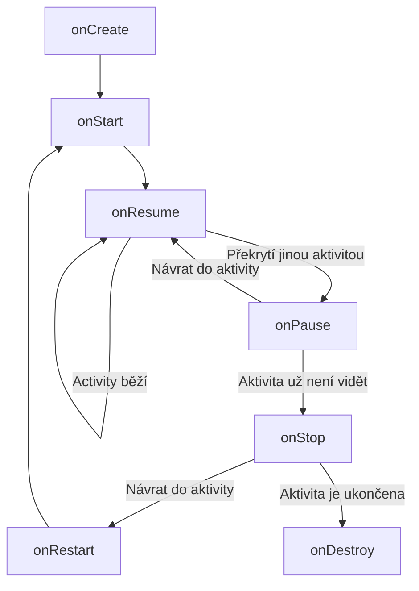

# Android

Android je mobilní operační systém založený na linuxovém jádře, vyvíjený primárně společností Google. Aplikace pro Android se píšou v Javě nebo Kotlinu a běží uvnitř sandboxovaného prostředí Android Runtime (ART). Každá aplikace má vlastní proces, vlastní instanci virtuálního stroje a vlastní sadu oprávnění.

!!! info "Architektura Androidu – vrstvy"
    | Vrstva | Co obsahuje |
    |:--|:--|
    | **Aplikace** | Systémové i uživatelské aplikace (Telefon, Kontakty, …). |
    | **Application Framework** | Activity Manager, Package Manager, Notification Manager, Content Providers, Resource Manager – API pro vývojáře. |
    | **Knihovny + Android Runtime** | C/C++ knihovny (SQLite, OpenGL, WebKit) + ART (dříve Dalvik) – spouští `.dex` bytecode. |
    | **Hardware Abstraction Layer (HAL)** | Rozhraní mezi frameworkem a hardwarovými ovladači. |
    | **Linuxové jádro** | Správa procesů, paměti, ovladače (WiFi, Bluetooth, kamera, audio, …). |

!!! info "Vývojové jazyky"

    - **Java** – původní a stále podporovaný jazyk. Zdrojový kód se kompiluje do Java bytecode (`.class`) a ten se pomocí nástroje `d8`/`R8` převádí na Dalvik bytecode (`.dex`). Pro Android se standardně používá podmnožina Java API + Android SDK.
    - **Kotlin** – od roku 2017 oficiální jazyk pro Android (Google I/O). Modernější, stručnější, null-safety, coroutines. 100% interoperabilní s Javou.
    - **C/C++** – přes Android NDK pro výkonově kritické části (hry, zpracování obrazu). Používá JNI (Java Native Interface) pro komunikaci s Javou/Kotlinem.

## Základní komponenty aplikace

Každá Android aplikace se skládá ze čtyř základních typů komponent. Každá komponenta má svůj účel a vlastní životní cyklus.

| Komponenta | Význam | Příklad |
|:--|:--|:--|
| **Activity** | Jedna obrazovka s UI – to, s čím uživatel interaguje. | Přihlašovací obrazovka, seznam kontaktů, detail produktu. |
| **Service** | Komponenta běžící na pozadí bez UI. | Přehrávání hudby, stahování souboru, synchronizace dat. |
| **Content Provider** | Správa sdílených dat mezi aplikacemi. | Poskytování kontaktů, fotek, kalendáře ostatním aplikacím. |
| **Broadcast Receiver** | Naslouchá systémovým nebo aplikačním událostem. | Reakce na vybitou baterii, dokončené stažení, příchozí SMS. |

Všechny komponenty musí být deklarovány v souboru `AndroidManifest.xml` – ten říká systému, jaké komponenty aplikace obsahuje, jaká oprávnění potřebuje (CAMERA, INTERNET, …), a jaké zařízení podporuje.

## Životní cykly

### Životní cyklus Activity

Activity prochází během své existence definovanými stavy. Android volá odpovídající callback metody, které musí vývojář implementovat.



!!! info "Callback metody Activity"
    | Metoda | Kdy se volá | Typické použití |
    |:--|:--|:--|
    | `onCreate()` | Při prvním vytvoření aktivity. | Inicializace UI (`setContentView`), binding ViewModelu, načtení uloženého stavu. |
    | `onStart()` | Aktivita se stává viditelnou. | Registrace listenerů, inicializace UI prvků závislých na viditelnosti. |
    | `onResume()` | Aktivita je v popředí a interaguje s uživatelem. | Spuštění animací, kamery, senzorů, obnovení herní smyčky. |
    | `onPause()` | Aktivita ztrácí fokus (např. příchozí hovor). | Pozastavení animací, uložení neuložených změn, uvolnění senzorů. |
    | `onStop()` | Aktivita už není viditelná. | Uvolnění drahých zdrojů (síť, databáze), zrušení registrací. |
    | `onRestart()` | Aktivita se vrací ze stavu stopped do started. | Obnovení stavu, který byl pozastaven v `onStop()`. |
    | `onDestroy()` | Před zničením aktivity. | Finální úklid – uvolnění všech zdrojů, zrušení všech listenerů. |

!!! danger "Co se může stát mezi onStop a onDestroy"

    Po `onStop()` může být aktivita zabita systémem (např. při nedostatku paměti), aniž by se zavolalo `onDestroy()`. **Nikdy nespoléhej na `onDestroy()` pro ukládání kritických dat** – používej `onPause()` nebo `onStop()`.

### Životní cyklus Fragmentu

Fragment je znovupoužitelná část UI, která má vlastní životní cyklus navázaný na hostitelskou Activity. Přidává metody pro připojení/odpojení k aktivitě a vytvoření/zničení view.

!!! info "Callback metody Fragmentu (nad rámec Activity)"

    - `onAttach()` – fragment je připojen k aktivitě.
    - `onCreateView()` – vytvoření layoutu fragmentu (inflace XML).
    - `onViewCreated()` – view je vytvořeno, inicializace UI prvků.
    - `onDestroyView()` – view je zničeno (např. při replace fragmentu), ale fragment stále existuje.

### ViewModel – přežití rotace

ViewModel je komponenta z Android Jetpack navržená tak, aby uchovávala data související s UI **přes změny konfigurace** (rotace obrazovky, změna jazyka, …). ViewModel zůstává v paměti, i když se Activity zničí a znovu vytvoří.

```kotlin
class MyViewModel : ViewModel() {
    private val _counter = MutableLiveData(0)
    val counter: LiveData<Int> = _counter

    fun increment() {
        _counter.value = (_counter.value ?: 0) + 1
    }
}
```

ViewModel se zničí až ve chvíli, kdy Activity definitivně končí (`finish()`, nikoliv rotace).

## Intenty

Intent je objekt pro komunikaci mezi komponentami – používá se ke spouštění aktivit, služeb a odesílání broadcastů. Intent může nést data (extras) ve formě klíč–hodnota.

### Explicitní vs. implicitní intenty

| Typ | Popis | Příklad |
|:--|:--|:--|
| **Explicitní** | Přesně specifikuje cílovou komponentu (třídu). | `Intent(this, DetailActivity::class.java)` |
| **Implicitní** | Specifikuje akci – systém najde vhodnou komponentu, která ji umí zpracovat. | `Intent(Intent.ACTION_VIEW, Uri.parse("https://example.com"))` |

!!! example "Předávání dat přes Intent"
    ```kotlin
    // Odeslání
    val intent = Intent(this, DetailActivity::class.java)
    intent.putExtra("user_id", 42)
    intent.putExtra("user_name", "Jan Novák")
    startActivity(intent)

    // Příjem v DetailActivity
    val userId = intent.getIntExtra("user_id", -1)
    val userName = intent.getStringExtra("user_name")
    ```

### Intent filtry

Aby mohla komponenta reagovat na implicitní intenty, musí v `AndroidManifest.xml` deklarovat **intent filter** – jaké akce, kategorie a datové typy přijímá:

```xml
<activity android:name=".ShareActivity">
    <intent-filter>
        <action android:name="android.intent.action.SEND" />
        <category android:name="android.intent.category.DEFAULT" />
        <data android:mimeType="text/plain" />
    </intent-filter>
</activity>
```

## Persistentní ukládání dat

Android nabízí několik způsobů, jak ukládat data trvale. Volba závisí na struktuře dat, velikosti a požadavcích na dotazování.

| Technologie | Vhodné pro | Složitost | Formát |
|:--|:--|:--|:--|
| **SharedPreferences** | Jednoduché klíč–hodnota páry (nastavení, preference). | Nízká | XML |
| **DataStore** | Moderní náhrada SharedPreferences – async, typově bezpečné. | Nízká | Protobuf |
| **SQLite / Room** | Strukturovaná relační data, komplexní dotazy. | Střední | SQLite DB |
| **Interní/externí úložiště** | Soubory – JSON, obrázky, logy. | Nízká | Souborový systém |

### SharedPreferences

Nejjednodušší úložiště – synchronní (starší) API pro ukládání primitivních typů pod řetězcovým klíčem.

```kotlin
val prefs = getSharedPreferences("app_prefs", MODE_PRIVATE)
// Zápis
prefs.edit().putString("username", "jan.novak").apply()
// Čtení
val username = prefs.getString("username", "")
```

### Room

Room je abstrakční vrstva nad SQLite, součást Android Jetpack. Poskytuje compile-time ověření SQL dotazů, podporu LiveData/Flow a anotace pro mapování entit na tabulky.

```kotlin
@Entity(tableName = "users")
data class User(
    @PrimaryKey val id: Int,
    @ColumnInfo(name = "name") val name: String,
    @ColumnInfo(name = "email") val email: String
)

@Dao
interface UserDao {
    @Query("SELECT * FROM users WHERE id = :id")
    suspend fun getUser(id: Int): User

    @Insert(onConflict = OnConflictStrategy.REPLACE)
    suspend fun insertUser(user: User)
}

@Database(entities = [User::class], version = 1)
abstract class AppDatabase : RoomDatabase() {
    abstract fun userDao(): UserDao
}
```

!!! tip "Databáze na hlavním vlákně"
    Room ve výchozím nastavení nedovolí dotazy na hlavním (UI) vlákně – vynucuje asynchronní přístup (coroutines, LiveData, RxJava).

## Práce s vlákny

Android je single-threaded UI framework – všechny UI operace musí probíhat na **hlavním (UI) vlákně**. Dlouhé operace (síť, databáze, výpočty) musí běžet na **pozadí**, jinak dojde k zamrznutí UI (*Application Not Responding* – ANR po ~5 sekundách).

!!! abstract "Možnosti práce s vlákny"
    | Mechanismus | Éra | Popis |
    |:--|:--|:--|
    | `Thread` + `Handler` | API 1 | Manuální správa vláken, komunikace přes `MessageQueue` a `Looper`. |
    | `AsyncTask` | API 3 | Zjednodušené pozadí → UI. **Zastaralé** (API 30), nedoporučuje se. |
    | `HandlerThread` | API 1+ | Vlákno s vlastním Looperem pro sekvenční zpracování úloh. |
    | **Coroutines** (Kotlin) | Moderní | Structured concurrency, `suspend` funkce, `launch`/`async`. **Doporučený přístup.** |
    | **RxJava** | Moderní | Reaktivní streams, operátory (`map`, `flatMap`, `debounce`). |

### Kotlin Coroutines

Coroutines jsou doporučený způsob pro asynchronní programování v Kotlinu. Umožňují psát asynchronní kód sekvenčním stylem pomocí `suspend` funkcí.

```kotlin
// Dispatchers.Main = UI vlákno (pro aktualizaci UI)
// Dispatchers.IO = síť, soubory, databáze
// Dispatchers.Default = výpočetně náročné operace

viewModelScope.launch(Dispatchers.IO) {
    val user = repository.getUser(42)     // síťový dotaz na pozadí
    withContext(Dispatchers.Main) {
        textView.text = user.name          // UI aktualizace na hlavním vlákně
    }
}
```

!!! info "Klíčové koncepty Coroutines"

    - **`suspend` funkce** – může být pozastavena a obnovena bez blokování vlákna.
    - **Coroutine Scope** – `viewModelScope`, `lifecycleScope` – automaticky ruší coroutines při zničení ViewModelu/Activity.
    - **Dispatchers** – určují, na jakém vlákně coroutine běží.

## Services

Service je komponenta, která běží na pozadí bez uživatelského rozhraní. Používá se pro dlouhotrvající operace, které mají pokračovat, i když uživatel opustí aplikaci.

!!! abstract "Typy Services"
    | Typ | Chování | Příklad |
    |:--|:--|:--|
    | **Foreground Service** | Viditelná notifikace v liště – uživatel ví, že služba běží. Systém ji nezabije, dokud není kritický nedostatek paměti. | Přehrávání hudby, navigace, nahrávání souboru. |
    | **Background Service** | Běží skrytě na pozadí. Systém ji může kdykoliv zabít. Od API 26 omezená – po zavření aplikace dostane jen pár minut. | Synchronizace dat, úklid cache. |
    | **Bound Service** | Služba, ke které se klient (typicky Activity) připojí přes `bindService()`. Nabízí client-server rozhraní. | Hudební přehrávač – Activity ovládá přehrávání přes bound service. |

!!! warning "Omezení background services (API 26+)"
    Od Androidu 8.0 (API 26) je spouštění background services silně omezeno. Pokud aplikace není v popředí, systém background service po pár minutách zabije. Pro práci na pozadí se doporučuje používat:

    - **WorkManager** – pro odloženou, garantovanou práci (sync, upload).
    - **Foreground Service** – pro práci, o které musí uživatel vědět.
    - **AlarmManager** – pro periodické spouštění v přesný čas.

### WorkManager

WorkManager je knihovna Jetpack pro garantované spouštění práce na pozadí – přežije restart zařízení i ukončení aplikace. Systém sám vybere nejvhodnější způsob provedení (JobScheduler, AlarmManager, Firebase JobDispatcher).

```kotlin
val uploadWork = OneTimeWorkRequestBuilder<UploadWorker>()
    .setConstraints(
        Constraints.Builder()
            .setRequiredNetworkType(NetworkType.UNMETERED) // jen na WiFi
            .build()
    )
    .build()

WorkManager.getInstance(context).enqueue(uploadWork)
```

## Notifikace

Notifikace jsou zprávy zobrazované uživateli mimo UI aplikace – ve stavové liště, na zamčené obrazovce, nebo jako heads-up popup. Jsou hlavním způsobem, jak aplikace komunikuje s uživatelem, když není v popředí.

!!! abstract "Anatomie notifikace"

    1. **Notification Channel** (API 26+) – kategorie, do které notifikace spadá. Uživatel si může nastavit chování pro každý kanál zvlášť (zvuk, vibrace, priorita).
    2. **Notification Builder** – vytvoří samotnou notifikaci: ikona, titulek, text, akce (tlačítka), priorita.
    3. **NotificationManager** – systémová služba, která notifikaci zobrazí.

```kotlin
val channel = NotificationChannel(
    "chat_messages",
    "Chat Messages",
    NotificationManager.IMPORTANCE_HIGH
)
notificationManager.createNotificationChannel(channel)

val notification = NotificationCompat.Builder(this, "chat_messages")
    .setSmallIcon(R.drawable.ic_message)
    .setContentTitle("Nová zpráva")
    .setContentText("Jan: Ahoj, jak se máš?")
    .setPriority(NotificationCompat.PRIORITY_HIGH)
    .addAction(R.drawable.ic_reply, "Odpovědět", replyPendingIntent)
    .build()

notificationManager.notify(1, notification)
```

!!! info "Typy notifikací"

    - **Heads-up** – vysune se z horní části obrazovky (pouze IMPORTANCE_HIGH).
    - **Ongoing** – trvalá notifikace, nelze ji smáznout (např. foreground service).
    - **Expandable** – obsahuje velký text nebo obrázek po roztažení.
    - **MessagingStyle** – speciální styl pro chatové notifikace s historií zpráv.
    - **InboxStyle** – seznam zpráv (např. „5 nových e-mailů").

## Broadcast Receiver

Broadcast Receiver je komponenta, která naslouchá **broadcastům** – systémovým nebo aplikačním událostem. Když je broadcast odeslán, systém doručí zprávu všem registrovaným receiverům.

!!! abstract "Dva typy registrace"
    | Typ | Jak se registruje | Životnost |
    |:--|:--|:--|
    | **Statická** (Manifest) | Deklarace v `AndroidManifest.xml`. | Přijímá broadcasty, i když aplikace neběží. Od API 26 omezeno – většina broadcastů nelze přijímat staticky. |
    | **Dynamická** (Context) | `registerReceiver()` v kódu. | Přijímá broadcasty jen dokud je registrující komponenta naživu. Musí se odregistrovat (`unregisterReceiver`). |

```kotlin
// Dynamická registrace
val receiver = object : BroadcastReceiver() {
    override fun onReceive(context: Context, intent: Intent) {
        when (intent.action) {
            Intent.ACTION_BATTERY_LOW -> showBatteryWarning()
            Intent.ACTION_AIRPLANE_MODE_CHANGED -> updateConnectivityStatus()
        }
    }
}
val filter = IntentFilter().apply {
    addAction(Intent.ACTION_BATTERY_LOW)
    addAction(Intent.ACTION_AIRPLANE_MODE_CHANGED)
}
registerReceiver(receiver, filter)

// Před zničením aktivity
unregisterReceiver(receiver)
```

### LocalBroadcastManager

Pro komunikaci **uvnitř vlastní aplikace** (bez opuštění procesu) se používá `LocalBroadcastManager` – je rychlejší a bezpečnější, protože data neopouští aplikaci.

!!! warning "LocalBroadcastManager je deprecated"
    Od Jetpack 2021 je `LocalBroadcastManager` deprecated. Alternativy:

    - **LiveData / StateFlow** – pro UI-vázané události.
    - **SharedFlow** – pro jednorázové události (one-shot events).
    - **EventBus** knihovny (GreenRobot, Otto) – event-driven komunikace.

## Výměna dat mezi komponentami

Při předávání dat mezi aktivitami, fragmenty nebo procesy existuje několik mechanismů:

| Mechanismus | Vhodné pro | Poznámka |
|:--|:--|:--|
| **Intent extras** (Bundle) | Malé objemy dat mezi aktivitami. | Omezeno na ~1 MB, podporuje primitivy, String, Parcelable. |
| **ViewModel** | Sdílení dat mezi fragmenty v rámci jedné aktivity. | Data přežijí rotaci, nepřežijí zabití procesu. |
| **SavedStateHandle** | Ukládání stavu ViewModelu, který přežije zabití procesu. | Součást`ViewModel`, automatická serializace. |
| **Parcelable** | Serializace objektů pro přenos přes Intent nebo uložení do Bundle. | Rychlejší a modernější náhrada `Serializable`. |
| **Repository pattern** | Sdílení dat napříč celou aplikací. | Singleton s in-memory cache a datovými zdroji (Room, Retrofit). |
| **Content Provider** | Sdílení dat **mezi různými aplikacemi**. | Používá se pro data, která mají být veřejná (kontakty, kalendář). |
