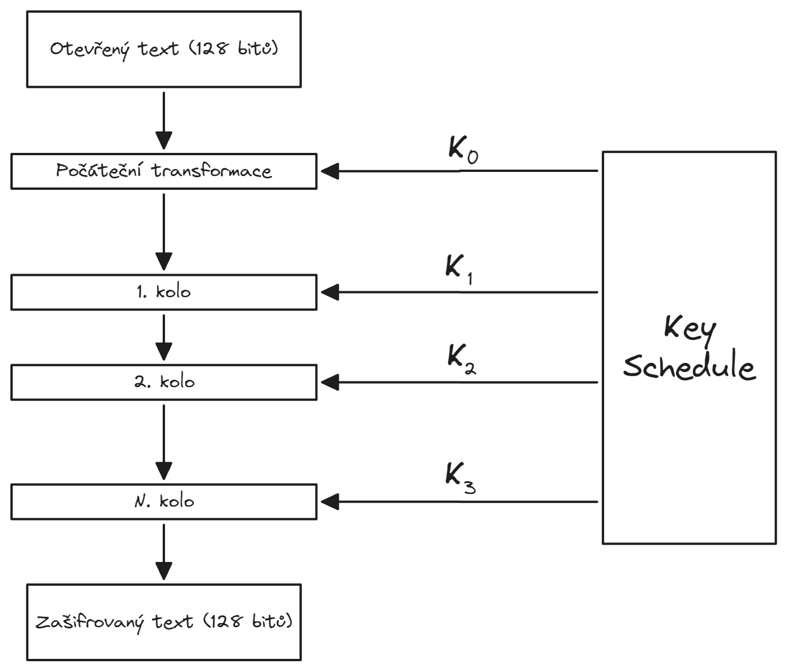
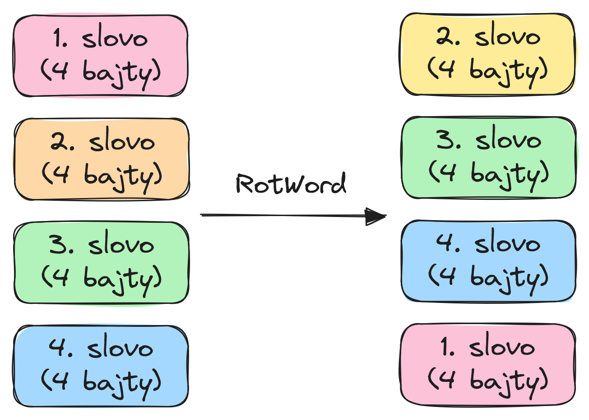
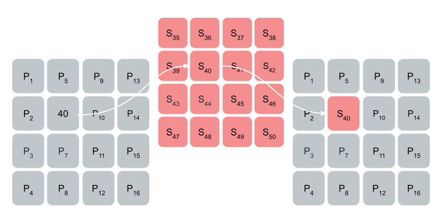

# AES
__Advanced Encryption Standard__ (zkráceně _AES_) je [symetrická bloková šifra](../symetricka_sifra.md), která pracuje s 128 bitovými bloky dat. Funguje na principu transformace vstupních bloků pevné délky (128 bitů) na zašifrované výstupní bloky stejné délky pomocí série kryptografických operací a tajného klíče.

!!! quote "Blokové schéma šifrování AES"
    

## Rozdělení otevřeného textu na bloky
Protože je AES bloková šifra, je potřeba vstupní text rozdělit na bloky o předepsané velikosti 128 bitů. Uvažujme otevřený text o délce $n$ bitů. Takový text se rozdělí na bloky po 128 bitech (16 bajtech). Pokud poslední blok má méně než 128 bitů, poté je doplněn daty tak, aby měl také délku 128 bitů.

### PKCS\#7 Padding
Tato metoda přidává k datům bajty, přičemž hodnota každého přidaného bajtu odpovídá počtu přidaných bajtů.

!!! info "Odstranění výplně při dešifrování"
    Odstranění výplně probíhá tak, že se přečte poslední bajt a postupně se odebírají bajty se stejnou hodnotou, dokud se nenarazí na rozdílný bajt.

!!! example "Příklad výplně"
    Pokud je například potřeba přidat 5 bajtů, každý z nich bude mít hodnotu `0x05` (v binární podobě `0000 0101`). I když je délka zprávy již násobkem délky bloku, přidá se celý nový blok s hodnotami odpovídajícími délce doplnění. Po dešifrování se doplnění odstraní na základě hodnoty posledního bajtu.

!!! quote ""
    

### ISO/IEC 9797-1 Padding
Tato metoda, též známá jako _OneAndZeroes Padding_, doplní jeden bajt s hodnotou `0x80` (v binární podobě `1000 0000`), následovaný nulovými bajty (0x00) až do dosažení délky bloku.

!!! info "Odstranění výplně při dešifrování"
    Odstranění výplně probíhá tak, že se v bloku po dešifrování odebere poslední jednička (_trailing one_)

## Key Schedule algoritmus
Na počátku šifrování jsou pomocí __key schedule__ algoritmu odvozeny šifrovací podklíče pro jednotlivá kola šifrování. Počet šifrovacích kol, a tím pádem i počet potřebných klíčů, závisí na použité délce původního klíče. Uvažujme klíč o bitové délce $N_K$, poté se optimální počet kol pro šifrování vypočítá následujícím způsobem:

$$N = \frac{N_K}{32} + 6$$

Klíč je rozdělen na 4bajtová (32 bitová) slova, přičemž každý šifrovací klíč je vygenerován pomocí tří operací:

- __RotWord__, neboli cyklický posun o jeden bajt doleva
- __SubWord__, neboli S-Box substituce na každý bajt slova
- __Rcon__, neboli přidání konstanty pro každé kolo

### RotWord
`RotWord` funkce provede na slovech klíče cyklický posun o jeden bajt doleva.

!!! quote ""
    

### SubWord (SubByte)
`SubWord` (a nebo `SubByte`) používá Rijndaelovu S-box substici, která předpočítá matici, ze které se vyhledávají bajty k nahrazení. K výpočtu, resp. inicializaci této matice, se používá konečné těleso $Z_2 \mod {x^8 + x^4 + x^3 + x + 1}$.

!!! quote ""
    

### RCON
`RCON` funkce pomocí operace XOR přičte ke stávajícím slovům klíče ještě speciální konstantu (_round constant_, zkráceno na _rcon_), která se spočítá jako

$$\text{rc}(i) = 2^{i-1} << 24$$

kde $i$ je index daného kola, $<<$ je cyklický bitový posun vlevo a $24$ je o kolik bitů se má $2^{i-1}$ posunout vlevo. Fintou v tomto výpočtu je to, že probíhá nad $Z_2$ tělesem.

!!! info "Rekurzivní definice"
    Výpočet lze také realizovat rekurzivní funkcí, kdy je definována následovně:

    $$\text{rc}(i) = \begin{cases}
        1 & i = 1 \\
        2 \cdot rc(i - 1) & rc(i - 1) \lt \text{0x80} \\
        (2 \cdot rc(i - 1)) \oplus \text{0x11} & rc(i - 1) \ge \text{0x80}
    \end{cases}$$

!!! example "Předpočítání RCON"
    RCON hodnoty jsou závislé pouze na počtu kol, a proto je lze předpočítat.

    |index|rcon (hex)|rcon (bin)|
    |:--:|:--:|:--:|
    |1|0x01|0000 0001|
    |2|0x02|0000 0010|
    |3|0x04|0000 0100|
    |4|0x08|0000 1000|
    |5|0x10|0001 0000|
    |6|0x20|0010 0000|
    |7|0x40|0100 0000|
    |8|0x80|1000 0000|
    |9|0x1B|0001 1011|
    |10|0x36|0011 0110|

## Průběh šifrovacího kola
Při počáteční transformaci se vstupní blok dat pomocí operace XOR spojí s prvním podklíčem. AES považuje každý blok za matici uspořádanou ve sloupcích. Pro každou takovouto matici se v jednom kole provedou následující operace:

- __Sub Bytes__ - V každý byte je nahrazen jiným bytem podle vyhledávací tabulky.
- __Shift Rows__ - Pro každý řádek je proveden posun vlevo. Každý řádek je posunut o $n - 1$ míst doleva, tzn. že první řádek je ponechán, druhý je posunut o jeden prvek doleva, třetí o dva, ...
- __Mix Columns__ - Každý sloupec je vynásoben předem danou maticí. V posledním kole se neprovádí.
- __Add Round Keys__ - Výsledek předchozích operací je spojen s klíčem pomocí operace XOR.