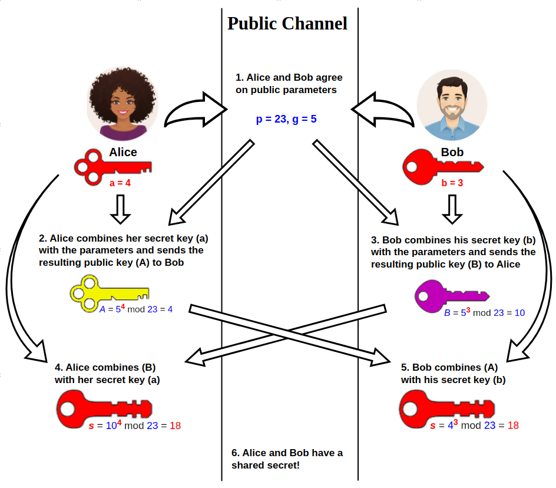
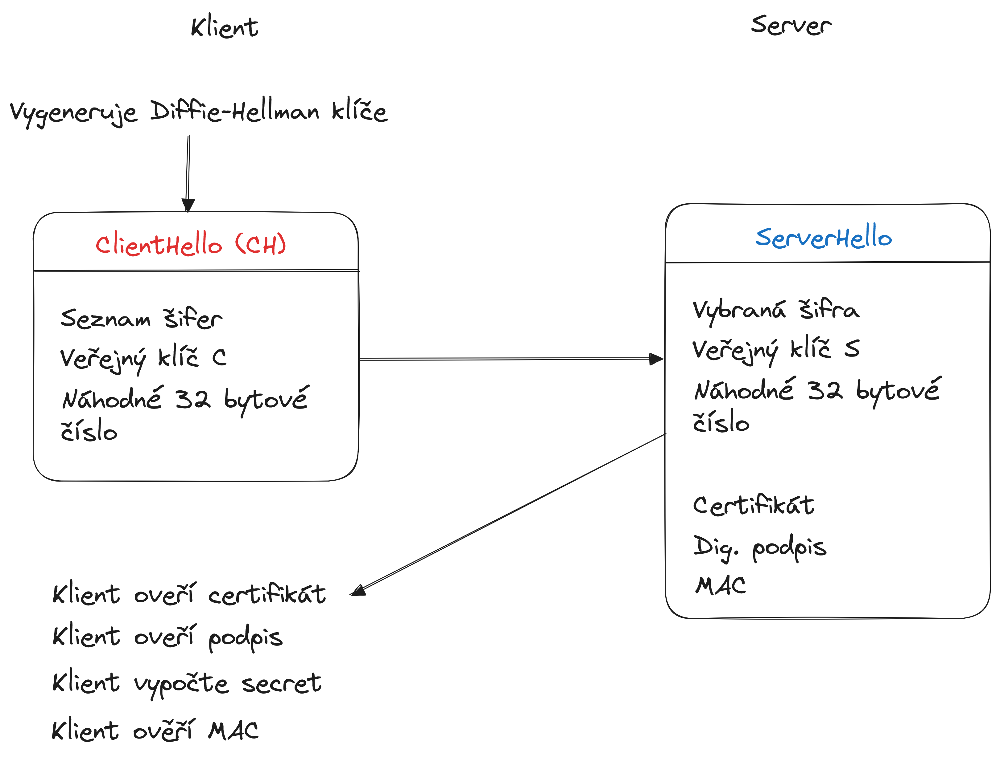
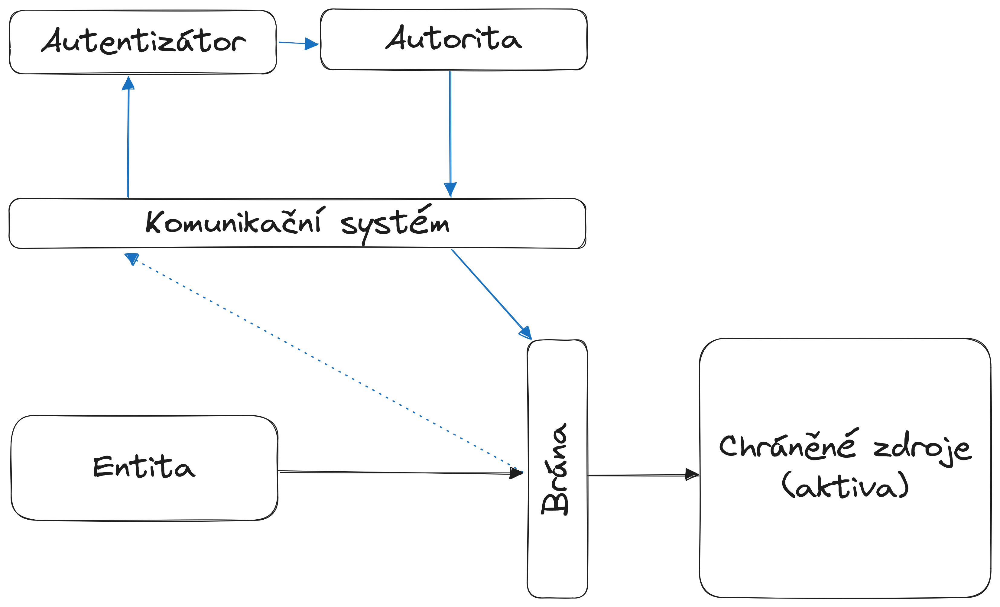

# Kryptologie
Kryptologie je disciplína, která se zabývá studováním šifrovacích systémů, které slouží k utajování zpráv a informací.

- __Kryptografie__ je disciplína, která se zabývá utajováním zpráv. To probíhá převodem čitelného textu (plaintext) do jeho nečitelné podoby (ciphertext). Tato nečitelná podoba je čitelná jenom se znalostí speciálních okolností (klíče).
- __Kryptoanalýza__ se naopak zaměřuje na analýzu a lámání šifrovacích systémů s cílem získat původní informace bez znalosti klíče.

## Bezpečnost šifer
Základním principem úspěšné ochrany dat pomocí kryptografie je [Kerckhoffův princip](./kerckhoffuv_princip.md), který říká, bezpečnost šifrovacího systému nesmí záviset na utajení (de)šifrovacího algoritmu, ale pouze na utajení klíče. Dodržení [Kerckhoffova principu](./kerckhoffuv_princip.md) je jednou z důležitých vlastností, která zákládá bezpečnost moderních šifer.

### Modely útoků
Cílem útočníků, kteří se snaží prolomit danou šifru, mohou být tři následující oblasti:

- __Key recovery attack__ – cílem je určit použitý klíč
- __Plaintext recovery attack__ – cílem je dešifrovat zašifrovaný text.
- __Distinguishing attack__ – cílem je zjistit, zda daný text je šifrová zpráva, nebo jde o náhodná data

Toho může útočník docílit několika způsoby. Podle toho, co má útočník k dispozici, se rozlišují [modely útoku](./modely_utoku.md) na:

- __Ciphertext only attack__ (COA) - útočník má k dispozici pouze šifrový text.
- __Known plaintext attack__ (KPA) - útočník má k dispozici otevřený text a jemu odpovídající šifrový text.
- __Chosen plaintext attack__ (CPA) - útočník má možnost volit otevřené texty a získává tomu odpovídající
šifrové texty.
- __Chosen ciphertext attack__ (CCA) - kromě CPA má útočník navíc možnost volit šifrové texty a získává tomu
odpovídající otevřené texty.

Pokud pak mluvíme o hodnocení samotné bezpečnosti šifry, můžeme ji hodnotit jako odolnost vůči zmíněným modelům útoku. Poté můžeme o šifrách prohlásit, že mají:

- __Absolutní bezpečnost__ - Otevřený text nelze nikdy jednoznačně určit bez ohledu na množství zachycené informace.
- __Dokazatelnou bezpečnost__ - Prolomení systému vyžaduje vyřešení těžkého výpočetního problému, například faktorizace nebo diskrétní logaritmus.
- __Výpočetní bezpečnost__ - Prolomení systému není možné systematickou analýzou s použitím dostupných zdrojů nebo v rozumné době.

Jednotlivé modely útoku spoléhají na to, že zašifrovaný text odráží statistické vlastnosti otevřeného textu (např. výskyt nejčastějších písmen, délky slov, ...). Princip [konfúze a difúze](konfuze_difuze.md) slouží k tomu, aby se statistické vlastnosti těchto jednotlivých částí rozprostřely do zašifrovaného textu a vznikla tak sloužitější závislost mezi klíčem, otevřeným textem a zašifrovaným textem.

### Entropie
Základní myšlenkou teorie informace je, že _informační hodnota_ předávané zprávy závisí na míře, jak je obsah zprávy překvapivý. Není žádným překvapením, když dojde k události, která je velmi pravděpodobná. Naopak, v případě málo pravděpodobných událostí, je jejich výskyt mnohem informativnější. Entropie měří očekávané (tj. průměrné) množství informace obsažené v informaci o výsledku [náhodného pokusu](../matematika/statistika/teorie_pravdepodobnosti/jevy.md).

!!! info "Entropie"
    Entropie [diskrétní náhodné veličiny](../matematika/statistika/teorie_pravdepodobnosti/nahodna_velicina.md) $X$ je jednotka udávající očekáváné množství informace potřebné k popisu proměnné.

    $$
    H(X) = -\sum_{x \in X} p(x) \cdot \log{p(x)}
    $$

!!! question "Intuice za entropií?"
    Entropie, neboli míra nepředvídatelnosti, odpovídá na otázku: "jak moc se musím ptát, abych se dostal k výsledku?" Přímo nám říká, jak moc předvídatelný, resp. nepředvídatelný, je výsledek [náhodného pokusu](../matematika/statistika/teorie_pravdepodobnosti/jevy.md). Pokud je nějaký z výsledků pokusu více pravděpodobný, tak bude entropie nižší, protože bude padat častěji, než ty ostatní. Naopak pokud mají pravdě
    
    Je to jako kdybychom hráli šibenici. Kdybychom hráli jednu hru s anglickou abecedou, a druhou hru s českou abecedou a diakritikou, tak první hra bude mít nižší entropii, protože při pokládání otázek nemusíme přemýšlet nad háčky a čárky, a rychleji tak vyřadíme nesmyslná písmena. Naopak u hry s českou abecedou a diakritikou musíme pokládat více otázek, protože musíme uvažovat háčky a čárky a člověk myslící si slovo má větší výběr možných slov.

!!! example "Entropie čísel v loterii"
    Například znalost, že určité číslo nevyhraje v loterii, nese velmi malou informaci, a má tak nízkou entropii, protože jakékoli určité číslo téměř určitě nevyhraje. Ale znalost, že určité číslo v loterii vyhraje, má vysokou informační hodnotu a tudíž velkou entropii, protože informuje o události s velmi nízkou pravděpodobností.

V šifrovacím systému chceme mít co největší možnou entropii, tj. nejvyšší možnou míru nepředvídatelnosti, ohledně zprávy a klíče. Pokud má zpráva velkou entropii, není její výskyt vůbec překvapivý, stejně tak jako výskyt jiné zprávy (mají stejnou pravděpodobnost výskytu). Podobně uvažujeme i u klíče, kde chceme dosáhnout maximální entropie. Pokud mají všechny klíče stejnou pravděpodobnost výskytu, je entropie maximální, protože nedokážeme předvídat.

!!! tip "Entropie hesla"
    Entropie hesla je klíčovým faktorem pro jeho bezpečnost. V podstatě označuje, jak těžké by bylo uhádnout heslo pomocí útoků jako je hrubá síla nebo útok na slovník. Pokud heslo obsahuje vysokou entropii, znamená to, že je těžké předvídat nebo rozluštit, což výrazně zvyšuje bezpečnost účtu. Entropie hesla se vypočítá podle počtu možných kombinací znaků, které heslo používá, a jeho délky. Vzorec pro výpočet entropie hesla je:

    $$
        H = L \cdot \log⁡_2{(N)}
    $$

    kde $H$ je entropie v bitech, $L$ je délka hesla, a $N$ je počet možných znaků v abecedě (např. pro alfanumerické heslo by $N$ bylo 62, pokud používáte malá a velká písmena a číslice).

### Náhodná a pseudonáhledná čísla
Entropie úzce souvisí s generováním čísel. Vyšší entropie znamená vyšší úroveň náhodnosti a obtížnější předvídatelnost, což je zásadní pro bezpečnost kryptografických operací.

Generování náhodných a pseudonáhodných čísel lze rozdělit do dvou kategorií:

1. __Pravá náhodná čísla__ (TRNG - True Random Number Generators): Tato čísla jsou generována na základě fyzikálních jevů, jako je šum v elektronických obvodech nebo radioaktivní rozpad. Jsou skutečně náhodná a nepředvídatelná, ale jejich generování může být pomalejší a náročnější na hardware.
2. __Pseudonáhodná čísla__ (PRNG - Pseudorandom Number Generators): Tato čísla jsou generována algoritmicky a při stejném počátečním stavu (seed) produkují stejnou posloupnost čísel. I když nejsou skutečně náhodná, mohou být dostatečně nepředvídatelná pro mnoho aplikací, zejména pokud jsou inicializována kvalitním seedem s vysokou entropií.

!!! tip "Je potřeba vysoké entropie"
    V kryptografii je důležité používat generátory s vysokou entropií, aby byla zajištěna bezpečnost klíčů a dalších tajných hodnot. Nedostatečná entropie může vést k předvídatelným výsledkům a tím k oslabení kryptografických systémů.

## Perfektní šifra
Aby šifra poskytovala perfektní bezpečnost, musí mít klíč alespoň tak velkou entropii, jakou má zpráva. Jinými slovy, klíč musí být dostatečně dlouhý a složitý, aby skryl veškerou informaci obsaženou ve zprávě. Pokud by klíč nebyl dostatečně náhodný nebo dlouhý, mohl by útočník využít informace obsažené v ciphertextu (zašifrované zprávě) k odvození původního textu. Vernamův kryptosystém, který je také známý jako jednorázová tabulka (one-time pad), je šifrovací technika, která používá náhodný klíč stejné délky jako zpráva. Pokud je klíč skutečně náhodný, použit pouze jednou a utajen, poskytuje absolutní bezpečnost.

Proces šifrování pomocí Vernamovy šifry je prostý. Pro každý znak otevřeného textu se vygeneruje celočíselný náhodný posun modulo délka abecedy. Tento posun se uloží jako součást klíče. Takto se zašifruje celý text. Dešifrování postupuje přesně opačným postupem, kdy se postupně posuny z klíče aplikují 

## Symetrické šifry
[Symetrické šifry](./symetricka_sifra.md) jsou takové šifry, které k šifrování a dešifrování používají jeden a ten samý klíč. Tyto šifry dále dělíme na blokové šifry, které šifrují otevřený text po blocích dané velikosti. Proudové šifry zase šifrují data po jednotlivých bitech.

### Blokové šifry
Blokové symetrické šifry kombinují své dílčí výstupy do jednoho velkého zašifrovaného textu. Jakým způsobem takové kombinování probíhá se dá přizpůsobit pomocí __operačních režimů__, které upravují fungování šifrovacího procesu.

### AES
[Advanced Encryption Standard](./aes/index.md) je [symetrická bloková šifra](../symetricka_sifra.md), která pracuje s 128 bitovými bloky dat. Funguje na principu transformace vstupních bloků pevné délky (128 bitů) na zašifrované výstupní bloky stejné délky pomocí série kryptografických operací a tajného klíče.

AES i jako další blokové šifry mají provozní režimy, které mění způsob šifrování textu. Nejzákladnějším je _ECB_, který šifruje každý blok zvlášť, poté _CBC_, který šifruje každý blok až poté, co je přidán k předchozímu zašifrovanému textu, a posledním důležitým módem je _CTR_, který šifruje hodnotu čítače a poté ho XORuje s otevřeným textem.

### Proudové šifry
Proudové šifry šifrují otevřený text tím, že ho kombinují s proudem pseudonáhodných bitů, který se chová jako klíč, tzv. __keystream__. Proudové šifry jsou obzvláště vhodné pro aplikace, kde je potřeba šifrovat data průběžně, jako například v komunikačních protokolech nebo streamovaném videu.

Vytvoření klíčového proudu probíhá pomocí [inicializačního vektoru](./aes/inicializacni_vektor.md) a šifrovacího klíče. Podobně se pak text dešifruje, kdy se dešifrovací proud vytváří ze stejného vektoru a klíče. Klíčové je u proudových šifer mít správný inicializační vektor a mít bity klíče a dat synchronizované. Pokud by se synchronizace narušila, způsobí to chyby při následném šifrování či dešifrování. Bezpečnost celé šifry stojí na jedinečnosti klíčového proudu, kdy nesmí být opakovaně použit pro různé zprávy, a generátor pseudonáhodných čísel musí být považován za bezpečný.

Mezi proudové šifry patří například [AES v režimu CFB](./aes/rezimy.md#cfb), RC4 nebo Bluetooth Stream Cipher.

## Hashování
Proces _hashování_, resp. hashovací funkce, je [zobrazení](../matematika/linearni_algebra/zobrazeni.md), které mění řetězec libovolné délky na řetězec pevné délky. Výsledek hashovací funkce, tzv. __hash__, je výpočetně jednoduchýse široce používají pro adresování paměti.

!!! danger "Kolize"
    Při hashování může nastat situace, kdy pro dva různé vstupy výjde stejný výsledek. Této situaci se říká __kolize__.

Kryptografická hashovací funkce je speciální typ hashovací funkce, která splňuje dodatečné požadavky zajišťující její bezpečnost a odolnost vůči různým typům útoků. Používají se primárně pro kontrolu integrity dat (zdali data nebyla změněna během přenosu), ukládání hesel v nečitelné podobě či digitální podpisy. Co odlišuje _klasickou_ hashovací funkci od té kryptografické? 

!!! info "Kryptografická hashovací funkce"
    Kryptografická hashovací funkce $h(x)$ má:
    
    - __Rovnoměrné rozložení hashů__: Pravděpodobnost, že hashovací funkce vytvoří konkrétní $n$-bitový hash, je $2^{−n}$. Každá možná hodnota hash by měla být stejně pravděpodobná, což umožňuje hash považovat za reprezentaci původní zprávy.
    - __Odolnost vůči nalezení vzoru__: Pro kryptografickou hašovací funkci $h$ a její libovolný výstup $y$ neexistuje prakticky realizovatelný algoritmus, který by uměl najít nějaké neznámé $x$ splňující $h(x) = y$
    - __Odolnost vůči nalezení druhého vzoru__: Pro daný vzor $x$ je obtížné spočítat hash $y$ takový, že $h(x)=h(y)$.
    - __Odolnost vůči nalezení kolize__: Je prakticky nemožné najít dvě různé vstupní zprávy, které mají stejný hash.

### Útoky hledající vzory
Odolnost vůči nalezení otevřeného textu je označována jako síla zabezpečení a závisí na délce hashe. Například hash o délce $n$ bitů má očekávanou odolnost $n$ bitů, pokud není prostor možných vstupních hodnot menší než $2^n$.

#### Rainbow Tables
Rainbow tables jsou speciálně vytvořené datové struktury, které usnadňují útočníkům nalézt původní heslo, které bylo převedeno na hash. Jsou to vlastně jakési slovníky, které mapují hashované hodnoty zpět na jejich původní hesla.

### Útoky hledající kolize
Odolnost vůči kolizím je nižší než odolnost vůči vůči nalezení otevřeného textu, a proto má hashovací funkce délky $n$ odolnost vůči kolizím přibližně $\frac{n}{2}$ bitů.

!!! question "Jak útočníci využívají kolize k útokům?"
    Nízká odolnost vůči kolizím může být zneužita k vytvoření podvržených zpráv, které ale mají správnou hash. Podívejme se na příklad jednoduché hashovací funkce $h(x)$, která sčítá číslice. Jak by se dalo využít kolize s takovou hashovací funkcí?

    !!! example ""
        Představme si, že ověřujeme pravost dokumentu pomocí takové hashe, přičemž hashujeme název souboru.
        - Originální dokument: Má název "1234". Jeho hash je 1+2+3+4 = 10.
        - Podvržený dokument: Má název "4321". Jeho hash je také 10.

        1. Vypočteme hash originálního dokumentu: Pro dokument "1234" vypočítáme hash 10.
        2. Najdeme dokument s jiným názvem, ale stejným hashem: V našem případě je to "4321".
        3. Nahradíme originální dokument podvrhem: Nahradíme dokument "1234" dokumentem "4321".
        4. Ověření: Pokud někdo zkontroluje hash nového dokumentu, vyjde mu opět 10, což odpovídá původnímu dokumentu. Tím pádem nebude schopen rozpoznat podvrh.

    V praxi se používají složitější hashovací funkce a používá se více dat k ověření integrity. Ovšem na tomto principu stojí [narozeninový útok](#narozeninovy-utok) a [Pollardův rhó útok](#pollarduv-ro-utok)

#### Narozeninový útok
Narozeninový útok je metoda hrubé síly využívající pravděpodobnostní jev známý jako paradox narozenin, který zvyšuje šanci na nalezení dvou různých vstupů se stejnou hash hodnotou (tzv. kolize). Tento jev je významný zejména u hashovacích funkcí, kde má přímý vliv na jejich odolnost vůči kolizím.

!!! tip "Paradox narozenin"
    V klasickém paradoxu narozenin se ukazuje, že pravděpodobnost, že dvě osoby v místnosti mají stejné datum narození, rychle roste s počtem osob. Už při 23 lidech je pravděpodobnost kolize vyšší než 50%. Tento jev je způsoben tím, že se porovnává velké množství dvojic, nikoliv pouze jedna.

!!! question "Proč chceme zabránit kolizím?"
    Je to primárně kvůli tomu, jakým způsobem aplikujeme hash funkce v zabezpečení. Představme si hashovací funkci, která hashuje hesla k přihlášení do banky. Při přihlášení se neporovnávají hesla v jejich otevřené podobě, ale v jejich zahashované podobě. Útočníkovi tak jde o to najít libovolnou zprávu, která vyprodukuje stejný hash. Pak útočník nemusí znát heslo, protože našel takový vzor, který generuje stejný hash jako naše původní heslo.

Pokud hashovací funkce produkuje hodnoty o délce $n$ bitů, existuje $2^n$ možných hash hodnot. Pravděpodobnost nalezení kolize roste přibližně úměrně počtu pokusů a při $\sqrt{2^n}$ pokusech dosahuje 50%.

#### Pollardův Ró útok
Pollardův Ró útok je algoritmus používaný k nalezení kolizí v hashovacích funkcích a také k faktorizaci velkých čísel (například v kryptografii RSA). Tento útok se často využívá jako efektivní metoda na řešení problémů s hledáním kolize hashovací funkce. Tento algoritmus využívá techniku náhodné procházky k detekci cyklů ve výstupních hodnotách hashovací funkce, což umožňuje identifikovat kolize s nižší paměťovou náročností než jiné metody.

!!! info "Princip Pollardova Ró algoritmu pro hledání kolizí"
    - __Definice iterativní funkce__: Zvolíme funkci, která na základě aktuální hodnoty generuje novou hodnotu. V kontextu hashovacích funkcí může být touto funkcí samotná hashovací funkce nebo její modifikace.
    - __Generování posloupnosti hodnot__: Začneme s počáteční hodnotou a iterativně aplikujeme zvolenou funkci, čímž vytváříme posloupnost hodnot. Vzhledem k omezenému počtu možných výstupů hashovací funkce a velkému počtu vstupů dojde dříve či později k opakování hodnoty, což signalizuje přítomnost cyklu.
    - __Detekce cyklu__: Použijeme techniku detekce cyklu, například Floydův algoritmus se dvěma ukazateli (tzv. "tortoise and hare" algoritmus), kde jeden ukazatel postupuje posloupností rychleji než druhý. Když se oba ukazatele setkají, identifikovali jsme cyklus.
    - __Identifikace kolize__: Po nalezení cyklu analyzujeme odpovídající vstupní hodnoty, abychom zjistili, zda vedou ke stejné hash hodnotě. Pokud ano, máme kolizi mezi dvěma různými vstupy.

!!! tip "Výhody Pollardova Ró algoritmu"
    - __Nízká paměťová náročnost__: Na rozdíl od jiných metod, jako je narozeninový útok, nevyžaduje algoritmus ukládání velkého množství hodnot, což z něj činí paměťově efektivní řešení.
    - __Efektivita__: Algoritmus má časovou složitost $O(\sqrt{n})$, kde n je počet možných výstupů hashovací funkce, což je srovnatelné s jinými metodami hledání kolizí.

!!! failure "Nevýhody Pollardova Ró algoritmu"
    - Standardní verze algoritmu __není snadno paralelizovatelná__, což může omezit jeho využití na víceprocesorových systémech.
    - Úspěšnost algoritmu může záviset na konkrétní implementaci a vlastnostech použité hashovací funkce. 

### Konstrukce hashovacích funkcí
Ke konstrukci hashovacích funkcí odolných vůči kolizím se dříve používaly jednosměrné kompresní funkce, u kterých již bylo známé, že jsou vůči kolizím odolné.

[Merkle Damgardova konstrukce](./hashing/merkle_damgard.md) provádí kompresi na jednotlivé bloky dat a každý tento blok je součástí vstupu pro další blok. Protože se šifruje blokově, musí se zprávy doplnit výplní, což je jedna z možných zranitelností této konstrukce (Lze vytvořit platný hash dobře prodlouženou zprávou a najít kolizi - _length extension attack_).

[Davies-Meyerova konstrukce](./hashing/davies-meyer.md) nepoužívá libovolné kompresní funkce, ale libovolnou kvalitní blokovou šifru. Vstupy do šifry zahrnují zprávu a předchozí stav (výstup z předchozí iterace), přičemž výstup je kombinován se vstupem pomocí operace XOR.

[Houbovité konstrukce](./hashing/houba.md) jsou takové hashovací funkce, které dokážou vzít libovolně dlouhý binární řetězec dat a vytvořit z toho výstup požadované délky. Každá houbovitá konstrukce má tři části:

- Vnitřní stav obsahující $b$ bitů, přičemž je rozdělen na __datovou část__ o velikosti $r$ a kapacitu $c$. 
- Pseudonáhodnou permutační funkci $f: \{0, 1\}^b \to \{0, 1\}^b$
- Výplňovou funkci $P$

!!! info "Fáze houbovité funkce"
    - __Absorbce__ (pohlcení), kde jsou vstupní data rozdělena na bloky pevné délky
        - Ze vstupních dat se přečte blok o velikosti $r$, který je případně doplněn výplňovou funkcí, pokud je délka dat menší než velikost bloku. 
        - Každý blok je xorován s aktuálním vnitřním stavem.
        - Vnitřní stav je následně změněn pseudonáhodnou permutační funkcí
    - __Exsorpce__ (vymačkání), kde jsou data čtena z vnitřního stavu
        - Z vnitřního stavu se odebere blok dat o velikosti $r$
        - Zbylý vnitřní stav je následně změněn pseudonáhodnou permutační funkcí

### Hashování s klíčem
Hashování s klíčem je technika, která kombinuje kryptografickou hashovací funkci s tajným klíčem za účelem zajištění integrity a autenticity zprávy. Tato metoda zaručuje, že pouze strany, které znají tajný klíč, mohou vytvořit nebo ověřit platný hash, čímž se předchází neoprávněným úpravám dat.

__Message Authentication Code__ (MAC) je specifický typ hashování s klíčem, který slouží k ověření integrity a autenticity zprávy. MAC bere jako vstup tajný klíč a zprávu a generuje krátký kód, který se připojuje ke zprávě. Příjemce s odpovídajícím tajným klíčem může tento kód ověřit a potvrdit, že zpráva nebyla pozměněna a pochází od důvěryhodného odesílatele. Příkladem je HMAC, který využívá hashovací funkce jako SHA-256. 

__Pseudorandom Function__ (PRF) je funkce, která na základě tajného klíče a vstupní hodnoty generuje výstup, jenž je nerozlišitelný od náhodného. PRF se používají v různých kryptografických protokolech, například pro odvozování klíčů nebo generování náhodných hodnot. Důležitou vlastností PRF je, že bez znalosti tajného klíče je pro útočníka obtížné předpovědět výstup pro libovolný vstup. Je třeba poznamenat, že ne všechny MAC jsou vhodné jako PRF; například poly1305 je MAC, ale není vhodný jako PRF.

V kryptografii existuje hierarchie mezi KDF (__Key Derivation Function__), PRF a MAC. KDF má silnější bezpečnostní požadavky než PRF, protože dokáže pracovat i s méně kvalitním klíčovým materiálem a generovat z něj bezpečné klíče. PRF má silnější požadavky než MAC, protože musí produkovat výstupy nerozlišitelné od náhodných hodnot. Tato hierarchie je důležitá pro správné použití těchto funkcí v různých kryptografických aplikacích.

!!! info "Možnosti konstrukce klíčovaného hashe z neklíčovaného"
    - Prefixed MAC $MAC = H(K || M)$
    - Suffixed MAC $MAC = H(M || K)$
    - Enveloping MAC $MAC = H(K || M || K)$
    - Nested MAC $NMAC = H(K2 || H(K1 || M))$

## Symetrické šifry s autentizací
Symetrické šifry s autentizací kombinují šifrování a autentizaci do jednoho procesu, čímž zajišťují jak důvěrnost, tak integritu a autenticitu dat. Tato kombinace je klíčová pro efektivní a bezpečnou komunikaci v moderních kryptografických systémech. Existuje několik způsobů, jak tyto šifry implementovat.

Authenticated Encryption (AE) je jedním z přístupů, který integruje šifrování a autentizaci do jednoho kroku. Tento přístup zajišťuje, že šifrovaná data jsou nejen chráněna před neoprávněným přístupem, ale také že příjemce může ověřit jejich integritu a autenticitu. Příklady implementací AE zahrnují Galois/Counter Mode (GCM) a Counter with CBC-MAC (CCM). GCM je mód blokové šifry, který poskytuje jak šifrování, tak autentizaci pomocí Galoisovy funkce. Tento mód je široce používán v moderních kryptografických protokolech díky své efektivitě a bezpečnosti. CCM kombinuje mód Counter pro šifrování s CBC-MAC pro autentizaci a je rovněž silně doporučován pro aplikace vyžadující silnou ochranu.

Dalším přístupem je metoda MAC-then-Encrypt (MtE), která nejprve generuje Message Authentication Code (MAC) pro zprávu a poté šifruje jak původní zprávu, tak MAC. Příjemce nejprve dešifruje zprávu a následně ověřuje MAC, aby zajistil integritu a autenticitu dat. I když tato metoda poskytuje určitou úroveň bezpečnosti, může být zranitelná vůči určitým útokům, pokud není správně implementována.

Encrypt-then-MAC (EtM) je konstrukce, která šifruje zprávu jako první a poté generuje MAC pro šifrovaný text. Tato metoda je považována za bezpečnější než MtE, protože útočník nemůže manipulovat s šifrovaným textem bez detekce. EtM je široce doporučována v kryptografických standardech a používá se pro zajištění silné ochrany před útoky na integritu a autenticitu.

Konečně existuje metoda Encrypt-then-Authenticate-then-Transmit (EAT), která zahrnuje tři kroky: nejprve se šifruje zpráva, poté se generuje MAC pro šifrovaný text a nakonec se odesílá šifrovaný text spolu s MAC. Tato konstrukce poskytuje silnou ochranu proti různým útokům, včetně útoků na integritu a autenticitu, a je považována za jednu z nejbezpečnějších.

Při výběru vhodné konstrukce je důležité zvážit specifické požadavky aplikace, včetně požadavků na výkon, bezpečnost a kompatibilitu s existujícími systémy. Moderní kryptografické protokoly často využívají kombinaci šifrování a autentizace, aby zajistily komplexní ochranu dat.

### AES GCM
AES-GCM (Galois/Counter Mode) je autorizovaná šifra s přidruženými daty (AEAD), která kombinuje šifrování a autentizaci do jednoho efektivního procesu. AES-GCM využívá blokovou šifru AES v režimu Counter (CTR) pro šifrování a Galoisovu funkci pro autentizaci. Při šifrování se inicializační vektor (IV) kombinuje s počítadlem, které se inkrementuje pro každý blok dat. Tato kombinace se šifruje pomocí AES, a výsledek se XORuje s plaintextem, čímž vzniká ciphertext. Současně se pomocí Galoisovy funkce generuje autentizační tag, který zajišťuje integritu a autenticitu jak šifrovaných dat, tak přidružených dat (AAD).

## Sdílené tajemství

### Diffie-Hellman
Diffie-Hellmanova výměna klíčů je kryptografický protokol, který umožňuje dvěma stranám bezpečně sdílet tajný klíč přes nezabezpečený kanál. Tento sdílený klíč může být následně použit pro šifrování komunikace pomocí symetrických šifer.

!!! info "Jak funguje Diffie-Hellman?"
    - __Veřejná dohoda__: Obě strany se veřejně dohodnou na dvou hodnotách: velkém prvočísle $p$ a základně $g$, které jsou veřejně známé a nemusí být chráněny.
    - __Výběr tajných klíčů__: Každá strana si zvolí tajný klíč: Alice zvolí $a$ a Bob $b$.
    - __Výpočet veřejných hodnot__: Alice vypočítá $A = g^a \mod{p}$ a Bob $A = B^b \mod{p}$.
    - __Výměna veřejných hodnot__: Alice a Bob si vymění hodnoty $A$ a $B$.
    - __Výpočet sdíleného klíče__: Alice vypočítá $s = B^a \mod{p}$ a Bob $s = A^b \mod{p}$. Díky vlastnostem umocňování v modulární aritmetice platí, že $s$ je stejný pro obě strany.

!!! quote ""
    

### RSA
RSA je asymetrický protokol, který využívá veřejný a soukromý klíč pro šifrování a dešifrování dat. Může být použit pro bezpečnou výměnu tajného klíče mezi stranami. Tento klíč se poté používá k šifrování komunikace pomocí symetrických šifer.

### ECDH
Tento protokol je vylepšením klasického Diffie-Hellmana a používá elliptické křivky, což zajišťuje silnou bezpečnost i při použití menších klíčů. ECDH se často používá v moderních systémech, jako je například v protokolech TLS a VPN.

## Asymetrické šifry
Asymetrické kryptosystémy, známé také jako šifrování s veřejným klíčem, využívají dvojici klíčů: veřejného a soukromého. Veřejný klíč je určen pro šifrování dat a může být volně sdílen, zatímco soukromý klíč slouží k dešifrování a musí být přísně chráněn. Tento princip umožňuje bezpečnou komunikaci mezi stranami, které nemají předchozí sdílený tajný klíč. Asymetrické šifry mají tu výhodu, že __eliminují potřebu bezpečného kanálu pro výměnu klíčů__, protože šifrování probíhá pomocí veřejného klíče. Též zajišťuje autentizaci, identifikaci autora zprávy pomocí veřejného klíče, a ověřuje autentičnost zprávy, protože zprávu nemohl nikdo vytvořit ani pozměnit bez vlastnictví privátního klíče. Nevýhodou je složitější implementace a nižší rychlost.

### RSA

## TLS
TLS (Transport Layer Security) je skupina protokolů používaný k zajištění bezpečné komunikace přes počítačové sítě, například na internetu. Nahrazuje starší protokol SSL (Secure Sockets Layer) a poskytuje následující klíčové funkce:

- __Šifrování__: Ochrana přenášených dat před odposlechem.
- __Autentizace__: Ověření identity komunikujících stran (např. serveru pomocí certifikátů).
- __Integrita__: Zajištění, že data nebyla během přenosu modifikována

## Record Protokol

## Handshake Protokol
Handshake protokol slouží k inicializaci zabezpečeného spojení mezi klientem (např. webový prohlížeč) a serverem (např. webový server). Během handshake fáze se dohodnou na šifrovacích algoritmech, vymění si klíče a autentizují se, čímž zajistí, že následující komunikace bude šifrovaná, autentická a integritní.

## Přístupové systémy
Přístupové kryptosystémy zahrnují mechanismy, které se používají pro řízení přístupu uživatelů nebo zařízení k systémům, datům nebo síťovým prostředkům (tzv. __aktiva__). Tyto systémy zajišťují, že pouze oprávněné subjekty mohou provádět akce na chráněných zdrojích.

!!! example "Obecné schéma přístupového systému"
    

V obecném případě máme __entitu__, která chce získat přístup ke __chráněným zdrojům__ (aktivům). Úkol přístupového systému je zjistit, zda je entita tím, za koho se prokazuje, a zda má právo k danému zdroj přistoupit. Svojí identitu prokazuje entita procesem autentizace, zatímco svojí pravomoc přístupu ke zdroji řídí __autorizace__. 

!!! question "Co je autentizace?"
    __Autentizace__ je proces slouží k ověření identity uživatele nebo systému. Autentizace může být založena na něčem, co víte (např. heslo), něčem, co máte (např. karty nebo tokeny), nebo něčem, čím jste (biometrické údaje).

    - __Identita__: Za koho se entita snaží prokázat
    - __Dokazovací faktor__: Čím se snaží entita ověřuje (např. heslo)
    - __Ověřovácí faktor__: Čím autorita ověřuje identitu (např. hash hesla v databázi)

!!! question "Co je autorizace?"
    __Autorizace__ je proces, kdy se a dochází k ověření

    Po autentizaci systém určuje, jaká práva a přístupy jsou uživateli nebo systému povoleny. Autorizace je založena na předchozím ověření a je řízena pomocí pravidel, jako jsou přístupové seznamy nebo role.

!!! info "Protokoly"
    - __Autentizační protokoly__:  EAP, Kerberos
    - __Autorizační protokoly__: OAuth
    - __Přístupové protokoly__: RADIUS

## Stavební prvky kryptografie
- Proměnné:
    - Utajené
        - Klíče symetrických šifer
        - Soukromé klíče asymetrických šifer
        - Seeds
    - Veřejné
        - Veřejné klíče asymetrických šifer (certifikáty)
        - Inicializační vektory
        - Nonce
        - Čísla bloků
- Funkce
    - Šifrovací a dešifrovací funkce
        - Šifrovací funkce $ENC$ s parametry pro otevřený text $M$ a šifrovací klíč $K_E$: $C = ENC(M, K_E)$
        - Dešifrovací funkce $DEC$ s parametry pro zašifrovaný text $C$ a dešifrovací klíč $K_D$: $M = DEC(C, K_D)$
        - Pro symetrické šifry $K_E = K_D$
        - Pro asymetrické šifry $K_E = K_V$ příjemce, $K_D = K_S$ příjemce
    - Pečetící a verifikační funkce
        - Pečetící funkce zprávy $M$ s pečetícím klíčem $K_P$: $P = PTC(M, K_P)$
        - Verifikační funkce zprávy $P$ s ověřovacím klíčem $K_O$: $W = VER(P, K_O)$
        - Symetrické šifry $K_P = K_O$ (např. MAC kódy)
        - Asymetrické šifry 
    - Generátor nepředvidatelných čísel $N = RNG()$
    - Hashovací funkce $H(D)$
    - Diffie-Helmanova funkce
        - $A = DHF(V, a)$
        - $B = DHF(U, b)$
        - $DHF(A, b) = DHF(B, a)$
    - Odvozovací funkce $DRNG()$
        - $B = ODF(S, T)$, kde $S$ je seed a $T$ je kontext

## Kvantová distribuce klíče (Quantum Key Distribution)
Symetrické šifry jsou kvantově odolné při dostatečné velikosti klíče. Je ovšem potřeba zajistit bezpečný kanál pro přenos klíče. Hlavní myšlenkou QKD je, že informace o klíči je přenášena pomocí kvantových stavů částic, například fotonů. Tyto kvantové stavy mohou být polarizace fotonů, fáze, nebo jiné vlastnosti částic, které jsou kvantově mechanicky reprezentovatelné. 

Důležité je, že měření kvantových stavů ovlivňuje jejich původní hodnotu. Tento jev, známý jako __Heisenbergův princip neurčitosti__, zaručuje, že jakýkoli pokus o odposlech přenosu je detekovatelný.

Protokol BB84 používá čtyři různé kvantové stavy, které jsou rozděleny do dvou bází (např. horizontální/vertikální polarizace a diagonální polarizace). 

|Báze|0|1|
|:--:|:--:|:--:|
|$+$|$\uparrow$|$\rightarrow$|
|$\times$|$\nearrow$|$\searrow$|

Protokol funguje následujícím způsobem:

- __Přenos kvantových bitů__ (qubitů): Alice připraví fotony v náhodných stavech a odesílá je Bobovi. Každý foton reprezentuje jeden bit.
- __Náhodné měření__: Bob měří každý přijatý foton v náhodně vybrané bázi.
- __Sdílení bází po veřejném kanále__: Po přenosu Alice a Bob veřejně komunikují (např. přes internet) a porovnávají báze, ve kterých fotony připravovali a měřili. Data získaná pomocí nesprávných bází jsou ignorována.
- __Generování klíče__: Zbývající data, kde se báze shodují, tvoří tajný klíč.
- __Test na přítomnost odposlechu__: Alice a Bob porovnají malou část svého klíče. Pokud zjistí vyšší než očekávanou chybovost, mohou detekovat přítomnost útočníka.

!!! tip "Odolnost vůči odposlechům"
    BB84 má odolnost vůči odposlechům založenou na statistice. Útočníkovi nezbývá nic jiného než také měřit náhodně vybranými bázemi, ovšem při volbě špatné báze (50% šance se netrefit) se daný foton přepóluje a i kdyby poté příjemce použil ten správný, tak má šanci naměřit špatnou hodnotu kvůli přepólování do jiné báze.

!!! question "Kolik bitů je třeba připravit na začátku?"
    Je doporučeno připravit minimálně 4x tolik bitů, kolik je požadovaná délka klíče. Je to kvůli tomu, že při náhodném měření statistiky polovina bitů bude změřena špatně a v následném kroku zahozena. Také se poté část bitů použije na ověření přítomnosti odposlechu.
