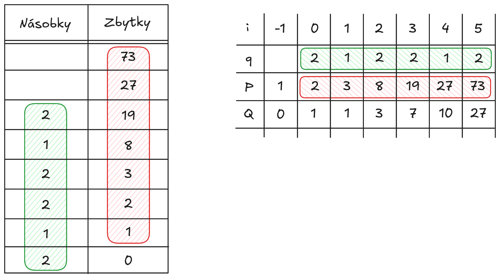

# Teorie dělitelnosti

## Dělitelnost

Celá čísla jsou uzavřená pod sčítáním, odčítáním i násobením — výsledek těchto operací zůstane vždy celým číslem. U dělení to neplatí: výsledek může být zlomek nebo iracionální číslo. Právě to, kdy dělení celých čísel celé číslo přece jen dá, je předmětem teorie dělitelnosti.

!!! abstract "Definice dělitelnosti"
    Uvažujme čísla $a$ a $b$, kde $a$ je libovolné celé číslo a $b$ je libovolné **nenulové** celé číslo. Poté řekneme, že $b$ dělí $a$, což značíme $b \mid a$, jestliže existuje celé číslo $q$ tak, aby platilo

    $$\exists q \in \mathbb{Z}: a = b \cdot q.$$

    - Číslo $a$ se nazývá **násobek** čísla $b$
    - Číslo $b$ se nazývá **dělitel** čísla $a$
    - Číslo $q$ se nazývá **podíl** čísel $a$ a $b$

    Jinými slovy: $b \mid a$ právě tehdy, když vydělíme-li $a$ číslem $b$, dostaneme celé číslo.

!!! example "Vlastnosti relace dělitelnosti"
    Vztah $b \mid a$ definovaný výše je relací na množině celých čísel. Tato relace má následující vlastnosti:

    1. Každé celé číslo je dělitelné jedničkou.
        - $\forall a \in \mathbb{Z}: 1 \mid a$
    2. Každé nenulové celé číslo dělí nulu.
        - $\forall a \in \mathbb{Z} \setminus \{0\}: a \mid 0$
    3. Každé nenulové celé číslo je dělitelné samo sebou.
        - $\forall a \in \mathbb{Z} \setminus \{0\}: a \mid a$
    4. Pokud $a \mid b$ a zároveň $b \mid a$, pak $|a| = |b|$.
        - $\forall a, b \in \mathbb{Z} \setminus \{0\}: (a \mid b) \wedge (b \mid a) \implies |a| = |b|$
    5. Relace dělitelnosti je tranzitivní: pokud $a \mid b$ a $b \mid c$, pak $a \mid c$.
        - $\forall a, b, c \in \mathbb{Z}: (a \mid b) \wedge (b \mid c) \implies a \mid c$
    6. Pokud $b$ dělí $a$, pak $b$ dělí i libovolný násobek $a$ — tedy $b \mid a$ zaručuje $b \mid (a \cdot c)$ pro jakékoli celé $c$.
        - $\forall a, b, c \in \mathbb{Z}: (b \mid a) \implies b \mid (a \cdot c)$
    7. Pokud společný dělitel $d$ dělí obě čísla $a$ i $b$, pak dělí i jejich součet a rozdíl.
        - $\forall a, b, d \in \mathbb{Z}: (d \mid a) \wedge (d \mid b) \implies d \mid (a \pm b)$

### Dělitelé
Vlastnost 1 a 3 dohromady vytváří nevlastní dělitele čísla. Každé celé číslo má nevlastní dělitele $\pm 1$ a $\pm a$. Všechny ostatní dělitele nazýváme vlastní. 

!!! info "Společný dělitel"
    Společný dělitel je takové celé číslo $d$, pro které platí, že celá čísla $a, b \in \mathbb{Z}$ dělí beze zbytku.

    $$a, b, d \in \mathbb{Z}: d \mid a \land d \mid b$$

    !!! info "Největší společný dělitel"
        Pro čísla $a, b \in \mathbb{Z}$ kde alespoň jedno je nenulové platí:

        1. Největší společný dělitel není ovlivněn pořadím čísel
            - $NSD(a, b) = NSD(b, a)$
        2. Největší společný dělitel není ovlivněn znaménkami čísel
            - $NSD(a, b) = NSD(-a, b) = NSD(a, -b) = NSD(-a, -b)$
        3. Pokud čísla $a$ i $b$ dělí nějaké číslo, tak ho bude dělit i jejich dělitel
            - $(d \mid a) \wedge (d \mid b) \equiv d \mid NSD(a, b)$
        4. Funkce pro výpočet největšího společného dělitele je homogenní pro kladné násobky.
            - $\forall k \in \mathbb{N}^+:\,NSD(k\cdot a, k\cdot b) = k\cdot NSD(a, b)$
            - $\forall d \in \mathbb{N}^+:\, NSD(\frac{a}{d}, \frac{b}{d}) = \frac{1}{d} \cdot NSD(a, b)$
        5. Největší společný dělitel násobku čísla $a$ a čísla $b$ je dělitelný největším společným dělitelem koeficientu a čísla $b$.

    !!! info "Bezoutova rovnost"
        Bézoutova rovnost říká, že NSD dvou přirozených čísel je jejich lineární kombinace.

        $$\begin{aligned}
        NSD(a,b) &= ax + by\\
        x, y &\in \mathbb{Z}
        \end{aligned}$$

        !!! info "Bézoutova rovnost pro více čísel"
            Bézoutova rovnost platí i pro více čísel, tudíž

            $$\begin{aligned}
                NSD(a_1, ..., a_n) &= a_1 x_1 + ... + a_nx_n
            \end{aligned}$$

!!! question "Kolik dělitelů má číslo?"
    Uvažujme číslo $n$, které je rozloženo na součin [prvočísel](prvocisla.md) ve tvaru

    $$n = p_1^{e_1} \cdot p_2^{e_2} \cdot\quad\ldots\quad\cdot p_k^{e_k} $$

    Každý dělitel čísla $n$ je součin některých mocnin těchto prvočísel. Pro každé prvočíslo $p_i$ můžeme použít jakoukoliv jeho mocninu od 0 (což znamená, že dané prvočíslo ve dělitelích vůbec není) až po $e_i$ (nejvyšší mocnina daného prvočísla, kterou můžeme použít), tudíž máme $e_i + 1$ možností.

    Počet dělitelů tak lze určit jako součin všech možných kombinací mocnin, které můžeme za každé prvočíslo použít. Označíme-li si počet dělitelů čísla $n$ jako $\tau(n)$, pak platí:

    $$\tau(n) = (e_1 + 1) \cdot (e_2 + 1) \cdot\quad\ldots\quad\cdot (e_k + 1)$$
    
!!! question "Lze určit součet všech dělitelů čísla?"
    $$S(n) = (\frac{p_{1}^{e_1 + 1} - 1}{p_1 - 1}) \cdot (\frac{p_{2}^{e_2 + 1} - 1}{p_2 - 1}) \cdot\quad\ldots\quad\cdot (\frac{p_{k}^{e_k + 1} - 1}{p_k - 1})$$

## Dělení se zbytkem
Dělení se zbytkem zachycuje situaci, kdy na oboru celých čísel dělíme taková dvě čísla, která nejsou v relaci býti dělitelem.

!!! tip "Definice dělení se zbytkem"
    Nechť $a \in \mathbb{Z}$, $b \in \mathbb{N}^+$. Pak existují jednoznačně určená čísla $q, r \in \mathbb{Z}$ splňující

    $$a = b \cdot q + r, \quad 0 \le r < b.$$

    - $a$ je **dělenec**
    - $b$ je **dělitel**
    - $q$ je **neúplný podíl**
    - $r$ je **zbytek**

### Euklidův algoritmus
Eukleidův algoritmus je algoritmem pro výpočet největšího společného dělitele. Poslední nenulový zbytek po dělení je právě největším společným násobkem.

!!! example "Nalezení největšího společného dělitele čísla 15 a 9"

    1. $\frac{15}{9} = 1$ (zbyt. 6)
    2. $\frac{9}{6} = 1$ (zbyt. 3)
    3. $\frac{6}{3} = 2$ (zbyt. 0)

    |Násobky|Zbytky|
    |:--:|:--:|
    ||15|
    ||9|
    |1|6|
    |1|3|
    |2|0|

    Největším společným dělitelem čísel 15 a 9 je 3.

### Řetězové zlomky
Řetězové zlomky jsou způsob, jak zapsat libovolné reálné číslo jako součet celých čísel a zlomků, které na sebe navazují. Tomuto procesu se říká **diofantická aproximace**. Každé číslo, které není celé, můžeme rozložit na celočíselnou část a zbytek, který se dá zapsat jako zlomek: 

$$\alpha = q_0 + \frac{1}{q_1 + \frac{1}{q_2 + \frac{1}{q_3 + \frac{1}{\ldots}}}}$$

Pokud je číslo racionální (zlomek), postup se dříve či později zastaví, protože dostaneme celé číslo. U iracionálních čísel se tento proces nezastaví a vytváří nekonečný řetězový zlomek. Jednotlivé mezivýsledky při vytváření řetězového zlomku se nazývají __přibližné zlomky__.

!!! abstract "Jednodušší zápis řetězových a přibližných zlomků"
    Protože nás v řetězových a přibližných zlomcích zajímají pouze celé části $q_i$, tak je budeme psát do seznamu pomocí písmena $\delta$. Pro $n$-tý přibližný zlomek vypadá $\delta_n$ takto: 

    $$\delta_n = [q_0, q_1, ..., q_n]$$

!!! example "Konstrukce řetězových zlomků"
    $$\begin{aligned}
        P_i &= q_i \cdot P_{i-1} + P_{i-2}\\
        Q_i &= q_i \cdot Q_{i-1} + Q_{i-2}\\        
    \end{aligned}$$

    

## Kongruence
Kongruence je relace ekvivalence mezi dvěma čísly v oboru celých čísel, které dávají po dělení stejným číslem stejný zbytek.

$$
a \equiv b \pmod{m}
$$

!!! example "Vlastnosti kongruencí"
    - K oběma stranám kongruence lze přičíst a odečíst libovolné celé číslo.
    - Obě strany kongruence (včetně modulu) lze vynásobit libovolným číslem.
    - Obě strany kongruence (včetně modulu) lze umocnit na $n \in \mathbb{N}$.
    - Členy z jedné strany kongruence lze převést na druhou, pokud u nich změníme znaménko.

### Lineární kongruence
Lineární kongruencí rozumíme kongruenci ve tvaru $ax \equiv b \pmod{m}$. Cílem je najít dvě řešení: partikulární (konkrétní) a obecné. Podle vlastnostní kongruencí je dobré se před samotným výpočtem podívat, zda-li není výhodné kongruenci upravit. Úpravou kongruencí myslím hlavně dvě následující vlastnosti:

!!! info ""
    Proto je vhodné se na kongruenci podívat, a zjistit, zda-li $NSD(a, b, m) \not{=} 1$. Pokud je největší společný dělitel těchto čísel různý od jedničky, můžeme jít vydělit všechny tři strany rovnice. Pokud máme v rovnici čísla, která jsou větší než modul, můžeme je nahradit zbytkem po celočíselným dělení právě daným modulem.

    $$\begin{aligned}
        192x &\equiv 212 \pmod{46} \\
        8x &\equiv 28 \pmod{46} \\
        4x &\equiv 14 \pmod{23} 
    \end{aligned}$$

!!! question "Existence řešení"
    Před samotným výpočtem lze ověřit, zda-li má kongruence řešení. K tomu se využívá [největší společný dělitel](spolecny_delitel.md) a euklidův algoritmus. Prvním krokem je spočítat největšího společného dělitele čísla $a$ a modulu $m$.

    - Pokud $NSD(a, m) = 1$, poté má kongruence __právě jedno řešení__.
    - Pokud $NSD(a, m) \gt 1$ a zároveň $NSD(a, m) \mid b$, má kongruence právě $NSD(a, m)$ řešení
    - Pokud $NSD(a, m) \gt 1$ a zároveň $NSD(a, m) \not\mid b$, nemá kongruence řešení

Princip řešení lineární kongruence je, stejně jako u rovnic, osamostatnit neznámou $x$ na jedné straně a na druhé mít, k čemu je kongruentní. Protože ale nepracujeme v reálných číslech, ale v celých, tak je úlohou najít __multiplikativní inverzi__ daného koeficintu u $x$.

!!! example "Multiplikativní inverze v reálných číslech"
    V případě reálných čísel je multiplikativní inverzí __převrácené číslo__. Například pro číslo $5$ je multiplikativní inverzní $\frac{1}{5}$, protože vynásobením $5$ a $\frac{1}{5}$ vznikne při jejich vynásobení neutrální prvek - jednička.

Při hledání multiplikativní inverze řešíme podkongruenci $ax \equiv 1 (m)$, neboli ptáme se, jaké číslo je kongruentní k jedničce, neutrálnímu prvku při násobení. Tuto podkongruenci řešíme [Bezoutovou rovností](./bezoutova_rovnost.md), kdy Bezoutův koeficient u čísla $a$ je právě hledanou multiplikativní inverzí. Hledání bezoutových koeficientů probíhá pomocí rozšířeného euklidova algoritmu, neboli euklidova algoritmu s tabulkou jednotlivých prvků rozvoje v řetězový zlomek.

!!! example "Příklad"
    Vyřeště kongruenci $419x \equiv 17 \pmod{21}$.

    Nejdříve se podíváme, zda-li lze kongruenci zjednodušit. V tomto příkladu je koeficient $a = 419$ větší než modulo $m = 21$, takže koeficient $a$ nahradíme jeho zbytkem po dělení modulem.

    $$\begin{aligned}
        419x &\equiv 17 \pmod{21} \\
        20x &\equiv 17 \pmod{21}
    \end{aligned}$$

    Podíváme se na řešitelnost. $NSD(20, 21) = 1$, takže tato upravená kongruence má právě jedno řešení. Cílem je osamostatnit neznámou na levé straně, tj. najít multiplikativní inverzi k číslu 20 v grupě $\mathbb{Z}_{21}$. Abychom takovou inverzi našli, řešíme kongruenci, a respektive bezoutovu rovnost:

    $$\begin{aligned}
        20x &\equiv 1 \pmod{21} \\
        20x + 21y &= 1
    \end{aligned}$$

    V tomto příkladě nemusíme nutně provádět euklidův algoritmus a rozvoj v přibližné zlomky, protože vidíme, že dosadíme $x = -1$ a $y = 1$, dostaneme $-20 + 21 = 1$, a rovnost bude tudíž platit. $x = -1$ je naše hledaná inverze, ale protože jsme v grupě $\mathbb{Z}_{21}$, převedeme si ji na prvek této grupy. $x = -1 + 21 = 20$.

    $$\begin{aligned}
        20x &\equiv 17 \pmod{21} \\
        20x \cdot 20 &\equiv 17 \cdot 20 \pmod{21} \\
        400x &\equiv 340 \pmod{21} \\
        (400 \mod{21}) x &\equiv (340 \mod{21}) \\
        x &\equiv 4 \pmod{21}
    \end{aligned}$$

    - Partikulárním řešením kongruence $419x \equiv 17 (21)$ je $x_0 = 4$.
    - Obecným řešením je pak $x = 4 + 21k$, kde $k\in N^+$

### Soustavy lineárních kongruencí
!!! example "Příklad"
    Vyřeště soustavu lineárních kongruencí:
    
    $$\begin{aligned}
        7x &\equiv 84 \pmod{15} \\
        7x &\equiv 42 \pmod{9} \\
        7x &\equiv 49 \pmod{10} \\
        7x &\equiv 21 \pmod{8} \\
    \end{aligned}$$

    $$\begin{aligned}
        x &\equiv 12 \pmod{15} \\
        x &\equiv 6 \pmod{9} \\
        x &\equiv 7 \pmod{10} \\
        x &\equiv 3 \pmod{8} \\
    \end{aligned}$$

    $$\begin{aligned}
        x &\equiv 12 \pmod{15} \\
        x = 12 + 15t \\
        \\
        x &\equiv 6 \pmod{9} \\
        12 + 15t &\equiv 6 \pmod{9} \\
        15t &\equiv -6 \pmod{9} \\
        15t &\equiv 3 \pmod{9} \\
    \end{aligned}$$

    $$\begin{aligned}
        15t &\equiv 1 \pmod{9} \\
        15x + 9y &= 1 \\
    \end{aligned}$$

    |Násobky|Zbytky|
    |:--:|:--:|
    ||15|
    ||9|
    |1|6|
    |1|3|
    |2|0|

    |i|-1|0|1|2|
    |:--:|:--:|:--:|:--:|:--:|
    |q|-|1|1|2|
    |P|1|1|2|5|
    |Q|0|1|1|3|

    15x + 9y &= 1 \\

### Příklady

!!! example "Nalezněte řešení následující soustavy kongruencí"
    $$\begin{aligned}
        24x + 14y + 22z &\equiv 16 \pmod{15} \\
        33x + 45y + 27z &\equiv 6 \pmod{45} \\
        16x + 9y + 31z &\equiv 7 \pmod{15} \\
    \end{aligned}$$

$$\begin{aligned}
    9x + 14y + 7z &\equiv 1 \pmod{15} \\
    33x + 0y + 27z &\equiv 6 \pmod{45} \\
    1x + 9y + 1z &\equiv 7 \pmod{15} \\
\end{aligned}$$

$$\begin{aligned}
    9x + 14y + 7z &\equiv 1 \pmod{15} \\
    11x + 0y + 9z &\equiv 2 \pmod{15} \\
    1x + 9y + 1z &\equiv 7 \pmod{15} \\
\end{aligned}$$

Tady mám někdě chybu. Zlatého bludišťáka dostane ten, kdo ji najde. Už vim, když odečítám rovnice od sebe tak nestačí akorát vynásobit -1, ale musím to vzít inverzí... takže když potřebuju odečíst 5y, tak musím od všeho odečíst 10, abych dostal -5y

$$\begin{aligned}
    1x + 9y + 1z &\equiv 7 \pmod{15} \\
    9x + 14y + 7z &\equiv 1 \pmod{15} \\
    11x + 0y + 9 &\equiv 2 \pmod{15} \\
    \\
    1x + 9y + 1z &\equiv 7 \pmod{15} \\
    0x + 5y + 7z &\equiv 1 \pmod{15} \\
    0x + 6y + 13z &\equiv 0 \pmod{15} \\
    \\
    1x + 9y + 1z &\equiv 7 \pmod{15} \\
    0x + 65y + 91z &\equiv 13 \pmod{15} \\
    0x + 6y + 13z &\equiv 0 \pmod{15} \\
    \\
    1x + 9y + 1z &\equiv 7 \pmod{15} \\
    0x + 5y + 1z &\equiv 13 \pmod{15} \\
    0x + 6y + 13z &\equiv 0 \pmod{15} \\
    \\
    1x + 4y + 0z &\equiv 9 \pmod{15} \\
    0x + 5y + 1z &\equiv 13 \pmod{15} \\
    0x + 1y + 0z &\equiv 11 \pmod{15} \\
    \\
    1x + 4y + 0z &\equiv 9 \pmod{15} \\
    0x + 1y + 0z &\equiv 11 \pmod{15} \\
    0x + 5y + 1z &\equiv 13 \pmod{15} \\
    \\
    1x + 4y + 0z &\equiv 9 \pmod{15} \\
    0x + 1y + 0z &\equiv 11 \pmod{15} \\
    0x + 0y + 1z &\equiv 3 \pmod{15} \\
    \\
    1x + 0y + 0z &\equiv 10 \pmod{15} \\
    0x + 1y + 0z &\equiv 11 \pmod{15} \\
    0x + 0y + 1z &\equiv 3 \pmod{15} \\
\end{aligned}$$

## Prvočísla a prvočíselné rozklady
Prvočíslo je takové číslo, které má pouze nevlastní dělitele, neboli je dělitelné pouze jedničkou nebo samo sebou. Čísla, která nesplňují podmínky pro prvočísla, se nazývají čísla složená.

$$(\forall n \in N^+) (n \mid p \to n = 1 \vee n = p)$$

- Nejmenší dělitel (různý od 1) složeného čísla $n$ je prvočíslo, které je nejvyše rovný $\lfloor \sqrt{n} \rfloor$ (Odmocnina z $n$ zaokrouhlená dolů na celou část)
- Pro libovolná dvě čísla, která spolu nemají žádného společného dělitele (jsou nesoudělná), existuje nekonečně mnoho prvočísel, která při dělení tímto číslem dají určitý konkrétní zbytek. Jinými slovy, lze vždy najít nekonečně mnoho prvočísel, pro které platí $p = m \cdot q + a$
- Počet prvočísel menších nebo rovno přirozenému číslu $n$ lze přibližně vypočítat jako $\pi(n) = \frac{n}{\ln{n}}$

### Kanonický rozklad na prvočísla
Každé přirozené číslo větší než 1 lze zapsat jako kanonický rozklad na prvočísla, což je součin všech prvočísel vyskytujících se v rozkladu s mocninou značící jejich násobnost (kolikrát se vyskytuje v rozkladu).

$$a = p_1^{\alpha_1} \cdot ... \cdot p_k^{\alpha_k}$$

Algoritmus funguje tak, že číslo zkoušíme dělit prvočísly do té doby, než je zbytek po dělení nulový.

!!! example "Rozklad čísla 24 a 16"
    

    $$\begin{aligned}
    24 &= 2^3 \cdot 3 \\
    16 &= 2^4 \\
    \end{aligned}$$

### Eulerova funkce
Eulerova funkce $\varphi(n)$ je taková funkce, která udává počet nesoudělných čísel s číslem $n$.

$$
\varphi(n) = (p_1^{e_{1}} - p_1^{e{_1} - 1}) \cdot\quad\ldots\quad\cdot (p_k^{e_{k}} - p_k^{e_{k} - 1})
$$

Pro libovolné prvočíslo $p$ platí $\varphi(p) = p - 1$.

### Mobiova funkce
Mobiova funkce $\mu(n)$ je funkcí, která je schopna určit, zdali je číslo složené z opakujících se, nebo různých, [prvočísel](./prvocisla.md).

$$\mu(n) = \begin{cases}
1 && n = 1 \\
0 && \text{pokud}\,n\,\text{obsahuje opakující se prvočísla}\\
(-1)^k && \text{pokud}\,n\,\text{je součinem}\,k\,\text{různých prvočísel}
\end{cases}$$

### Eratosthenovo síto
__Eratosthenovo síto__ je algoritmus pro nalezení všech prvočísel menších nebo rovných zadanému číslu $n$. Tento algoritmus pochází z doby starověkého Řecka a vytvořil ho matematik Eratosthenés.

!!! abstract "Jak funguje Eratosthenovo síto?"
    Na začátku algoritmu si vytvořme seznam čísel od 2 do $n$. Nyní opakujeme následující kroky:
    
    1. První číslo v seznamu je prvočíslo
    2. Ze seznamu odstraní všechny násobky posledního prvočísla
    3. Přesuneme se na další číslo, které nebylo vyškrtnuto
    4. Opakujeme vyškrnutí násobků
    5. Algoritmus končí v moment, kdy narazíme na číslo $\lfloor \sqrt{n} \rfloor$ (odmocnina z $n$ zaokrouhlená dolů na celou část)

### Segmentované Eratosthenovo síto
Segmentované Eratosthenovo síto je optimalizovaná verze původního algoritmu, která řeší vysoké paměťové nároky u vyšších horních mezí a neefektivní používání mezipaměti. Řešením je rozdělit si síto na menší části, které se postupně zpracovávají a používají již dříve nalezené násobky.

!!! abstract "Jak funguje Segmentované Eratosthenovo síto"
    1. Rozsah čísel od 2 do $n$ si rozdělíme na segmenty o velikosti $\delta$, přičemž tato velikost musí být větší nebo rovna $\sqrt{n}$.
    2. První segment zpracujeme "klasickým" Eratosthenovým sítem.
    3. U každého dalšího segmentu
        - Vytvoříme pole o velikosti jednoho segmentu ($\delta$)
        - Označíme si násobky dříve nalezených prvočísel jako čísla složená
        - Neoznačené pozice odpovídají prvočíslům v daném segmentu.

### Inkrementální Eratosthenovo síto
Inkrementální síto je algoritmus pro generování prvočísel bez horní hranice, který funguje postupným vkládáním prvočísel do výpočtu jejich násobků. Tímto způsobem jsou prvočísla nalezena v mezerách mezi násobky, které jsou postupně odstraňovány.

#### Atkinovo síto
!!! bug "TODO"

### Pritchardovo síto
!!! bug "TODO"

### Sundaramovo síto
!!! bug "TODO"

### Pseudočtvercové síto
!!! bug "TODO"

## Společný násobek
Společný násobek dvou nebo více čísel je číslo, které je dělitelné všemi těmito čísly.

$$\begin{aligned}
    (a \mid D) &\wedge (b \mid D) \\
    a, b &\in \mathbb{Z} - \{0\}
\end{aligned}$$

!!! example "Příklad"
    Pokud máme čísla $a=3$ $b=4$, jejich společné násobky jsou všechna čísla, která jsou násobky jak 3, tak 4, například 12,24,36 atd.

### Nejmenší společný násobek
Nejmenší společný násobek čísel $a, b \in \mathbb{Z}$ je takové číslo, které je dělitelné těmto čísly a je ze všech možných to nejmenší. Označujeme ho jako $NSN(a, b)$ nebo $LCM(a, b)$ (Least Common Multiple).

!!! tip "Způsob výpočtu nejmenšího společného násobku"
    1. Metodou hrubé síly, kdy hledáme $min(\{max(|a|, |b|), ..., a\cdot b\})$
    2. Metodou rozkladu čísel $a, b$ na prvočísla
    3. Využití vztahu nejmenšího společného násobku s [největším společným dělitelem](./spolecny_delitel.md)

Nejmenší společný násobek čísel $a, b \in \mathbb{Z}$ lze vypočítat jako podíl jejich součinu a jejich největšího společného dělitele.

$$NSN(a, b) = \frac{a \cdot b}{NSD(a, b)}$$

??? question "Jak funguje výpočet pomocí největšího společného dělitele?"
    Když vynásobíme dvě čísla, dostaneme určitě nějaký jejich násobek. Problém ale je, že tento násobek nemusí být ten nejmenší. Když se podíváme na rozklad obou čísel na prvočísla, může se stát, že mají některé prvočinitele stejné a při násobení se tak započítají dvakrát - jejdnou z jednoho čísla a jednou z druhého.

    

    Jak najdeme společné prvočinitele dvou čísel? Uvědomme si, že prvočinitelé jsou v součinu, tudíž musíme najít číslo, kterým můžeme obě čísla vydělit beze zbytku. Když hledáme to největší číslo, kterým můžeme obě čísla vydělit beze zbytku, hledáme [největšího společného dělitele](#nejvetsi-spolecny-delitel). Ten nám ukáže, jaké společné faktory obě čísla mají.

    

    Pak už nám stačí spočítat součin čísel a vydělit ho největším společným dělitelem (NSD).

    - Pokud mají nějaké společné prvočinitele, při násobení se započítají dvakrát, ale NSD jeden výskyt odstraní jeho vydělením.
    - Pokud nemají žádné společné prvočinitele, jejich NSD je jednička, takže dělení výsledek nijak nezmění.

# Dolní a horní celá část

Funkce __dolní__ a __horní__ celá část jsou takové funkce, které libovolné reální číslo ($x \in \mathbb{R}$) převádí na celé číslo ($x \in \mathbb{Z}$).

!!! info "Dolní celá část"
    Dolní část $\lfloor x \rfloor$ reálného čísla $x$ je definována jako nejbližší celé číslo menší nebo rovné číslu $x$. Číslo $x$ je tak vždycky zaokrouhleno dolů k nejblizšímu celému číslu.

    - Funkci dolní celá část označujeme symbolem $\lfloor x \rfloor$ nebo pomocí funkce $\floor{x}$
    - Platí $\lfloor x \rfloor \le x \lt \lfloor x \rfloor$.

!!! info "Horní celá část"
    Horní část $\lceil x \rceil$ reálného čísla $x$ je definována jako nejbližší celé číslo větší nebo rovné $x$. Číslo $x$ je tak vždycky zaokrouhleno nahoru k nejblizšímu celému číslu.

    - Funkci horní celá část označujeme symbolem $\lceil x \rceil$ nebo pomocí funkce $\ceil{x}$
    - Platí $\lceil x - 1 \rceil \lt x \le \lceil x \rceil$

!!! info "Lomenná část"
    Lomenná část $\{x\}$ reálného čísla $x$ je definována jako desetinná část čísla $x$. Číslu $x$ tak zůstane pouze část za desetinnou čárkou.

    - Funkci lomenná část označujeme symbolem $\{x}\$ nebo pomocí funkce $\frac2{x}$
    - Platí $\{x\} = x - \lfloor x \rfloor$

!!! technical "Psaní těchto funkcí v LaTeXu"
    - V klasickém LaTeXu nebo Mathjaxu nejsou funkce $\floor{x}$, $\ceil{x}$ nebo $\myfrac{x}$ definovaný. V Mathjax konfiguraci jsou tedy definovány jako makra.
    - Kvůli tomu, aby se funkce $\myfrac{x}$ netloukla s funkcí pro konstrukci zlomků `\frac`, tak se používá příkaz `\myfrac`.