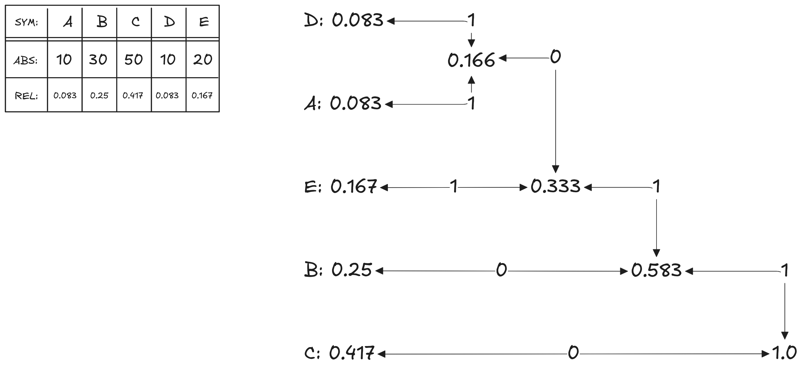
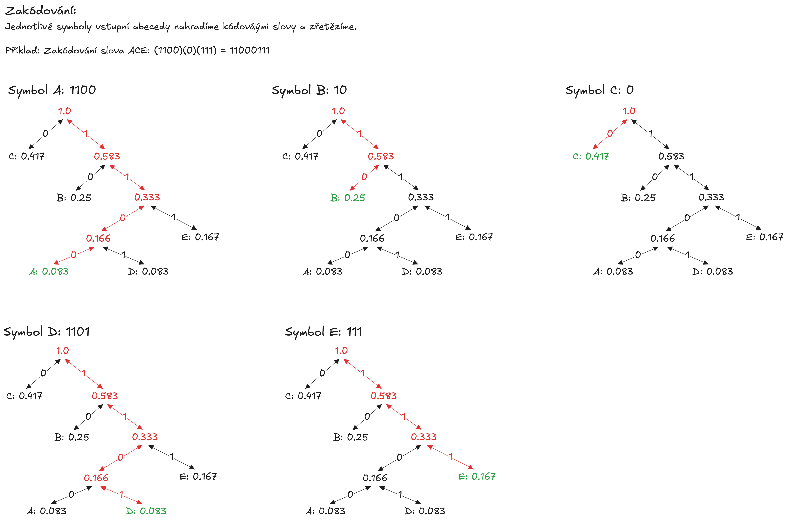
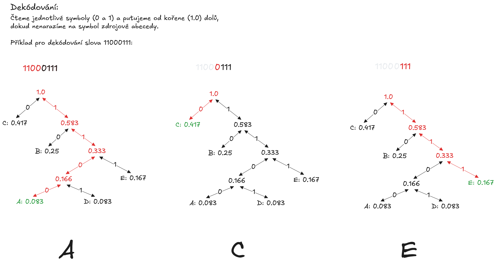
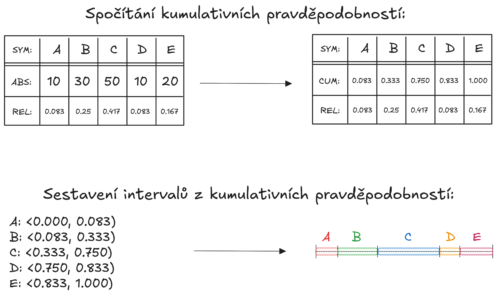

# Teorie kódování
Mějme zdrojovou množinu symbolů a cílovou (kódovou) množinu symbolů. Kódem nazýváme zobrazení mezi zdrojovou abecedou a kódovou abecedou. Řetězce symbolů z kódové abecedy nazýváme kódová slova.

## Prefixový kód
Prefixový kód je takový kód, jehož kódová slova nezačínají žádným jiným kódovým slovem. Takový prefixový kód, jehož délka je co nejmenší, nazýváme __minimálním kódem__.

!!! important "Kraftova nerovnost - existence prefixového kódu"
    Kraftova nerovnost je nutnou a postačující podmínkou existence prefixového kódu. Konkrétně říká, že pokud známe předem dané délky slov, můžeme zjistit, zda tvoří prefixový kód či nikoliv.

    $$K = \sum_{i=1}^{n} D^{-l_i}$$

    - Kde $D$ je počet různých symbolů kódové abecedy
    - a $l_i$ je délka jednotlivých kódových slov.

    Pomocí Kraftovy nerovnosti tak můžeme vzít známá kódová slova nad kódovou abecedou a zjistit, jestli tvoří prefixový kód.
    
    !!! tip "Saturace prefixového kódu"
        Pomocí hodnoty Kraftovy nerovnosti můžeme také zjistit, jak moc saturovaný daný prefixový kód je:

        - Pokud je $K > 1$, tak prefixový kód neexistuje - kódových slov je tam moc a dohromady neutvoří prefixový kód.
        - Pokud je $K = 1$, tak je prefixový kód úplný - už žádné další slovo nemůžeme přidat, ale dohromady tvoří prefixový kód.
        - Pokud je $K < 1$, tak je prefixový kód neúplný - můžeme ještě slova přidávat tak, aby vznikl prefixový kód.

### Huffmanova konstrukce
Huffmanova konstrukce vytváří minimální kód pro zadané znaky a jejich četnosti.

!!! info "Konstrukce kódu"
    1. Znaky uspořádáme sestupně podle četnosti
    2. Sečteme poslední 2 pravděpodobnosti a výsledek zařadíme mezi ostatní pravděpodobnosti
    3. Opakujeme, dokud součet pravděpodobností není 1
    4. Postupně začneme přiřazovat hranám 0 a 1 - symbol 1 vždy hraně s vyšší pravděpodobností

    !!! note "Přiřazení symbolu hraně"
        Ono je to v podstatě jedno - důležité je, že při konstrukci musíme být konzistentní. Je tedy možné dát 0 té hraně s vyšší pravděpodobností, ale musíme to tak pak udělat pro celý strom.

    

!!! info "Zakódování slova"
    Jednotlivé symboly zdrojové abecedy nahradíme kódovými slovy, které odpovídají symbolům.

    

!!! info "Dekódování slova"
    Čteme jednotlivé symboly a pohybujeme se ve zkonstruovaném stromě od kořene (pravděpodobnost 1.0) až k symbolu zdrojové abecedy, přičemž strom procházíme jako kdyby byl konečný automat přijímající symboly. Po nalezení symbolu proces opakujeme.

    

!!! tip "Adaptivní Huffmanovo kódování"
    Adaptivní Huffmanovo kódování aktualizuje kódovací strom při příchozím symbolu. Cílem je častěji vyskytující se symboly upřednostnit a dát blíže ke kořeni kódovacího stromu. Je to časově náročnější, ale dokáže to generovat lepší kompresní poměr než běžná, statická, varianta.

### Aritmetické kódování
Arimeticé kódování nekóduje vstupní abecedu do výstupní abecedy, ale do reálného čísla. Oproti Huffmanově kódování nemá problém s neurčitostí při stejných četnostech symbolu vstupní abecedy. Kód je založen na postupném zmenšování předem daného intervalu tak, aby byl vždy rozdělen v poměru podle četností symbolů (častější symboly mají větší část intervalu).

!!! info "Konstrukce kódu"
    1. Spočítáme relativní četnosti jednotlivých symbolů, pokud je ještě nemáme.
    2. Spočítáme kumulativní pravděpodobnosti jednotlivých symbolů.
    3. Sestavíme počáteční intervaly symbolů

    

!!! info "Zakódování slova"
    Začínáme s počáteční horní a dolní mezí $\left<L_0, H_0\right)$. Nový interval pro symbol $Z$, který má interval $\left<Z_L, Z_H\right)$ z kumulativních pravděpodobností, se vypočítá jako:
    
    $$\left<L_{i-1} + Z_L \cdot (H_{i-1} - L_{i-1}), L_{i-1} + Z_H \cdot (H_{i-1} - L_{i-1})\right)$$

    Pro poslední symbol vstupního slova se z výsledného intervalu vybere reprezentativní hodnota. Nejčastěji taková, která se dobře uchovává v paměti.

!!! info "Dekódování slova"
    Začínáme s předchozí, případně počáteční, zakódovanou zprávou $K_{i-1}$ - podle kumulativních pravděpodobností zjistíme, k jakému vstupnímu symbolu $K_{i-1}$ náleží. Poté spočítáme další číslo $K_{i}$ pomocí vzorce:
    
    $$\begin{aligned}K_i = \frac{K_{i-1} - Z_L}{Z_H - Z_L}\end{aligned}$$

    Algoritmus dekódování není konečný - musíme se zastavit podle vnějšího signálu (např. předem známé délky zakódované zprávy).

#### DFWLD
__Dyadic fraction with least denominator__ (zkráceně DFWLD) je druhem aritmetického kódu, který je bezeztrátový nultého řádu.

!!! info "Zakódování slova"
    Pro zdrojovou abecedu $A = \left(\begin{array}{cccccc}a & b & c & \ldots \\ p_1 & p_2 & p_3 & \ldots \end{array}\right)$, kde první řádek jsou __znaky zdrojové abecedy__ a druhý řádek jsou __pravděpodobnosti znaků__ kódujeme pomocí DFWLD následujícím způsobem:

    1. __Spočítáme si kumulativní pravděpodobnosti znaků__ - Předpokládáme, že zdrojová abeceda je seřazena od nejvyšší pravděpodobnosti po tu nejmenší. Pak kumulativní pravděpodobnost $C(x)$ počítáme jako __ostře menší__, takže se pravděpodobnost toho konkrétního znaku __nepočítá__.
    2. __Pro každý znak slova spočítáme novou dolní a horní mez__
        - dolní mez $a_i = a_{i-1} + l_{i-1} \cdot C(p_i)$
        - délka intervalu $l_i = l_{i-1} \cdot p_{i}$
    3. __Určení parametru__ $t \in \mathbb{N}^+$ - Ten spočítáme z nerovnice $t \ge \left\lceil-\frac{\ln{l_n}}{\ln{2}}\right\rceil \gt -t + 1$
    4. __Určení parametru__ $s \in \mathbb{N}$ - Ten spočítáme z nerovnice $a_n \cdot 2^t \le s \lt (a_n + l_n) \cdot 2^t$. V případě, že nám výjdou dva výsledky, volíme ten sudý.
    5. __Sestavení dyadického zlomku__ $R = \frac{s}{2^t}$
    6. __Zakódování do binární podoby__ - Výsledné číslo bude mít $t$ znaků. Pokud má číslo méně bitů než $t$, tak se doplní nulami zleva.

!!! info "Dekódování slova"
    ...

## Bezpečnostní kód
Bezpečnostní kódy jsou takové kódy, které mají za cíl zajistit bezpečnost a integritu přenášené zprávy. Lineární kód je takový kód, ve kterých jsou kódová slova tvořena lineární kombinací bázových slov (minimální množina kódových slov).

### Generující a kontrolní matice
- __Generující matice__: Matice z bázových slov kódu.
- __Kontrolní matice__: Matice z transponované parity generující matice a jednotkové matice.

### Hammingovská vzdálenost
Hammingovská vzdálenost $d_H$ je nejmenší počet pozic, na kterých se dva řetězce liší.

$$d_{H}(x,y) = |\{i \in \{1, \dots, n\} \mid x_i \not= y_i \}|$$

Minimální Hammingovská vzdálenost kódu $C$ je nejmenší možná vzdálenost mezi jakýmikoliv dvěma různými kódovými slovy.

$$d(C) = \min_{x,y \in C \mid x \not= y} d_H(x, y)$$

### Detekce a oprava chyby
!!! important "Schopnost detekce chyby"
    Kód detekuje až $k$ chyb tehdy a jen tehdy, když nejmenší Hammingovská vzdálenost mezi dvěma kódovými slovy je alespoň $k+1$. Jinak řečeno, kód detekuje až ${d-1}$ chyb.

    $$k_{max} = d(C) - 1$$

!!! important "Schopnost opravy chyby"
    Kód opraví až $k$ chyb tehdy a jen tehdy, když nejmenší Hammingovská vzdálenost mezi dvěma kódovými slovy je alespoň $2k+1$. Jinak řečeno, kód opravuje až $\lfloor \frac{d-1}{2} \rfloor$ chyb.

    $$k_{max} = \lfloor \frac{d(C)-1}{2} \rfloor$$

### Hammingův kód
Hammingův kód, např. kód $(7,4)$ je bezpečnostním kódem, který má celkem 7 bitů, z toho 4 pro data, a 3 pro paritu.