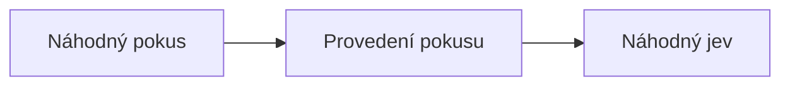

# Pokusy a jevy

__Náhodný pokus__ je každý děj, jehož výsledek není předem jednoznačně znám. Množinu všech možných výsledků takového pokusu nazýváme __základní prostor__ $\Omega$. Výsledek náhodného pokusu pak nazýváme __náhodný jev__ a je logicky součástí základního prostoru.

## Druhy náhodných jevů
Náhodné jevy lze rozdělit do několika tříd podle jejich vlastností. Každý náhodný jev je podmnožinou základního prostoru $\Omega$, a při pokusu může nastat pouze jeden výsledek (například při hodu kostkou nám nemůže padnou dvojka a zároveň šestka). To znamená, že náhodný jev může být pouze jedním z možných výsledků pokusu. Pokud má jev jen jeden možný výsledek (například že na kostce padne číslo 2), říkáme mu __elementární__.

Některé pokusy ale nemusí mít cílit na jeden konkrétní výsledek, například pokud bychom hledali pravděpodobnost, že padne sudé číslo na šestistěnné kostce, tak hledáme jednotlivé pravděpodobnosti všech sudých čísel, které pak akorát sečteme[^1]. Takovému jevu se říká __složený__, protože se skládá z více dílčích jevů (padnutí dvojky, čtyřky a šestky).

Pro úplnost se ještě definují jevy __jisté__ a __nemožné__. Jistý jev je takový náhodný jev, který nastane vždycky. Jinak řečeno, jeho podmnožina výsledků je totožná se základním prostorem $\Omega$. Ještě jinak řečeno, jev má pravděpodobnost 100%.

Naopak jev nemožný má jako možné výsledky prázdnou množinu, tudíž nikdy žádný výsledek ze základního prostoru nenastane. Pravděpodobnost je tudíž 0%.  

Tím, že je náhodný jev **podmnožinou**, je tak možné provádět množinové operace mezi jevy. Zejména je pak dobré zmínit podjev (podmnožina), rovnost, průnik, sjednocení a deMorganovy zákony.

|Jev|Vysvětlení|Poznámky|
|:--|:--|:--|
|Náhodný jev|Podmnožina základního prostoru|$\Omega \in \{3, 6\}$|
|Elementární jev|Jednoprvková podmnožina základního prostoru|$\Omega \in \{3\}$|
|Složený jev|Víceprvková podmnožina základního prostoru|$\Omega \in \{3, 6, 9\}$|
|Jistý jev|Jev, který nastane vždy|$P = 1$|
|Nemožný jev|Jev, který nikdy nenastane|$P = 0$|
|Podjev|Jev, který nastane pouze tehdy, když nastane jiný jev||

[^1]: To je možné díky [kombinatorickému pravidlu součtu](../../kombinatorika/kombinatoricka_pravidla.md#pravidlo-souctu)