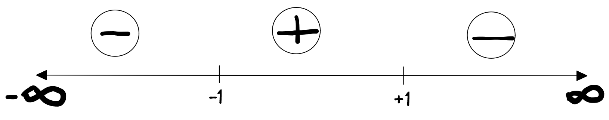

# Integrace
__Integrace__ je operace opačná k [derivaci](derivace.md), která vyjadřuje součet nekonečně mnoha hodnot.

- __Neurčitý integrál__ vyjadřuje primitivní funkci $F(x)$, která je antiderivací funkce $f(x)$ a tudíž pro ní platí $(F(x))' = f(x)$.
    - Funkční hodnota primitivní funkce $F(x)$ je limitní kumulativní součet hodnot funkce $f(x)$
- __Určitý integrál__ používá primitivní funkci k nalezení plochy pod křivkou, která je ohraničena integračními mezemi.
    - $\int_{a}^{b} f(x) dx = F(b) - F(a)$

## Věci co se hodí znát

### Per partes
Per partes se využívá pro integraci součinu funkcí.

$$\int f(x)g'(x)dx=f(x)g(x)-\int f'(x)g(x)dx$$

lze substituovat jako 

$$
\int u \cdot v'dx=u\cdot v-\int u'\cdot vdx
$$

Co to znamená? Pokud máš součin nebo podíl, tak jde řešit metodou per partes. U integrálu zvolíš co bude *u* a *v*. Jeden výběr bude pravděpodobně lepší. Jak to poznat? Integrál ve výrazu $u\cdot v-\int u'\cdot vdx$ bude jednodušší na výpočet. Názorná ukázka
https://youtu.be/gZvICMtNbeQ?t=456

### DI-Metoda
DI metoda je abstrakcí metody per-partes, která operace z per-partes uspořádá do tabulky.

!!! example "DI Metoda"
    - Sloupec $D$ je pro členy, které se derivují
    - Sloupec $I$ je pro členy, které se integrují
    - Šipky mezi diagonálními prvky směrem doprava dolů označují součin prvků
    - První sloupec se znaménkem říká znaménko celého členu (Výsledné znaménko závisí také na znaménkách jednotlivých prvků).
    - Poslední řádek DI metody se zapíše pod integrál

    

### Substituce
Pokud lze vyjádřit $h(x)$ jako $f(g(x)) \cdot g'(x)$, pak platí:
$$\int h(x)dx =\int f(g(x)) \cdot g'(x)dx=\int f(z)dz=F(z)+C=F(g(x))+C$$

Co to znamená? Pokud máš složenou funkci, tak jde vyřešit substitucí. Názorná ukázka
https://youtu.be/Qx_NnL2iSGM?t=472

### Rozklad na parciální zlomky

## Příklady
Příklady jsou převzaty od doc. Václava Fiňka z Technické univerzity v Liberci.

???+ example "4.1: Vypočtěte"
    $$\Large \int_0^{\frac{1}{2}} 4x\cdot\arctan({2x})\;dx$$

    !!! tip "Aplikace [DI Metody](#per-partes)"
        Sestavíme si DI tabulku:

        ||D | I 
        |:---:|:----------------:|:-------------:|
        |+|$\arctan(2x)$ | $4x$ |
        |-|$\frac{2}{4x^2+1}$|$2x^2$|

        Zapíšeme výsledek: $\arctan(2x)\cdot{2x^2}-\int_0^{\frac{1}{2}}\frac{2x^2}{4x^2 + 1}\cdot 2x^2\;dx$

        $$
        \begin{aligned}
        &= \arctan(2x)\cdot{2x^2}-\int_0^{\frac{1}{2}}\frac{4x^2}{4x^2 + 1}\;dx
        \end{aligned}
        $$

    !!! tip "Dělení polynomů"

        $$\large\begin{aligned}
        4x^2 &: 4x^2 +1 = 1 - \frac{1}{4x^2+1}\\
        -(4x^2 + 1) \\
        -1 \\
        \end{aligned}$$

        $$
        \large\begin{aligned}
        &= \arctan(2x)\cdot{2x^2}-\int_0^{\frac{1}{2}}1-\frac{1}{4x^2 + 1}\;dx \\
        &= \arctan(2x)\cdot{2x^2}- x - \int_0^{\frac{1}{2}}\frac{1}{(2x)^2 + 1}\;dx \\
        \end{aligned}
        $$

    !!! tip "Substituce"
        
        $$\large\begin{aligned}
        u &= 2x \\
        du &= 2dx \\
        \end{aligned}$$

        $$\large\begin{aligned}
        &= \arctan(2x)\cdot{2x^2}-x + \frac{1}{2}\int_0^{1}\frac{1}{u^2 + 1}\;du \\
        &= \left[\arctan(2x)\cdot{2x^2}-x + \frac{1}{2}\arctan(2x)\right]^{\frac{1}{2}}_{0} \\
        &= \left(\arctan(1)\cdot{2\left(\frac{1}{2}\right)^2} - \frac{1}{2} + \frac{1}{2}\arctan(1)\right) - \left(\arctan(0)\cdot{2\cdot0^2}-0 + \frac{1}{2}\arctan(0)\right) \\
        &= \boxed{\arctan(1) - \frac{1}{2}}
        \end{aligned}$$

???+ example "4.2: Vypočtěte"
    $$\Large \int_0^{1} \frac{x^4}{\left(e^{x^5}\right)^5}\;dx$$

    $$\large
    \begin{align}
        &= \int_0^{1} \frac{x^4}{e^{5x^5}}\;dx \\
        &= \frac{1}{25}\int_0^{1} \frac{25x^4}{e^{5x^5}}\;dx
    \end{align}
    $$

    !!! tip "Substituce"

        $$\large\begin{aligned}
        u &= 5x^5 \\
        du &= 25x^4 \\
        \end{aligned}$$

    $$\large
    \begin{align}
        &= \frac{1}{25}\int_0^{5} \frac{1}{e^{u}}\;du \\
        &= \frac{1}{25}\int_0^{5} e^{-u}\;du
    \end{align}
    $$

    !!! tip "Substituce"

        $$\large\begin{aligned}
        v &= -u \\
        dv &= -du \\
        \end{aligned}$$

    $$\large
    \begin{align}
        &= -\frac{1}{25}\int_{0}^{-5} e^{v}\;dv \\
        &= \frac{1}{25}\int_{-5}^{0} e^{v}\;dv \\
    \end{align}
    $$

    !!! warning "Pozor na hranice integrace"
        Pro $a > b$ platí, že $\int_a^b f(x) = -\int_b^a f(x)$.
        viz Otočení integračních mezí

    $$\large
    \begin{align}
        &= \frac{1}{25}\left[e^v\right]^{0}_{-5} \\
        &= \frac{1}{25}\cdot\left(e^0 - e^{-5}\right) \\
        &= \boxed{\frac{1}{25}\cdot\left(1 - e^{-5}\right)} \\
    \end{align}
    $$

???+ example "4.3: Vypočtěte:"
    $$\Large \int_{-\frac{\pi}{2}}^{0} \frac{\sin(x)\cos(x)}{25 + 10\sin(x)+\sin^2(x)}\;dx$$

    $$\large
    \begin{align}
        &= \int_{-\frac{\pi}{2}}^{0} \frac{\sin(x)\cos(x)}{\left(\sin(x)+5\right)^2}\;dx
    \end{align}
    $$

    !!! tip "Substituce"
        $$\large\begin{aligned}
        u &= 5 + \sin(x) \\
        du &= \cos(x) \\
        \end{aligned}$$

    $$\large
    \begin{align}
        &= \int_4^{5} \frac{u-5}{u^2}\;du \\
        &= \int_4^{5} \frac{u}{u^2}\;du - \int_4^{5} \frac{5}{u^2}\;du \\
        &= \int_4^{5} \frac{1}{u}\;du - 5\int_4^{5} \frac{1}{u^2}\;du \\
        &= \left[\ln(u)\right]_{4}^{5} - 5\left[-\frac{1}{u}\right]_{4}^{5} \\
        &= \ln(5)-\ln(4)-5\left(-\frac{1}{5}+\frac{1}{4}\right) \\
        &= \ln\left(\frac{5}{4}\right) + 1 - \frac{5}{4} \\
        &= \boxed{\ln\left(\frac{5}{4}\right)- \frac{1}{4}} \\
    \end{align}
    $$

???+ example "4.34: Vypočtěte:"
    $$\Large \int_{0}^{\ln(2)} \frac{5e^x}{15+8e^x+e^{2x}}\;dx$$

    !!! tip "Substituce"
        $$\large\begin{aligned}
        u &= e^x \\
        du &= e^x\;dx \\
        \end{aligned}$$

        $$\large
        \begin{align}
            &= 5\int_{1}^{2} \frac{1}{15+8u+u^{2}}\;du \\
            &= 5\int_{1}^{2} \frac{1}{(u+5)(u+3)}\;du \\
        \end{align}
        $$

    !!! tip "Rozklad na [parciální zlomky](#rozklad-na-parciální-zlomky)"
        $$\large\begin{aligned}
        \frac{A}{(u+5)} + \frac{B}{(u+3)} = \begin{cases}
        A = -\frac{1}{2} \\
        B = \frac{1}{2}
        \end{cases} \\
        \end{aligned}$$

    $$\large
    \begin{align}
        &= 5\int_{1}^{2} -\frac{1}{2}\frac{1}{u+5} + \frac{1}{2}\frac{1}{u+3}\;du \\
        &= -\frac{5}{2}\int_{1}^{2}\frac{1}{u+5} + \frac{5}{2}\int_{1}^{2}\frac{1}{u+3}\;du \\
        &= -\frac{5}{2}\left[\ln(u+5)\right]_{1}^{2} + \frac{5}{2} \left[\ln(u+3)\right]_{1}^{2} \\
        &= -\frac{5}{2}\left[\ln(7) - \ln(6)\right] + \frac{5}{2} \left[\ln(5) - \ln(4)\right] \\
        &= -\frac{5}{2}\left[\ln\left(\frac{7}{6}\right)\right] + \frac{5}{2} \left[\ln\left(\frac{5}{4}\right)\right] \\
        &= \frac{5}{2}\left(\ln\left(\frac{5}{4}\right) - \ln\left(\frac{7}{6}\right)\right) \\
        &= \frac{5}{2}\left(\ln\left(\frac{5}{4}\cdot\frac{6}{7}\right)\right) \\
        &= \frac{5}{2}\left(\ln\left(\frac{5}{2}\cdot\frac{3}{7}\right)\right) \\
        &= \boxed{\frac{5}{2}\left(\ln\left(\frac{15}{14}\right)\right)} \\
    \end{align}
    $$

???+ example "4.36: Spočtěte obsah obrazce"
    Spočtěte obsah obrazce ohraničeného funkcemi $\cos{(\frac{\pi{x}}{2})}$ a $x^2-1$

    !!! info
        $$\begin{aligned}
        f(x) &= \cos{(\frac{\pi{x}}{2})} \\
        g(x) &= x^2-1
        \end{aligned}$$

    !!! info "Vypočítání integrační meze"
        $f(x) = 0, x = 1, -1, 3, -3, ...$
        $g(x) = 0, x = 1, -1$
        
        - Integrál budeme počítat na intervalu $\left<-1, 1\right>$
        - Monotonie funkce $f(x)$
        
        - Monotonie funkce $g(x)$
        
        
        $$
        \begin{aligned}
            &= \int_{-1}^{1} f(x) - g(x)\;dx \\
            &= \int_{-1}^{1} \cos{\left(\frac{\pi{x}}{2}\right)}\;dx - \int_{-1}^{1}x^2\;dx+\int_{-1}^{1}1\;dx \\
        \end{aligned}
        $$

    !!! tip "Substituce"
        $$\large\begin{aligned}
        u &= \frac{\pi}{2}{x} \\
        du &= \frac{\pi}{2} \\
        \end{aligned}$$

    $$
    \begin{aligned}
        &= \int_{-1}^{1} \cos{\left(\frac{\pi{x}}{2}\right)}\;dx - \int_{-1}^{1}x^2\;dx+\int_{-1}^{1}1\;dx \\
        &= \frac{2}{\pi}\int_{-1}^{1} \cos{\left(\frac{\pi{x}}{2}\right)}\;dx - \int_{-1}^{1}x^2\;dx+\int_{-1}^{1}1\;dx \\
        &= \frac{2}{\pi}\int_{-\frac{\pi}{2}}^{\frac{\pi}{2}} \cos{(u)}\;dx - \left[\frac{x^3}{3}\right]_{-1}^{1}+\left[x\right]_{-1}^{1} \\
        &= \frac{2}{\pi}\left[\sin(u)\right]_{-\frac{\pi}{2}}^{\frac{\pi}{2}} - \left[\frac{x^3}{3}\right]_{-1}^{1}+\left[x\right]_{-1}^{1} \\
        &= \frac{2}{\pi}\left[1 + 1\right] - \frac{2}{3} + 2 \\
        &= \frac{4}{\pi}-\frac{2}{3}+2 \\
        &= \boxed{\frac{4}{\pi}+\frac{4}{3}}
    \end{aligned}
    $$

???+ example "4.48: Vypočtěte"
    $$\Large \int_{0}^{1} \frac{2-3\arcsin(x)}{\sqrt{1-x^2}}\;dx$$

    $$
    \begin{aligned}
        &\int_{0}^{1} \frac{2-3\arcsin(x)}{\sqrt{1-x^2}}\;dx \\
        &= \int_{0}^{1} \frac{2}{\sqrt{1-x^2}}\;dx - \int_{0}^{1} \frac{3\arcsin(x)}{\sqrt{1-x^2}}\;dx \\
        &= 2\int_{0}^{1} \frac{1}{\sqrt{1-x^2}}\;dx - 3\int_{0}^{1} \frac{\arcsin(x)}{\sqrt{1-x^2}}\;dx
    \end{aligned}
    $$

    !!! tip "Substituce"
        $$\large\begin{aligned}
        u &= \arcsin(x) \\
        du &= \frac{1}{\sqrt{1-x^2}}dx \\
        \end{aligned}$$

    !!! info
        $$\arcsin(0) = 0$$

        $$\arcsin(1) = \frac{\pi}{2}$$

    $$
    \begin{aligned}
        &= 2\int_{0}^{1} \frac{1}{\sqrt{1-x^2}}\;dx - 3\int_{0}^{1} \frac{\arcsin(x)}{\sqrt{1-x^2}}\;dx \\
        &= 2\int_{0}^{\frac{\pi}{2}}\;du - 3\int_{0}^{\frac{\pi}{2}} u\;du \\
        &= 2\cdot\left[u\right]_{0}^{\frac{\pi}{2}} - 3\cdot\left[\frac{u^2}{2}\right]_{0}^{\frac{\pi}{2}} \\
        &= 2\frac{\pi}{2} - 3\cdot\left[\frac{\left(\frac{\pi}{2}\right)^2}{2} - \frac{0}{2}\right] \\
        &= \pi -3 \cdot \left[\frac{\pi^2}{4}\cdot\frac{1}{2}\right] \\
        &= \boxed{\pi - \frac{3\pi^2}{8}} \\
    \end{aligned}
    $$

???+ example "4.49: Vypočtěte"
    $$\Large \int_{e}^{e^2} \frac{2+\ln{x}}{x\cdot(\ln^2{x} + 4\ln{x} + 4)}\;dx$$

    !!! tip "Substituce"
        $$\large\begin{aligned}
        u &= \ln{x} \\
        du &= \frac{1}{x} \\
        \end{aligned}$$

    !!! info
        $$\ln{(e)} = 1$$
    
        $$\ln{(a^b)} = b\cdot\ln{(a)}$$

    $$
    \begin{aligned}
        &= \int_{e}^{e^2} \frac{2+\ln{x}}{x\cdot(\ln^2{x} + 4\ln{x} + 4)}\;dx \\
        &= \int_{1}^{2} \frac{2+u}{u^2 + 4u + 4}\;du \\
        &= \int_{1}^{2} \frac{u+2}{(u+2) \cdot (u+2)}\;du \\
        &= \int_{1}^{2} \frac{1}{u+2} \;du \\
        &= \left[\ln|u+2|\right]_{1}^{2} \\
        &= \ln|4| - \ln|3| \\
        &= \boxed{\ln\left|\frac{4}{3}\right|}
    \end{aligned}
    $$

    !!! info
        $$\ln{a} - \ln{b} = \ln{\frac{a}{b}}$$

???+ example "4.50: Spočtěte obsah obrazce ohraničeného funkcemi"
    Spočtěte obsah obrazce ohraničeného funkcemi $x\cdot\sin{x}$ a $x\cdot(x-\pi)$

    !!! info
        $$\begin{aligned}
        f(x) &= x\cdot\sin{x} \\
        g(x) &= x\cdot(x-\pi)
        \end{aligned}$$

    !!!info "Výpočet integrační meze"
        - Obě funkce se budou rovnat v nule, protože budeme v obou násobit nulou.
        - Když pak vynecháme vnější $x$ a podíváme, kdy se funkce znovu rovnají nule, tak pro 
            - $\sin(x) = 0$ pro $x=k\pi$
            - $x-\pi = 0$ pro $x = \pi$
        - Můžeme tedy zvolit interval $\left<0, \pi\right>$

    $$
    \begin{aligned}
        &= \int_{0}^{\pi} f(x) - g(x)\;dx \\
        &= \int_{0}^{\pi} x\cdot\sin{x}\;dx - \int_{0}^{\pi}x\cdot(x-\pi)\;dx \\
        &= \int_{0}^{\pi} x\cdot\sin{x}\;dx - \int_{0}^{\pi}x^2\;dx+\int_{0}^{\pi}x\pi\;dx \\
    \end{aligned}
    $$

    !!! tip "Aplikace [DI Metody](#per-partes)"
        Sestavíme si DI tabulku:
        
        ||D | I 
        |:---:|:----------------:|:-------------:|
        |+|$x$ | $\sin{x}$ |
        |-|$1$|$-\cos{x}$|
        |+|0|$-\sin{x}$|
        
        Zapíšeme výsledek: $x\cdot(-\cos{x})-1\cdot(-\sin{x}) = -x\cdot\cos{x}+\sin{x}$

    $$
    \begin{aligned}
        &= \int_{0}^{\pi} x\cdot\sin{x}\;dx - \int_{0}^{\pi}x^2\;dx+\int_{0}^{\pi}x\pi\;dx \\
        &= \left[-x\cdot\cos{x}+\sin{x}\right]_{0}^{\pi}-
        \left[\frac{x^3}{3}\right]_{0}^{\pi}
        +\pi\cdot \left[\frac{x^2}{2}\right]_{0}^{\pi} \\
        &= \left[-\pi\cdot\cos{\pi}+\sin{\pi} - 0\cdot\cos(0)+\sin(0)\right] - \left[\frac{\pi^3}{3} - \frac{0}{3}\right] + \pi\cdot\left[\frac{\pi^2}{2} - \frac{0}{2}\right] \\
        &= \left[-\pi\cdot{-1}+0 - 0\cdot1+0\right] - \frac{\pi^3}{3} + \pi\cdot\frac{\pi^2}{2} \\
        &= \pi- \frac{\pi^3}{3} + \frac{\pi^3}{2} \\
        &= \pi - \frac{2\pi^3}{6} + \frac{3\pi^3}{6} \\
        &= \boxed{\pi + \frac{\pi^3}{6}}
    \end{aligned}
    $$

???+ example "4.54: Spočtěte obsah obrazce ohraničeného funkcemi"
    Spočtěte obsah obrazce ohraničeného funkcí $x^2$ a přímkou procházející body $[−1, 1]$ a $[1,5]$

    !!! question "Jak určit předpis přímky ze dvou bodů?"
        viz směrnicový tvar přímky. Později doplním.

    !!! info "Výpočet integračních mezí"
        $$\Large
        \begin{aligned}
            f(x) &= g(x) \\
            x^2 &= 2x+3 \\
            x^2-2x-3&=0 \\
            (x-3)\cdot(x+1) &= 0 \\
            x &\in\boxed{\{-1, 3\}}
        \end{aligned}
        $$

    !!! info "Jak správně zapsat oblast mezi funkcemi?"
        Nejprve zjistíme, která funkce je "výš" než ta druhá.
        
        Protože se funkce protínají akorát v bodech $x=-1$ a $x = 3$, tak je na tomhle intervalu ($x\in(-1,3)$) buďto **pod** nebo **nad** přímkou. Vezmem tedy $x$ z intervalu a dosadíme.

        $$\Large
        \begin{aligned}
        x &= 0 \\
        f(0) &= 0 \\
        g(0) &= 3 \\
        \end{aligned}$$
        
        Lze vidět, že bod na přímce má vyšší funkční hodnotu než bod na parabole. Oblast mezi nimi je tedy vyjádřena jako rozdíl mezi oblastí pod přímkou a oblastí pod parabolou: $\int{g(x)-f(x)}dx$

    $$\Large
    \begin{aligned}
        \int_{-1}^{3} g(x) - f(x)\;dx
    \end{aligned}
    $$

???+ example "4.55: Vypočtěte"
    $$\Large \int_{1}^{2} (x-2)\ln(4x)\;dx$$

    !!! tip "Aplikace [DI Metody](#per-partes)"
    Sestavíme si DI tabulku:
    
    ||D | I |
    |:---:|:----------------:|:-------------:|
    |+|$\ln(4x)$ | $x-2$ |
    |-|$\frac{4}{4x}$|$\frac{x^2}{2}-2x$|
    
    Zapíšeme výsledek: $\ln(4x)\cdot\left(\frac{x^2}{2}-2x\right) - \int_{1}^{2}\frac{4}{4x}\cdot\left(\frac{x^2}{2}-2x\right)$

    $$\large
    \begin{align}
        &= \left[\ln(4x)\cdot\left(\frac{x^2}{2}-2x\right)\right]_{1}^{2} - \int_{1}^{2}\frac{1}{x}\cdot\left(\frac{x^2}{2}-2x\right)\;dx \\
        &= \left[\ln(4x)\cdot\left(\frac{x^2}{2}-2x\right)\right]_{1}^{2} - \frac{1}{2}\int_{1}^{2}x\;dx + 2\int_{1}^{2}1\;dx \\
        &= \left[\ln(4x)\cdot\left(\frac{x^2}{2}-2x\right) - \frac{x^2}{4}\right]_{1}^{2} + 2\int_{1}^{2}1\;dx \\
        &= \left[\ln(4x)\cdot\left(\frac{x^2}{2}-2x\right) - \frac{1}{2}\cdot\frac{x^2}{2}\right]_{1}^{2} + 2\int_{1}^{2}1\;dx \\
        &= \left[\ln(4x)\cdot\left(\frac{x^2}{2}-2x\right) - \frac{x^2}{4} + 2x\right]_{1}^{2}\\
        &= \left[\ln(8)\cdot\left(\frac{4}{2}-4\right) - \frac{4}{4} + 4\right] - \left[\ln(4)\cdot\left(\frac{1}{2}-2\right) - \frac{1}{4} + 2\right]\\
        &= \left[-2\ln(8) + 3\right] - \left[-\frac{3}{2}\ln(4)-\frac{1}{4} + \frac{8}{4}\right]  \\
        &= -2\ln\left(2^3\right) + 3 + \frac{3}{2}\ln\left(2^2\right) - \frac{7}{4} \\
        &= -6\ln(2) + 3 + \frac{6}{2}\ln(2) - \frac{7}{4} \\
        &= -6\ln(2) + \frac{12}{4} + 3\ln(2) - \frac{7}{4} \\
        &= \boxed{-3\ln(2) + \frac{5}{4}}
    \end{align}
    $$

    !!! info
        $\log(a^c) = c\cdot\log(a)$

???+ example "4.56: Vypočtěte"
    $$\Large \int_{0}^{2} \frac{-4x}{4+x^2}\;dx$$

    $$\large
    \begin{align}
        &= -2\int_{0}^{2} \frac{2x}{4+x^2}\;dx \\
    \end{align}
    $$

    !!! tip "Substituce"
        $$\large\begin{aligned}
        u &= x^2 \\
        du &= 2x\;dx \\
        \end{aligned}$$

    $$\large
    \begin{align}
        &= -2\int_{0}^{4} \frac{1}{u+4}\;du \\
        &= -2\left[\ln\left|u+4\right|\right]_{0}^{4} \\
        &= -2\left(\ln\left|8\right| - \ln\left|4\right|\right)\\
        &= -2\left(\ln\left|\frac{8}{4}\right|\right)\\
        &= \boxed{-2\ln\left|2\right|}\\
    \end{align}
    $$

???+ example "4.57: Vypočtěte"
    $$\Large \int_{0}^{\pi} \frac{\sin(x)\cdot(5-3\cos(x)+\cos^2(x))}{4-4\cos(x)+\cos^2(x)}\;dx$$

    $$\large
    \begin{align}
        &= -\int_{0}^{\pi} \frac{-\sin(x)\cdot(5-3\cos(x)+\cos^2(x))}{4-4\cos(x)+\cos^2(x)}\;dx \\
    \end{align}
    $$

    !!! tip "Substituce"
        $$\large\begin{aligned}
        u &= cos(x) \\
        du &= -sin(x)dx \\
        \end{aligned}$$

    $$\large
    \begin{align}
        &= -\int_{1}^{-1} \frac{u^2-3u+5}{u^2-4u+4}\;du \\
    \end{align}
    $$

    !!! warning "Pozor na prohození integračních mezí"

    $$\large
    \begin{align}
        &= \int_{-1}^{1} \frac{u^2-3u+5}{u^2-4u+4}\;du \\
    \end{align}
    $$

    !!! tip "Dělení polynomů"
        $$\large\begin{aligned}
        (u^2-3u+5) &: (u^2-4u+4) = 1 + \frac{u+1}{u^2-4u+4}\\
        -(u^2-4u+4) \\
        \\
        u+1 \\
        \end{aligned}$$

    $$\large
    \begin{align}
        &= \int_{-1}^{1} 1 + \frac{u+1}{u^2-4u+4}\;du \\
        &= \int_{-1}^{1} 1\;du + \int_{-1}^{1}\frac{u+1}{(u-2)^2}\;du \\
        &= \left[u\right]_{-1}^{1} + \int_{-1}^{1}\frac{u}{(u-2)^2}\;du +\int_{-1}^{1}\frac{1}{(u-2)^2}\;du \\
    \end{align}
    $$

    !!! tip "Substituce"
        $$\large\begin{aligned}
        v &= u - 2 \\
        dv &= du \\
        \end{aligned}$$

    $$\large
    \begin{align}
        &= \left[u\right]_{-1}^{1} + \int_{-3}^{-1}\frac{v+2}{v^2}\;dv +\int_{-3}^{-1}\frac{1}{v^2}\;dv \\
        &= 2 + \int_{-3}^{-1}\frac{v}{v^2}\;dv + \int_{-3}^{-1}\frac{2}{v^2}\;dv +\int_{-3}^{-1}\frac{1}{v^2}\;dv \\
        &= 2 + \int_{-3}^{-1}\frac{1}{v}\;dv + 2\int_{-3}^{-1}\frac{1}{v^2}\;dv +\int_{-3}^{-1}\frac{1}{v^2}\;dv \\
        &= 2 + \int_{-3}^{-1}\frac{1}{v}\;dv + 3\int_{-3}^{-1}\frac{1}{v^2}\;dv \\
        &= 2 + \left[\ln|v|\right]_{-3}^{-1} + 3\left[-\frac{1}{v}\right]_{-3}^{-1} \\
        &= 2 + \left(\ln(1) - \ln(3)\right) + 3\left[1 -\frac{1}{3}\right]_{-3}^{-1} \\
        &= 2 - \ln(3) + 3 - 1 \\
        &= \boxed{4 - \ln(3)} \\
    \end{align}
    $$

???+ example "4.58: Vypočtěte"
    $$\Large \int_{0}^{1} 8x\cdot\arctan(2x)\;dx$$

    $$\large
    \begin{align}
        &= \int_{0}^{1} 4x\cdot\arctan(2x)\;2dx \\
    \end{align}
    $$

    !!! tip "Substituce"
        $$\large\begin{aligned}
        u &= 2x \\
        du &= 2dx \\
        \end{aligned}$$

    $$\large
    \begin{align}
        &= \int_{0}^{2} 2u\cdot\arctan(u)\;2du \\
        &= 2\int_{0}^{2} u\cdot\arctan(u)\;2du \\
    \end{align}
    $$

    !!! tip "Aplikace [DI Metody](#per-partes)"
        Sestavíme si DI tabulku:
        
        ||D | I 
        |:---:|:----------------:|:-------------:|
        |+|$\arctan(u)$ | $u$ |
        |-|$\frac{1}{u^2+1}$|$\frac{u^2}{2}$|
        
        Zapíšeme výsledek: $\arctan(u)\cdot\frac{u^2}{2}-\int_0^{2}\frac{1}{u^2+1}\cdot\frac{u^2}{2}\;du$

    $$\large
    \begin{align}
        &= 2\left[\arctan(u)\cdot\frac{u^2}{2}\right]_{0}^{2}-2\int_0^{2}\frac{1}{u^2+1}\cdot\frac{u^2}{2}\;du \\
        &= \left[\arctan(u)\cdot{u^2}\right]_{0}^{2}-\int_0^{2}\frac{u^2}{u^2+1}\;du \\
    \end{align}
    $$

    !!! tip "Dělení polynomů"
        $$\large\begin{aligned}
        (u^2) &: (u^2+1) = 1 - \frac{1}{u^2 + 1}\\
        -(u^2+1) \\
        \\
        -1\\
        \end{aligned}$$

    $$\large
    \begin{align}
        &= \left[\arctan(u)\cdot{u^2}\right]_{0}^{2}-\int_0^{2}1 - \frac{1}{u^2 + 1}\;du \\
        &= \left[\arctan(u)\cdot{u^2}\right]_{0}^{2}-\int_0^{2}1\;du + \int_0^{2}\frac{1}{u^2 + 1}\;du \\
        &= \left[\arctan(u)\cdot{u^2} - u\right]_{0}^{2} + \int_0^{2}\frac{1}{u^2 + 1}\;du \\
        &= \left[\arctan(u)\cdot{u^2} - u + \arctan(u)\right]_{0}^{2} \\
    \end{align}
    $$

    !!! info
        $\arctan(0) = 0$

    $$\large
    \begin{align}
        &= \left[4\arctan(2) - 2 + \arctan(2)\right] - \left[0\arctan(0) - 0 + \arctan(0)\right]\\
        &= 4\arctan(2) - 2 + \arctan(2)\\
        &= \boxed{5\arctan(2) - 2}\\
    \end{align}
    $$

???+ example "4.59: Vypočtěte"
    $$\Large \int_{0}^{1} \frac{1}{\sqrt{1-x^2}\sqrt[3]{\arccos(x)}}\;dx$$

    $$\large
    \begin{align}
        &= -\int_{0}^{1} -\frac{1}{\sqrt{1-x^2}}\cdot\frac{1}{\sqrt[3]{\arccos(x)}}\;dx \\
    \end{align}
    $$

    !!! tip "Substituce"
        $$\large\begin{aligned}
        u &= \arccos(x) \\
        du &= -\frac{1}{\sqrt{1-x^2}}dx \\
        \end{aligned}$$

    $$\large
    \begin{align}
        &= -\int_{\frac{\pi}{2}}^{0} \frac{1}{\sqrt[3]{u}}\;du \\
    \end{align}
    $$

    !!! warning "Pozor na prohození integračních mezí"

    $$\large
    \begin{align}
        &= \int_{0}^{\frac{\pi}{2}} \frac{1}{\sqrt[3]{u}}\;du \\
        &= \int_{0}^{\frac{\pi}{2}} u^{-\frac{1}{3}}\;du \\
        &= \left[ \frac{u^{\frac{2}{3}}}{\frac{2}{3}}\right]_{0}^{\frac{\pi}{2}} \\
        &= \left[ \frac{3}{2}\sqrt[3]{u^2}\right]_{0}^{\frac{\pi}{2}} \\
        &= \left[ \frac{3}{2}\sqrt[3]{\left(\frac{\pi}{2}\right)^2}\right] - \left[ \frac{3}{2}\sqrt[3]{0^2}\right]\\
        &= \left[ \frac{3}{2}\sqrt[3]{\frac{\pi^2}{4}}\right] - 0\\
        &= \boxed{\frac{3}{2}\sqrt[3]{\frac{\pi^2}{4}}}
    \end{align}
    $$

???+ example "4.60: Vypočtěte"
    $$\Large \int_{\ln{3}}^{\ln{5}} \frac{e^{3x}+e^{2x}}{e^{2x}-4e^x+4}\;dx$$

    $$\large
    \begin{align}
        &= \int_{\ln{3}}^{\ln{5}} \frac{e^x\cdot(e^{2x}+e^{x})}{e^{2x}-4e^x+4}\;dx \\
    \end{align}
    $$

    !!! tip "Substituce"
        $$\large\begin{aligned}
        u &= e^x \\
        du &= e^xdx \\
        \end{aligned}$$

    $$\large
    \begin{align}
        &= \int_{3}^{5} \frac{u^2+u}{u^2-4u+4}\;du \\
    \end{align}
    $$

    !!! tip "Dělení polynomů"
        $$\large\begin{aligned}
        (u^2+u) &: (u^2-4u+4) = 1 + \frac{5u-4}{u^2-4u+4}\\
        -(u^2-4u+4) \\
        \\
        5u-4 \\
        \end{aligned}$$

    $$\large
    \begin{align}
        &= \int_{3}^{5} 1+ \frac{5u-4}{u^2-4u+4}\;du \\
        &= \int_{3}^{5} 1\;du + \int_{3}^{5}\frac{5u-4}{u^2-4u+4}\;du \\
        &= \int_{3}^{5} 1\;du + \int_{3}^{5}\frac{5u-4}{u^2-4u+4}\;du \\
        &= \left[u\right]_{3}^{5} + 5\int_{3}^{5}\frac{u}{(u-2)^2}\;du - 4\int_{3}^{5}\frac{1}{(u-2)^2}\;du \\
    \end{align}
    $$

    !!! tip "Substituce"
        $$\large\begin{aligned}
        v &= u-2 \\
        dv &= du \\
        \end{aligned}$$

    $$\large
    \begin{align}
        &= \left[u\right]_{3}^{5} + 5\int_{1}^{3}\frac{v+2}{v^2}\;dv - 4\int_{1}^{3}\frac{1}{v^2}\;du \\
        &= \left[u\right]_{3}^{5} + 5\int_{1}^{3}\frac{v}{v^2}\;dv + 10\int_{1}^{3}\frac{1}{v^2}\;dv - 4\int_{1}^{3}\frac{1}{v^2}\;du \\
        &= \left[u\right]_{3}^{5} + 5\int_{1}^{3}\frac{1}{v}\;dv + 6\int_{1}^{3}\frac{1}{v^2}\;dv\\
        &= \left[u\right]_{3}^{5} + 5\left[\;\ln|u|\;\right]_{1}^{3} + 6\left[\;-\frac{1}{v}\;\right]_{1}^{3}\\
        &= 2 + 5[\ln(3)-\ln(1)] + 6\left[\;-\frac{1}{3} + 1\;\right]_{1}^{3}\\
        &= 2 + 5\ln(3) + -2 + 6\\
        &= \boxed{6 + 5\ln(3)}\\
    \end{align}
    $$

???+ example "4.61: Vypočtěte"
    $$\Large \int_{1}^{e} 4x\cdot\ln(2x)\;dx$$

    $$\large
    \begin{align}
        &= \int_{1}^{e} 2x\cdot\ln(2x)\;2dx \\
    \end{align}
    $$

    !!! tip "Substituce"
        $$\large\begin{aligned}
        u &= 2x \\
        du &= 2dx \\
        \end{aligned}$$

    $$\large
    \begin{align}
        &= \int_{2}^{2e} u\cdot\ln(u)\;du \\
    \end{align}
    $$

    !!! tip "Aplikace [DI Metody](#per-partes)"
        Sestavíme si DI tabulku:
        
        ||D | I 
        |:---:|:----------------:|:-------------:|
        |+|$\ln(u)$ | $u$ |
        |-|$\frac{1}{u}$|$\frac{u^2}{2}$|
        
        Zapíšeme výsledek: $\frac{1}{2}\ln(u)u^2-\int_2^{2e}\frac{u}{2}\;du$

    $$\large
    \begin{align}
        &= \left[\frac{1}{2}\ln(u)u^2\right]_{2}^{2e}-\frac{1}{2}\int_2^{2e}u\;du \\
        &= \left[\frac{1}{2}\ln(u)u^2\right]_{2}^{2e}-\frac{1}{2}\left[\frac{u^2}{2}\right]_{2}^{2e} \\
        &= \frac{1}{2}\left(4e^2\ln(2e) - 4\ln(2)\right)-\frac{1}{2}\left[\frac{4e^2 - 4}{2}\right] \\
        &= \frac{1}{2}\left(4e^2\ln(2e) - 4\ln(2)\right)-\frac{1}{2}\left[{2e^2 - 2}\right] \\
        &= \left(2e^2(\ln(2) + \ln(e)) - 2\ln(2)\right)-e^2 + 1 \\
        &= 2e^2\ln(2) + 2e^2 - 2\ln(2)-e^2 + 1 \\
        &= 2e^2\ln(2) - 2\ln(2) + 1 + e^2 \\
        &= \boxed{\ln(2)\cdot(2e^2 - 2) + e^2 + 1} 
    \end{align}
    $$

???+ example "4.62: Výpočet"
    $$\Large \int_{0}^{1} \frac{1}{(1+x^2)\cdot\sqrt{\arctan(x)}}\;dx$$

    !!! tip "Substituce"
        $$\large\begin{aligned}
        u &= \arctan{x} \\
        du &= \frac{1}{x^2+1}dx \\
        \end{aligned}$$

    $$\large
    \begin{align}
        &= \int_{0}^{\frac{\pi}{4}} \frac{1}{\sqrt{u}}\;du \\
        &= \int_{0}^{\frac{\pi}{4}} u^{-\frac{1}{2}}\;du \\
        &= \left[\frac{u^{\frac{1}{2}}}{\frac{1}{2}}\right]_{0}^{\frac{\pi}{4}} \\
        &= \left[2u^{\frac{1}{2}}\right]_{0}^{\frac{\pi}{4}} \\
        &= 2\sqrt{\frac{\pi}{4}}\\
        &= \boxed{\sqrt{\pi}}\\
    \end{align}$$

???+ example "4.63: Výpočtěte"
    $$\Large \int_{1}^{e} \frac{\ln(x)}{x\cdot(1+2\ln(x)+\ln^2(x))}\;dx$$

    !!! tip "Substituce"
        $$\large\begin{aligned}
        u &= \ln(x) \\
        du &= \frac{1}{x}dx \\
        \end{aligned}$$

    $$\large
    \begin{align}
        &= \int_{0}^{1} \frac{u}{1+2u+u^2}\;du \\
        &= \int_{0}^{1} \frac{u}{(u+1)^2}\;du \\
    \end{align}
    $$

    !!! tip "Substituce"
        $$\large\begin{aligned}
        v &= u+1 \\
        dv &= du \\
        \end{aligned}$$

    $$\large
    \begin{align}
        &= \int_{1}^{2} \frac{v-1}{v^2}\;dv \\
        &= \int_{1}^{2} \frac{v}{v^2}\;dv - \int_{1}^{2} \frac{1}{v^2}\;dv \\
        &= \int_{1}^{2} \frac{1}{v}\;dv - \int_{1}^{2} v^{-2}\;dv \\
        &= \left[\;\ln|v|\;\right]_{1}^{2} - \left[\;\ln\left|-\frac{1}{v}\right|\;\right]_{1}^{2} \\
        &= \left(\;\ln|2| - \ln|1| \;\right) - \left(\;-\frac{1}{2} + 1\right) \\
        &= \ln|2| + \frac{1}{2} - 1 \\
        &= \boxed{\ln|2| -\frac{1}{2}} \\
    \end{align}$$

???+ example "4.64: Výpočtěte"
    $$\Large \int_{0}^{\pi} 2x^2\cdot\cos(2x)\;dx$$

    $$\large
    \begin{align}
        &= \int_{0}^{\pi} x^2\cdot\cos(2x)\;2dx \\
    \end{align}
    $$

    !!! tip "Substituce"
        $$\large\begin{aligned}
        u &= 2x \\
        du &= 2dx \\
        \end{aligned}$$

    $$\large
    \begin{align}
        &= \int_{0}^{2\pi} \left(\frac{u}{2}\right)^2\cdot\cos(u)\;du \\
        &= \int_{0}^{2\pi} \frac{1}{4}u^2\cdot\cos(u)\;du \\
        &= \frac{1}{4}\int_{0}^{2\pi} u^2\cdot\cos(u)\;du \\
    \end{align}
    $$

    !!! tip "Aplikace [DI Metody](#per-partes)"
        Sestavíme si DI tabulku:
        
        ||D | I 
        |:---:|:----------------:|:-------------:|
        |+|$u^2$ | $\cos(u)$ |
        |-|$2u$|$\sin(u)$|
        |+|$2$|$-\cos(u)$|
        |-|$0$|$-\sin(u)$|
        
        Zapíšeme výsledek: $u^2\sin(u)+2u\cos(u)-2\sin(u)$

    $$\large
    \begin{align}
        &= \frac{1}{4}\left[u^2\sin(u)+2u\cos(u)-2\sin(u)\right]_{0}^{2\pi} \\
        &= \frac{1}{4}\left[4\pi\right] \\
        &= \boxed{\pi}
    \end{align}$$

???+ example "4.65: Vypočtěte"
    $$\Large \int_{0}^{\frac{\sqrt{2}}{2}} \frac{1}{\sqrt{1-x^2}\cdot\arccos(x)}\;dx$$

    !!! tip "Substituce"
        $$\large\begin{aligned}
        u &= \arccos(x) \\
        du &= -\frac{1}{\sqrt{1-x^2}}\;dx \\
        \end{aligned}$$

    $$\large
    \begin{align}
        &= -\int_{0}^{\frac{\sqrt{2}}{2}} -\frac{1}{\sqrt{1-x^2}}\cdot\frac{1}{\arccos(x)} \;dx \\
        &= -\int_{\frac{\pi}{2}}^{\frac{\pi}{4}} \frac{1}{u}\;du \\
    \end{align}
    $$

    !!! warning "Pozor na prohození integračních mezí"

    $$\large
    \begin{align}
        &= \int_{\frac{\pi}{4}}^{\frac{\pi}{2}} \frac{1}{u}\;du \\
        &= \left[\;\ln|u|\;\right]_{\frac{\pi}{4}}^{\frac{\pi}{2}} \\
        &= \left[\ln\left|\frac{\pi}{2}\right| - \ln\left|\frac{\pi}{4}\right| \right] \\
        &= \ln\left|\frac{\pi}{2}\cdot\frac{4}{\pi}\right| \\
        &= \boxed{\ln(2)}
    \end{align}
    $$

???+ example "4.66: Vypočtěte"
    $$\Large \int_{-\infty}^{0} \frac{e^{2x}}{1+4e^{4x}}\;dx$$

    !!! tip "Substituce"
        $$\large\begin{aligned}
        u &= e^x \\
        du &= e^x\;dx \\
        \end{aligned}$$

    $$\large
    \begin{align}
        &= \int_{-\infty}^{0} \frac{e^{x} \cdot e^{x}}{1+4e^{4x}}\;dx \\
        &= \int_{0}^{1} \frac{u}{1+4u^4}\;du \\
    \end{align}
    $$

    !!! tip "Substituce"
        $$\large\begin{aligned}
        v &= u^2 \\
        dv &= 2u\;du \\
        \end{aligned}$$

    $$\large
    \begin{align}
        &= \frac{1}{2}\int_{0}^{1} \frac{2u}{1+4u^4}\;du \\
        &= \frac{1}{2}\int_{0}^{1} \frac{1}{1+4v^2}\;dv \\
        &= \frac{1}{2}\int_{0}^{1} \frac{1}{1+(2v)^2}\;dv \\
        &= \frac{1}{2}\int_{0}^{1} \frac{1}{1+(2v)^2}\;dv \\
    \end{align}
    $$

    !!! tip "Substituce"
        $$\large\begin{aligned}
        t &= 2v \\
        dt &= 2v\;du \\
        \end{aligned}$$

    $$\large
    \begin{align}
        &= \frac{1}{4}\int_{0}^{1} \frac{2}{1+(2v)^2}\;dv \\
        &= \frac{1}{4}\int_{0}^{2} \frac{1}{1+t^2}\;dv \\
        &= \frac{1}{4}\left[\arctan(t)\right]_{0}^{2} \\
        &= \boxed{\frac{1}{4}\arctan(2)} \\
    \end{align}
    $$