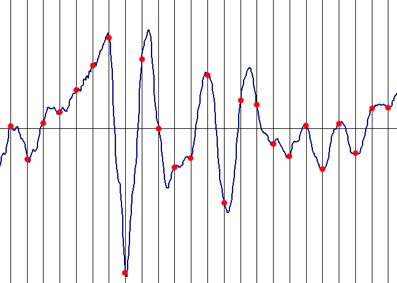
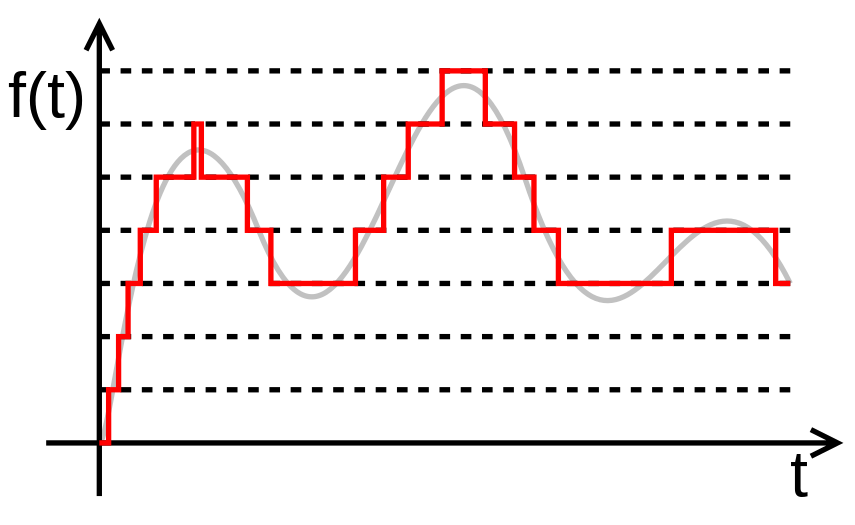

# AD Převod

## Vzorkování
Vzorkování je proces převodu spojitého signálu na diskrétní signál. To znamená, že místo toho, aby byl signál sledován nepřetržitě, je měřen v pravidelných intervalech. Tomuto intervalu se říká _vzorkovací frekvence_.

!!! quote "Vzorkování signálu"
    

!!! tip "Vzorkovací teorém"
    Podle Nyquistova-Shannonova vzorkovacího teorému musí být vzorkovací frekvence alespoň dvojnásobkem nejvyšší frekvence přítomné v signálu, aby mohl být signál přesně rekonstruován bez ztráty informace. Tato frekvence se nazývá __Nyquistova frekvence__.
    
    $$
       f_s > 2 \cdot f_{max} 
    $$

    - $f_s$ je vzorkovací frekvence
    - $f_{max}$ je nejvyšší frekvence

### Aliasing
__Aliasing__, česky _překlad frekvencí_ je jev, který vzniká při vzorkování signálu. Vzniká tehdy, když je signál vzorkován frekvencí menší než je dvojnásobek té nejvyšší frekvence. Jinak řečeno, překládání frekvencí vzniká při nedodržení [Vzorkovacího teorému](#vzorkování).

!!! abstract ""
    Doplnit příklady a výpočty přeložených frekvencí

Aby se zabránilo překladu těchto nežádoucích frekvencí, prožene se signál [dolní propustí](filtry.md). Ideální dolní propust slouží jako práh, který ponechá frekvence pod hranicí a frekvence nad hranicí odstraní. Tím se odstraní frekvence, které by se mohly potenciálně přeložit do těch frekvencí, které nás zajímají, a způsobit tak nežádoucí šum.

!!! info "Praxe"
    V praxi ideální filtry neexistují a vyšší frekvence jsou pouze utlumeny. I tak je filtrování výhodné, protože utlumením těchto frekvencí zmenšíme dopad, který bude jejich překlad mít.

## Kvantování
Kvantování je proces převodu spojitého signálu na diskrétní signál tím, že jeho hodnoty jsou zaokrouhleny na nejbližší hodnoty z konečné množiny úrovní. Tento proces se používá po vzorkování signálu.

!!! quote "Kvantování signálu"
    

Hladiny (úrovně), na které se signál "zaokrouhluje" se nazývají **kvantizační hladiny** (nebo **kvantizační úrovně**). Ty se rozlišují hlavně na __lineární__ a __nelineární__. 

- Lineární kvantování má úrovně od sebe stejně daleko. Provádí se např. pomocí zaokrouhlování. Aby nedošlo ke znatelnému zkreslení, doporučuje se pro $n$-bitový převodník mít $2^n$ kvantizačních hladin. 
- Nelineární kvantování se používá tam, kde je zapotřebí konkrétnějši popsat určitou sekci hladin signálu. Příkladem z praxe je např. [A-Law](https://en.wikipedia.org/wiki/A-law_algorithm) nebo [Mu-Law](https://en.wikipedia.org/wiki/%CE%9C-law_algorithm).

Stejně jako u [vzorkování](#vzorkování) platí vzorkovací teorém, i u [kvantování](#kvantování) platí jistá pravidla, za kterých nedojde ke znatelnému zkreslení signálu. Kvantování není nic jiného, než zaokrouhlování na určité hladiny, tudíž pokuď těhto hladin bude málo, bude se muset více zaokrouhlovat. Chyba kvantování (zaokrouhlení) se ve výsledném signálu projevuje jako **kvantizační šum**, který může zásadně ovlivnit kvalitu výstupního signálu.
