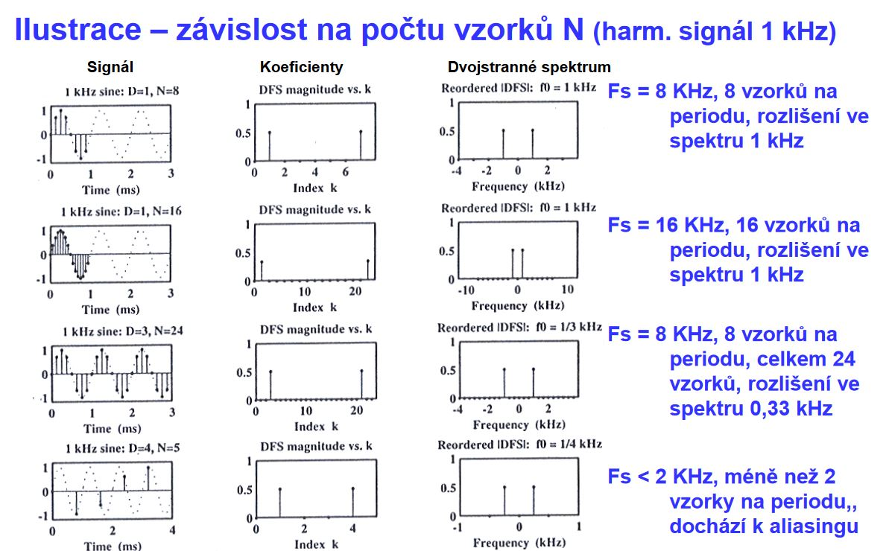
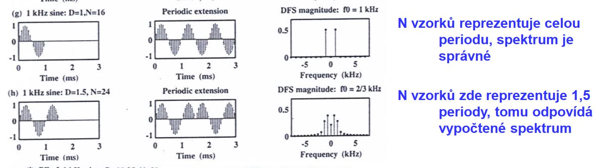

# Spektrum signálu
Spektrum signálu vyjadřuje závislost amplitud a fází harmonických složek signálu na frekvenci. Podle typu závislosti se dělí na

- Amplitudové spektrum
- Fázové spektrum

!!! example "Spektrum"
    

## Rozmazání spektra
Rozmazání spektra je jev, který vzniká při analýze spektra necelé periody signálu. Kolem hlavních frekvenčních složek se začnou objevovat další složky, které spektrum zatěžují nežádoucí chybou.

!!! example "Rozmazání spektra"
    

!!! success "Řešení rozmazání spektra"
    K rozmazání spektra dochází při analýze obecného signálu běžně. Dopad rozmazání spektra lze minimalizovat díky okénkovacím funkcím (windowing functions), které začátek a konec výběru signálu upravují tak, aby kraje výběru neměly takovej vliv na rádoby periodu. 