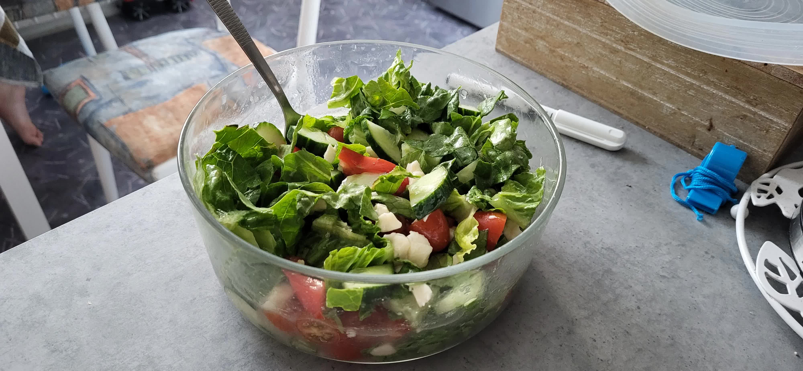

# Zeleninový salát se zálivkou

!!! quote ""
    

## Ingredience

## Postup

1. __Nakrájíme zeleninu__
    - Listy salátu nakrájíme nebo natrháme na malé kousíčky zhruba o velikosti 2 cm.
    - Okurku rozdělíme na čtvrtiny a nakrájíme na měsíčky.
    - Rajčátka nakrájíme na plátky, které následně nakrájíme na kostičky.
    - Mozarrelu nakrájíme na malé kostičky.

2. __Vytvoříme zálivku__
    - Do hrnku dáme jednu čajovou lžičku octa
    - Zbytek hrnku zalijeme vodou
    - Do hrnku nasypeme dvě čajové lžičky soli a 4 čajové lžičky cukru
    - Dochucujeme podle chuti

3. __Zalijeme salát zálivkou__
    - Do misky sesypeme všechnu nakrájenou zeleninu a mozzarellu
    - Promíchanou směs ingrediencí zalijeme zálivkou
    - Pokapeme trochou oleje

!!! danger "Zálivka je moc kyselá"
    Pak je v ní asi moc octa. Je lepší začít odznova.

!!! danger "Zálivka je vodová"
    Pak je v ní octa málo.
